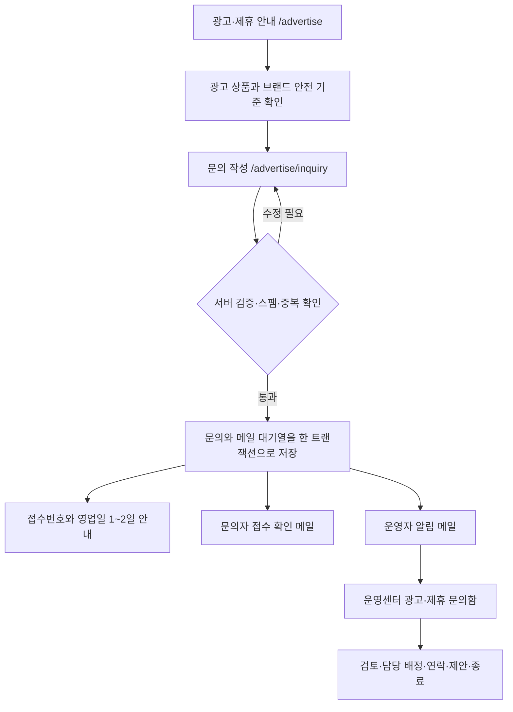

# 뉴앙 광고 플랫폼 V1 상세 기획서

- 문서 상태: **승인 완료 · 구현 기준**
- 작성일: 2026-08-01
- 사용자 승인일: 2026-08-01
- 적용 대상: 뉴앙 웹·모바일 웹, 운영센터
- 연계 문서: `NUANG_MONETIZATION_AND_ADVERTISING_STRATEGY.md`, `NUANG_ASSESSMENT_FIRST_HOME_RESTRUCTURE_PLAN.md`, `admin/NUANG_ADMIN_PLATFORM_V3_PRODUCT_SPEC.md`
- 구현 원칙: Release 1A → 1B → 1C 순서로 개발하고 각 단계마다 이 문서의 금지 화면·데이터 방화벽·인수 기준을 다시 점검한다.
- 법률 고지: 이 문서는 제품·기술·운영 기획이며 법률·세무 자문을 대체하지 않는다. 실제 송출 전 최신 약관과 개인정보 관련 법률 검토를 다시 수행한다.

---

## 구현 현황 · 2026-08-01

Release 1A~1C 코드 구현과 로컬 검증을 완료했다. 실제 광고와 메일 송출은 외부 계정 승인, 두 데이터베이스 마이그레이션, 운영 환경변수, Resend webhook·예약 작업을 사용자가 연결하기 전까지 fail-closed 상태다.

| 범위 | 구현 상태 | 운영 전 남은 게이트 |
| --- | --- | --- |
| 광고 안내·3단계 문의·접수 완료 | 완료 | 운영 연락 이메일과 메일 발신 도메인 |
| 암호화 문의 저장·outbox·Resend | 완료 | `202608010002` 실행, secrets, webhook·cron |
| 운영센터 문의·캠페인·인벤토리·소재·설정 | 완료 | `202608010003` 실행, 초기 운영값 입력 |
| 홈 AdSense 수동 슬롯 | 완료·기본 중지 | AdSense Ready, CMP, IDs, CSP 보고 검토, 5% 승인 |
| 피드 쿠팡 정적 카드 | 완료·기본 중지 | 활동 URL, 공식 소재·문구, hostname, 5% 승인 |
| 성향 데이터 광고 방화벽·빈도·의견 | 완료 | 운영 smoke test와 보호 지표 확인 |

구현 뒤에도 검사 문항·채점·결과 리포트·함께하기 진행 화면의 광고 금지는 유지한다.

---

## 0. 최종 제안 요약

뉴앙의 첫 광고 플랫폼은 광고를 많이 보여주는 시스템이 아니라, **성향 검사와 커뮤니티의 신뢰를 해치지 않는 범위에서만 수익을 만드는 통제 시스템**으로 설계한다.

첫 개발 범위에는 Google AdSense와 쿠팡 파트너스를 모두 포함한다. 다만 두 공급자를 같은 슬롯에서 무작위로 섞거나 한 화면에 연달아 노출하지 않는다.

1. `HOME_INLINE_01`
   - 공급자: Google AdSense
   - 위치: 홈 `추천` 탭에서 공개 주제검사 3개를 본 뒤, `함께하기` 섹션 전
   - 형식: 수동 반응형 인라인 디스플레이 광고 1개
2. `FEED_COMMERCE_01`
   - 공급자: 쿠팡 파트너스
   - 위치: 커뮤니티 `추천` 피드에서 공개·검수 통과 게시물 8개 뒤
   - 형식: 운영자가 직접 검수한 정적 제휴 카드 1개
3. 검사 소개·문항·채점·결과 리포트, 함께하기 방·선택·결과, 로그인, 마이 개인정보, 알림, 검색, 운영센터에는 광고를 넣지 않는다.
4. 애드센스 자동 광고, 앵커, 비네트, 전면, 플로팅 광고는 사용하지 않는다.
5. 뉴앙 코드, 검사 답변·점수, 결과 문장, 궁합 정보, 검색어, 계정 식별자는 광고 타기팅과 광고 이벤트에서 영구 배제한다.
6. 광고 문의는 공개 랜딩 → 문의 폼 → 접수번호 → 문의자 확인 메일 → 운영자 알림 메일 → 운영센터 처리의 하나의 흐름으로 구현한다.
7. 문의 저장과 메일 발송을 분리한다. 메일 서비스가 장애여도 문의는 접수되며, 발송 대기열이 자동 재시도한다.
8. 운영센터에 `비즈니스 운영 > 광고·제휴`를 추가하고 문의, 슬롯, 캠페인, 소재, 성과·품질, 설정, 긴급 중지를 한곳에서 관리한다.

### 승인 후 개발 원칙

사용자가 “기획대로 진행”이라고 승인하면 아래의 권장 기본값도 함께 승인한 것으로 본다.

- 애드센스는 비개인화 광고 요청을 기본으로 한다.
- 실광고는 운영 도메인, AdSense `Ready`, 개인정보 안내, 동의 체계, 공급자 설정, 슬롯 플래그가 모두 정상일 때만 요청한다.
- 쿠팡은 자동 추천·다이나믹 배너·Open API가 아니라 공식 생성 링크와 정적 소재부터 시작한다.
- 문의 답변 예정 시간은 `영업일 기준 1~2일`로 안내한다.
- 첫 송출은 5%부터 시작해 보호 지표가 통과할 때만 25% → 50% → 100%로 높인다.

---

## 1. 목표와 성공의 정의

### 1.1 제품 목표

- 무료 핵심 경험을 유지할 수 있는 초기 광고 수익 기반을 만든다.
- 뉴앙을 단순 배너 매체가 아니라 `나를 이해하고, 서로를 이해하는 성향 놀이터`에 어울리는 브랜드 협업 매체로 보이게 한다.
- 광고주가 뉴앙의 서비스 성격, 가능한 상품, 안전 기준을 이해하고 바로 문의할 수 있게 한다.
- 운영자가 개발자 도움 없이 광고 문의와 제휴 소재의 상태를 확인하고 중단할 수 있게 한다.
- 수익보다 검사 시작률, 검사 완주율, 재방문, 커뮤니티 참여, 페이지 성능과 신뢰를 먼저 보호한다.

### 1.2 사용자 성공 기준

- 사용자는 광고를 일반 콘텐츠나 검사 결과로 오인하지 않는다.
- 광고 때문에 핵심 CTA, 질문 선택, 결과 해석, 피드 읽기가 가려지거나 밀리지 않는다.
- 광고가 채워지지 않거나 공급자에 장애가 있어도 빈 박스와 오류 문구가 남지 않는다.
- 사용자는 불편한 광고를 숨기고 의견을 보낼 수 있다.
- 광고 문의자는 로그인 없이도 3~5분 안에 문의를 제출하고 접수번호를 받는다.

### 1.3 사업 성공 기준

- 공급자별 실제 노출·수익과 뉴앙의 보호 지표를 함께 본다.
- 문의 유실률 0%, 중복 메일 0건을 목표로 한다.
- 신규 문의, 미응답, SLA 초과, 메일 실패, 정책 검수 대기를 운영센터에서 바로 확인한다.
- 광고주에게 제공하는 리포트는 캠페인 집계만 포함하고 사용자 성향·검사 데이터를 포함하지 않는다.

### 1.4 이번 범위가 아닌 것

- 유료 구독, 광고 제거 상품, 결제
- 개인 성향 기반 광고 타기팅
- 광고주에게 개인 또는 세그먼트 성향 데이터 판매
- 실시간 경매를 직접 구현하는 광고 서버
- 쿠팡 Open API, 개인 관심 기반 다이나믹 배너
- 스폰서 밸런스게임 제작·계약 자동화
- 네이티브 iOS·Android AdMob
- 광고 소재 파일 업로드
- 예상 수익을 실제 수익처럼 보여주는 기능

---

## 2. 기획 검토 구성과 저장소 현황

이 문서는 다음 네 관점의 검토를 합쳤다.

- 제품·수익화 기획: 광고 밀도, 반복 이용, 광고 문의 전환, 운영 흐름
- 광고 정책·개인정보: AdSense, 쿠팡 파트너스, 전 연령 서비스, 경제적 이해관계 표시
- UX·브랜드: 뉴앙 앱의 부드러운 디자인과 광고의 명확한 구분
- 기술·운영: Next.js, Supabase, 관리자 감사 기록, Resend 메일, 장애 복구

### 2.1 현재 재사용 가능한 기반

| 현재 기반 | 파일 | 광고 플랫폼에서 재사용할 내용 |
| --- | --- | --- |
| 홈 콘텐츠 순서 | `src/features/assessment/AssessmentHub.tsx` | `RecommendedDiscovery`의 주제검사와 함께하기 사이에 슬롯 경계를 추가 |
| 공개 피드 | `src/features/feed/CommunityFeed.tsx` | 검수 통과 게시물 수를 기준으로 쿠팡 카드를 삽입 |
| 익명·회원 의견 접수 | `src/app/api/feedback/route.ts` | same-origin, 서버 검증, 지문 기반 반복 제출 제한 패턴 재사용 |
| 고객 의견 폼 | `src/features/feedback/ProductFeedbackForm.tsx` | 작성 내용 보존, 성공·실패 상태, 접근성 패턴 재사용 |
| 운영 알림 메일 | `src/features/admin/server-admin-review-notification.ts` | Resend, HTML escape, 운영센터 링크, idempotency 패턴 재사용 |
| 관리자 권한 | `src/features/admin/server-admin-access.ts` | 관리자 인증과 서비스 역할 전용 데이터 접근 재사용 |
| 관리자 메뉴 | `src/features/admin/admin-navigation.ts` | `비즈니스 운영 > 광고·제휴` 항목 추가 |
| 감사 기록 | `audit.admin_audit_log`과 관리자 RPC | 상태·담당자·긴급 중지 변경을 데이터와 감사 기록에 함께 저장 |
| 시스템 점검 | `src/features/admin/server-admin-system.ts` | 광고·메일 환경변수, 테이블, RPC 상태 점검 추가 |
| 개인정보 안내 | `src/features/policy/policy-skeleton.ts` | Google 광고 처리, 쿠키·식별자, 문의 정보, 국외 처리 내용을 개정 |

### 2.2 반드시 보완할 현재 한계

- 광고 공급자나 광고 슬롯 코드가 없다.
- 현재 메일은 저장 뒤 한 번 발송하는 best-effort 방식이다. 광고 문의에는 재시도 가능한 outbox가 필요하다.
- 현재 보안 헤더에는 CSP가 없다. AdSense 적용 전 Report-Only 검증과 nonce 기반 CSP 설계가 필요하다.
- 광고 문의 연락처는 일반 의견보다 민감하므로 암호화·보존·비식별화 정책이 별도로 필요하다.
- 관리자 역할은 현재 이메일 기반 단일 관리자 접근에 가깝다. V1에서는 기존 접근을 유지하되 광고 설정의 위험 작업은 재확인 다이얼로그와 감사 기록으로 보완한다.

---

## 3. 광고 원칙과 데이터 방화벽

### 3.1 사용자 신뢰 원칙

1. 광고보다 뉴앙 콘텐츠가 먼저 나온다.
2. 광고는 `광고` 또는 쿠팡 공식 대가성 문구로 첫 시선에서 구분한다.
3. 광고를 뉴앙의 성향 분석이나 편집 추천처럼 보이게 만들지 않는다.
4. 검사와 결과의 신뢰를 광고 수익과 교환하지 않는다.
5. 광고가 없으면 자연스럽게 콘텐츠만 이어진다.
6. 운영자가 언제든 전역·공급자·슬롯 단위로 즉시 중단할 수 있어야 한다.

### 3.2 영구 금지 데이터

다음 값은 광고 공급자 요청, 소재 선택, URL query, DOM `data-*`, 로그, 이벤트, 광고주 리포트에 절대 포함하지 않는다.

- account ID, 이메일, 전화번호, OAuth 식별자
- 뉴앙 코드와 코드 글자
- 검사 종류, 문항, 응답, 응답 시간, 점수, 채점 버전
- 결과 이름, 결과 리포트 문장, 성향지도 열람 내용
- 궁합 대상, 방 ID, 참여자, 둘·그룹 궁합 점수
- 건강·관계·성적 성향·정치·종교 등 민감할 수 있는 내용
- DM, 알림, 검색어, 자유 입력, 게시물 원문
- 광고주가 임의로 붙인 사용자 식별 query parameter

### 3.3 허용 가능한 문맥

- 안정된 슬롯 키: `HOME_INLINE_01`, `FEED_COMMERCE_01`
- 사전 정의한 넓은 화면 문맥: `home_recommended`, `feed_recommended`
- 기기 폭 구간: `mobile`, `tablet`, `desktop`
- 언어와 앱 버전
- 캠페인·소재 ID
- 30분 비활동 뒤 만료되는 무작위 세션 토큰

### 3.4 전 연령 서비스 보호

- 성인, 도박, 주류·담배, 고금리 대출, 선정적 만남, 정치 선전, 불법·위험 상품, 과장 의료·다이어트 광고를 기본 차단한다.
- Google의 사용자 기반 광고를 끄고 비개인화 요청을 기본으로 한다.
- 알려진 아동·청소년 사용자 또는 아동 대상 화면이 생기면 Google의 최신 age treatment 신호와 국내외 규정을 별도 적용한다.
- 나이를 알 수 없는 일반 이용자에게는 성향·행동으로 나이를 추측하지 않는다. 일반 이용자용 비개인화 설정을 적용하되, 알려진 보호 연령에는 더 보수적인 처리 또는 광고 미노출을 적용한다.
- 동의가 필요한 지역인데 유효한 신호가 없거나, 알려진 보호 연령을 안전하게 처리할 수 없는 경우에만 광고 요청을 보내지 않는 fail-closed 원칙을 적용한다.

---

## 4. 공급자별 역할

### 4.1 Google AdSense — 자동 수요를 채우는 기본 인벤토리

권장 방식:

- 수동 반응형 display ad unit만 사용한다.
- Auto ads, anchor, vignette, side rail, intent-driven format은 끈다.
- 운영 도메인이 AdSense `Ready`가 된 뒤에만 요청한다.
- 비개인화 광고를 기본으로 하고 사용자 기반 광고 수집을 끈다.
- 광고 위에 자체 클릭 레이어·링크·제스처를 올리지 않는다.
- Google 광고 클릭은 자체 수집하지 않고 AdSense 리포트를 기준으로 한다.

AdSense 광고는 뉴앙 운영센터에서 개별 소재를 사전 승인할 수 없으므로 다음을 병행한다.

- 민감 카테고리와 광고주 URL 차단
- Google Ad review center 정기 검토
- 사용자 광고 의견과 긴급 중지
- 공급자 정책 점검일 기록

### 4.2 쿠팡 파트너스 — 운영자가 고르는 문맥형 제휴 카드

권장 방식:

- 쿠팡 파트너스에서 생성한 공식 링크와 정적·카테고리 소재만 사용한다.
- 상품명, 이미지, 가격 표현, 링크, 노출 기간, 대체 텍스트를 운영자가 검수한다.
- `당신의 성향에 맞는 상품`이라고 표현하지 않는다.
- 가격·할인·배송 정보는 자동으로 오래 남겨 사실과 달라질 수 있으므로, 직접 확인할 수 없으면 고정 문구에 넣지 않는다.
- 링크에는 계정·성향 식별자를 추가하지 않는다.
- 링크 이동 전 자체 redirect로 감추지 않고 검수된 공식 파트너스 URL로 직접 이동한다.
- `rel="sponsored nofollow noopener noreferrer"`를 적용한다.

각 노출의 첫 부분에는 현재 공식 가이드의 다음 문구를 잘리지 않게 표시한다.

> 이 게시물은 쿠팡 파트너스 활동의 일환으로, 이에 따른 일정액의 수수료를 제공받습니다.

이 문구는 2026-08-01 현재 확인 가능한 쿠팡 공식 가이드 기준이다. 구현 직전 파트너스 포털에서 최신 약관·공지·필수 문구를 다시 확인하고, 변경되었다면 운영센터의 잠긴 공통 고지 문구를 최신 원문으로 갱신한다.

### 4.3 공급자 분리 규칙

- `HOME_INLINE_01`에는 AdSense만 허용한다.
- `FEED_COMMERCE_01`에는 쿠팡 정적 제휴 카드만 허용한다.
- 같은 슬롯에서 AdSense와 쿠팡을 랜덤 혼용하지 않는다.
- 공급자 장애를 다른 공급자의 광고로 즉시 대체하지 않는다. 슬롯은 조용히 사라진다.
- 공급자별 노출·수익·신고·중지 사유를 분리 집계한다.

---

## 5. 광고 배치 설계

### 5.1 허용·금지 매트릭스

| 화면 | V1 광고 | 정확한 위치 | 이유 |
| --- | --- | --- | --- |
| 홈 추천 | 허용 | 공개 주제검사 3개 뒤, 함께하기 전 `HOME_INLINE_01` | 핵심 콘텐츠를 먼저 이해한 뒤 자연스러운 섹션 경계 |
| 홈 나 알아보기·함께하기·연구소 탭 | 금지 | 없음 | 사용자가 선택한 목적에 집중 |
| 커뮤니티 추천 피드 | 조건부 허용 | 공개·검수 통과 게시물 8개 뒤 `FEED_COMMERCE_01` | 충분한 유기 콘텐츠 뒤 제휴 카드 1개 |
| 데칼코마니·놀이터 피드 | V1 금지 | 없음 | 성향 필터·놀이 문맥과 광고 혼동 방지 |
| 게시물 상세·작성·검색·알림 | 금지 | 없음 | 행동 버튼·개인 맥락·저가치 화면 보호 |
| 성향지도 | V1 금지 | 없음 | 성향 해석과 상업 추천 혼동 방지 |
| 코어·정밀·주제검사 소개·문항 | 금지 | 없음 | 검사 시작·응답 집중 보호 |
| 모든 결과 리포트·공유 결과 | 금지 | 없음 | 결과 신뢰와 공유 CTA 보호 |
| 함께하기 목록 | V1 금지 | 없음 | 초기 지표 검증 뒤 별도 검토 |
| 방 생성·참여·대기·선택·결과 | 금지 | 없음 | 오클릭과 게임 몰입 보호 |
| 로그인·가입·오류·빈 상태 | 금지 | 없음 | 정책·신뢰·저가치 화면 보호 |
| 마이·설정·계정·개인 기록 | 금지 | 없음 | 개인정보 화면 보호 |
| 운영센터 | 영구 금지 | 없음 | 운영자의 자기 광고 노출·클릭 방지 |

### 5.2 커뮤니티 콘텐츠 안전 조건

쿠팡 카드는 다음 조건을 모두 만족할 때만 렌더링한다.

- 피드 모드가 `recommended`
- 광고 전 공개 게시물이 8개 이상
- 광고 인접 게시물이 `moderation_status=allowed`와 공개 상태
- 신고 검토 중, 차단, 삭제, 민감 콘텐츠 플래그가 없음
- 빈 피드, 필터 결과, 특정 게시물 강조 이동 상태가 아님
- 전역·공급자·슬롯 kill switch가 활성 상태가 아님

### 5.3 빈도 기본값

- 세션: 앱 사용 후 30분 비활동 시 새 세션
- 홈 AdSense: 세션당 최대 1회
- 피드 쿠팡: 세션당 최대 1회
- 전역: 세션당 최대 3회, 24시간당 최대 6회
- 동일 쿠팡 소재: 24시간당 최대 2회
- 두 광고 사이: 최소 3~5분 또는 유기 콘텐츠 8개 중 먼저 충족되는 더 엄격한 조건
- 사용자가 광고를 숨기면 해당 공급자는 그 세션 동안 다시 노출하지 않음
- 첫 방문에서 핵심 CTA보다 앞에 광고를 노출하지 않음

### 5.4 단계적 노출

두 공급자의 코드는 같은 개발 릴리스에 완성하되 실제 송출은 순차적으로 연다.

1. 광고 없는 A/A 기준선 수집: 최소 7일 또는 충분한 핵심 이벤트 표본
2. 홈 AdSense: 대상 세션 5% → 25% → 50% → 100%
3. 홈 보호 지표 통과 뒤 피드 쿠팡: 대상 세션 5% → 25% → 50% → 100%
4. 각 단계는 최소 7일 관찰하고 중단 기준을 먼저 평가

표본이 너무 작으면 통계적 유의성을 억지로 주장하지 않고 관찰 기간과 실제 수치를 함께 기록한다.

---

## 6. 광고 UI/UX 규격

### 6.1 공통 상태 모델

```text
disabled → eligible → loading → filled
                           ├→ no_fill
                           ├→ blocked
                           └→ error
```

- `disabled`: 정책·환경·플래그상 노출 불가, DOM을 만들지 않음
- `eligible`: 모든 규칙 통과, 아직 공급자 요청 전
- `loading`: 예약 공간만 표시, 광고 클릭 요소 없음
- `filled`: 광고와 명확한 라벨·의견 동선 표시
- `no_fill`, `blocked`, `error`: 사용자에게 오류를 보이지 않고 화면 밖에서 조용히 접음

### 6.2 공통 시각 원칙

- 뉴앙 일반 카드와 혼동되지 않도록 중립적인 흰색 또는 옅은 회색 표면과 1px 경계를 사용한다.
- 캐릭터, 보라색 핵심 CTA, 검사 결과 배지, 추천 이유 UI를 사용하지 않는다.
- 모서리는 6~8px로 앱 카드보다 절제한다.
- 상단에 작은 `광고` 라벨을 둔다.
- 모바일 좌우 여백과 콘텐츠 최대 너비는 현재 화면 그리드를 따른다.
- 탭바·CTA와 최소 24px 이상 떨어뜨린다.
- 깜빡임, 화살표, 자동 애니메이션, 흔들림으로 주목을 유도하지 않는다.

### 6.3 크기와 CLS

- 모바일 최소 가용 너비 320px를 지원한다.
- AdSense는 `min-height` 예약 공간을 사용하되 고정 `height`나 `max-height`로 반응형 광고를 자르지 않는다.
- 초기 권장 예약 높이: 모바일 100px, 데스크톱 120px. 실제 광고는 공식 반응형 크기를 따른다.
- 공급자 미설정이면 예약 공간도 만들지 않는다.
- no-fill이 예상되면 사용자가 슬롯에 접근하기 전에 접어 CLS를 줄인다.
- p75 CLS 0.1 이하를 기본 목표로 하고 광고 도입 증가분은 0.02 이내로 제한한다.

### 6.4 AdSense 프레임

- Google의 `Ads by Google` 또는 AdChoices 표시를 가리지 않는다.
- 광고 iframe 위·안에 자체 버튼과 click listener를 올리지 않는다.
- 자체 `광고 의견` 버튼은 광고 영역과 분리된 하단 보조 행에 둔다.
- 운영자·개발·미리보기에는 실제 iframe 대신 `광고 미리보기 — 실광고 미요청` fixture를 표시한다.

### 6.5 쿠팡 제휴 카드

구성 순서:

1. 공식 대가성 문구
2. 정적 이미지와 대체 텍스트
3. 사실 확인된 짧은 제목과 설명
4. `쿠팡에서 보기` 외부 이동 버튼
5. `광고 의견` 보조 동선

금지 문구:

- `당신의 뉴앙 코드에 딱 맞아요`
- `이 성향이라면 반드시 필요해요`
- `뉴앙이 보장하는 상품`
- 검증하지 않은 가격·할인율·배송 보장

허용 문구 예:

- `함께 놀 때 곁들이기 좋은 간식 아이디어`
- `주말 모임을 준비할 때 살펴볼 수 있어요`

### 6.6 광고 의견

사용자 선택:

- 관심 없어요
- 너무 자주 보여요
- 불편한 내용이에요
- 잘못된 광고 같아요

처리:

- 앞의 두 항목은 해당 세션 노출 억제와 빈도 조정 집계에 사용한다.
- 뒤의 두 항목은 운영센터 `성과·품질` 검토 큐로 보낸다.
- 자유 입력은 V1에서 받지 않아 민감정보·운영 부담을 줄인다.
- 의견 제출을 광고 클릭과 연결하거나 보상하지 않는다.

### 6.7 접근성

- 라벨은 색만으로 구분하지 않는다.
- 광고 의견 버튼은 최소 44×44px 터치 영역을 확보한다.
- 쿠팡 이미지에는 의미 있는 대체 텍스트를 넣고 장식 이미지는 빈 alt를 사용한다.
- 외부 이동을 스크린리더 이름에 알린다.
- 로딩·no-fill 변화로 포커스를 이동시키지 않는다.
- 광고 iframe에 공급자가 제공하는 title이 있는지 확인한다.

---

## 7. 광고 문의 정보구조와 사용자 흐름

### 7.1 진입점

- 마이 `설정 > 서비스 정보 > 광고·제휴 문의`
- 공개 주소 `/advertise`
- 광고 영역의 `광고·제휴 안내` 링크
- 운영자가 외부에 공유할 수 있는 canonical URL

일반 사용자의 불편 신고인 `광고 의견`과 광고주의 영업 문의인 `광고·제휴 문의`는 문구와 경로를 분리한다.

### 7.2 전체 흐름



### 7.3 `/advertise` 랜딩 구성

헤드라인:

> 뉴앙과 함께, 서로를 이해하는 브랜드 경험을 만들어보세요.

서브카피:

> 뉴앙은 성향 검사와 함께하기 놀이, 커뮤니티를 통해 사람들이 자신과 서로를 알아가는 서비스입니다. 사용자 경험과 개인정보를 지키는 범위에서 브랜드와 오래 기억되는 접점을 만듭니다.

섹션:

1. 뉴앙 소개와 슬로건
2. 가능한 상품
   - 인라인 배너
   - 문맥형 제휴 카드
   - 후속 상품인 브랜드 함께하기 팩
3. 브랜드 안전 원칙
   - 개인 검사·성향 데이터 미제공
   - 검사·결과 핵심 화면 광고 금지
   - 모든 소재 사전 검수
4. 진행 절차
   - 문의 → 검토 → 제안 → 소재 검수 → 일정 확정 → 집행·리포트
5. FAQ
   - 최소 예산, 일정, 소재 규격, 결과 데이터 제공 범위, 금지 업종
6. `광고 문의하기` CTA

가짜 DAU, CTR, 도달 수치, 유명 광고주 로고를 채우지 않는다. 실제 검증된 값이 준비되기 전에는 `초기 파트너와 상품을 함께 설계합니다`라고 정직하게 안내한다.

### 7.4 랜딩 디자인

- 앱의 크림색 배경과 차분한 보라 포인트를 유지하되 캐릭터 중심의 아기자기한 구성은 사용하지 않는다.
- 짙은 잉크색 제목, 넓은 여백, 규칙적인 12-column 데스크톱 그리드와 단일 컬럼 모바일 레이아웃을 사용한다.
- 과장된 그라디언트와 영업 팝업을 쓰지 않는다.
- 광고주에게는 전문 플랫폼, 기존 사용자에게는 뉴앙다운 서비스 안내로 느껴져야 한다.

### 7.5 문의 폼 필드

| 항목 | 필수 | 규칙 |
| --- | --- | --- |
| 회사·브랜드명 | 필수 | 2~100자 |
| 담당자명 | 필수 | 2~50자 |
| 업무 이메일 | 필수 | 정규화·형식 검증, 화면 재표시 시 마스킹 |
| 연락처 | 선택 | 국제번호 허용, 암호화 저장 |
| 공식 홈페이지·캠페인 URL | 선택 | `https`만, 500자 이하, 서버에서 직접 접속하지 않음 |
| 홍보할 제품·서비스 | 필수 | 10~300자 |
| 문의 유형 | 필수 | 배너 / 문맥형 제휴 / 브랜드 함께하기 팩 / 기타 |
| 캠페인 목적 | 필수 | 인지도 / 방문 / 참여 / 출시 / 기타 |
| 희망 노출면 | 필수 | 홈 / 커뮤니티 / 함께하기 후속 협업 / 상담 필요 |
| 예산 구간 | 필수 | 100만원 미만 / 100~300만원 / 300~1,000만원 / 1,000만원 이상 / 미정 |
| 희망 일정 | 필수 | 시작·종료일 또는 `협의 가능` |
| 주요 대상 | 필수 | 광고주가 설명하는 넓은 고객군, 민감 타기팅 요구 금지 안내 |
| 소재 준비 상태 | 필수 | 준비 완료 / 제작 중 / 공동 기획 필요 |
| 문의 내용 | 필수 | 20~3,000자 |
| 개인정보 수집·이용 동의 | 필수 | 동의 문서 버전·시각 저장 |
| 마케팅 소식 수신 | 선택 | 기본 off, 문의 처리 동의와 분리 |

V1에는 파일 첨부를 넣지 않는다. 악성 파일, 저장 비용, 개인정보 유입을 줄이기 위해 참고 URL만 받는다.

### 7.6 폼 경험

- 긴 한 화면이 아니라 `기본 정보 → 캠페인 → 상세·동의`의 3단계로 나눈다.
- 현재 단계와 남은 단계를 텍스트로 표시한다.
- 단계 이동 시 입력을 브라우저 임시 저장소에 보존하되 이메일·전화는 페이지를 닫으면 삭제한다.
- 오류는 필드 가까이에 구체적으로 표시하고 첫 오류로 포커스를 이동한다.
- 제출 중 버튼을 잠그고 중복 요청 방지 키를 사용한다.
- 실패 시 작성 내용을 유지한다.

### 7.7 접수 완료

표시 정보:

- `문의가 접수됐습니다`
- 공개 접수번호 예: `AD-20260801-A7K3M2`
- `영업일 기준 1~2일 안에 업무 이메일로 연락드릴게요.`
- 입력 이메일의 마스킹 값
- 광고 안내로 돌아가기

DB UUID를 공개 접수번호로 사용하지 않는다. 순차 번호로 전체 문의량을 유추할 수 없도록 날짜와 난수 조합을 쓴다.

---

## 8. 이메일과 장애 복구

### 8.1 발송 종류

1. 운영자 알림
   - 제목: `[뉴앙 광고문의][문의유형] 회사·브랜드명 · 접수번호`
   - 본문: 접수 시각, 유형, 회사명, 접수번호, 운영센터 링크만 포함
   - 이메일·전화·자유 입력 원문은 메일에 넣지 않음
2. 문의자 확인
   - 제목: `[뉴앙] 광고 문의가 접수됐습니다 · 접수번호`
   - 본문: 접수번호, 문의 유형, 예상 답변일, 철회·수정 문의 경로
   - 광고성 메일 동의나 구독으로 취급하지 않음

### 8.2 저장과 발송 순서

1. API가 문의를 검증한다.
2. DB 함수가 문의 행과 `운영자 알림`, `문의자 확인` outbox 두 행을 같은 트랜잭션으로 저장한다.
3. API는 저장 성공 즉시 접수 성공을 반환한다.
4. 서버가 outbox 발송을 즉시 시도한다.
5. 실패하면 예약 작업이 지수 backoff로 재시도한다.
6. 최대 재시도 뒤 `dead`가 되면 운영센터에 경보를 띄운다.
7. 운영자는 원인 확인 뒤 감사 기록이 남는 `다시 보내기`를 실행할 수 있다.

### 8.3 재시도 기본값

- 1분 → 5분 → 30분 → 2시간 → 12시간
- 5회 실패 뒤 dead-letter
- Resend idempotency key: `ad-inquiry/{event-kind}/{inquiry-id}/{template-version}`
- 동일 키와 동일 payload만 재사용
- provider message ID, 전송·반송·불만 상태 기록

### 8.4 환경변수

서버 전용:

- `AD_INQUIRY_NOTIFICATION_EMAILS`
- `AD_INQUIRY_FROM`
- `RESEND_API_KEY`
- `AD_OUTBOX_CRON_SECRET`
- `AD_CONTACT_HASH_PEPPER`
- 기존 `FIELD_ENCRYPTION_KEY`

브라우저에 어떤 이메일 API key도 노출하지 않는다. 운영 수신 주소는 비어 있으면 `ADMIN_REVIEW_NOTIFICATION_EMAILS`, 그마저 없으면 `ADMIN_BOOTSTRAP_EMAILS`를 쓰되 운영센터에서 명확한 경고를 표시한다.

### 8.5 이메일 보안

- 제목과 HTML에 들어가는 모든 사용자 입력을 escape한다.
- CRLF와 헤더 주입 문자를 차단한다.
- 문의자의 이메일을 `reply-to`로 자동 설정하지 않는다.
- 발송 도메인의 SPF, DKIM, DMARC 상태를 운영 체크리스트에 둔다.
- 메일 공급자에는 발송에 필요한 최소 정보만 전달한다.

---

## 9. 운영센터 `광고·제휴`

### 9.1 메뉴 구조

관리자 사이드바에 새 그룹을 추가한다.

```text
비즈니스 운영
└─ 광고·제휴
   ├─ 문의
   ├─ 캠페인
   ├─ 인벤토리
   ├─ 소재 검수
   ├─ 성과·품질
   └─ 설정
```

경로는 `/admin/advertising` 하나를 기본으로 하고 query 또는 내부 탭으로 구분한다. 탭 이동은 전체 페이지 리다이렉트와 중복 로딩 없이 즉시 전환한다.

### 9.2 운영 개요

상단 지표:

- 신규 문의
- 오늘까지 미응답
- SLA 초과
- 연락·제안 진행 중
- 메일 전송 실패
- 정책 검수 대기
- 현재 송출 중 슬롯

수익 공급자 API가 연결되지 않았으면 `미연동`이라고 표시한다. 추정값이나 임의 숫자를 만들지 않는다.

### 9.3 문의 큐

상태:

```text
접수 → 검토 중 → 연락 완료 → 제안 전달 → 협의 중 → 계약 → 종료
                  └────────────→ 거절
접수/검토 중 ──────────────────→ 스팸 검토 → 스팸
```

목록 열:

- 접수번호
- 회사·브랜드
- 문의 유형
- 예산 구간
- 희망 일정
- 상태
- 담당자
- 다음 조치일
- 경과 시간·SLA

필터:

- 상태, 담당자, 문의 유형, 예산, 희망 월, SLA 초과, 메일 실패
- 회사명·접수번호·이메일 blind index 검색

상세:

- 제출 원문과 동의 증적
- 연락처 복호화 보기 기록
- 담당자와 우선순위
- 내부 메모
- 연락 기록
- 상태 변경 타임라인
- 다음 조치일
- 확인 메일·운영 메일 상태와 재전송

### 9.4 상태 변경 규칙

- 상태 변경에는 담당자, 사유, 다음 조치일을 요구한다.
- `계약`, `거절`, `종료`, `스팸`은 확인 다이얼로그를 거친다.
- 상태와 감사 로그는 하나의 DB 함수에서 원자적으로 저장한다.
- 메모와 외부 연락 기록을 구분한다.
- 삭제 버튼 대신 보존 정책에 따른 비식별화를 사용한다.

### 9.5 캠페인

상태:

```text
draft → policy_review → approved → scheduled → active → paused → ended
```

필수 정보:

- 광고주·문의 연결
- 공급자
- 캠페인명과 목적
- 슬롯
- 시작·종료 시각
- 소재
- 계약·예산 메모
- 정책 체크리스트
- 승인자와 승인 시각

`paused` 뒤 다시 켤 때에는 최신 소재·링크·정책 문구를 다시 승인한다.

### 9.6 인벤토리

슬롯별 표시:

- 슬롯 키와 실제 화면 위치
- 허용 공급자
- 활성·중단 상태
- 최소 선행 콘텐츠 수
- 세션·24시간 빈도
- 최근 요청·채움·오류
- 최근 정책 변경자와 시각

전역, 공급자, 슬롯 단위의 3단 kill switch를 제공한다. 전역 중지는 한 번의 확인으로 즉시 적용하며 재활성화는 별도 승인한다.

### 9.7 소재 검수

쿠팡 소재 체크리스트:

- 파트너스 공식 링크인가
- 노출 URL이 쿠팡 계정 활동 페이지에 등록됐는가
- 대가성 문구가 첫 부분에 정확히 노출되는가
- 이미지와 로고 사용 권한이 있는가
- 가격·할인·배송 표현이 현재 사실인가
- 금지 업종·과장·성향 맞춤 표현이 없는가
- 모바일 320px에서 문구가 잘리지 않는가
- 링크 host와 만료일이 정상인가

AdSense는 개별 소재 대신 공급자 상태, 차단 카테고리, Ad review center 점검일과 사용자 신고를 관리한다.

### 9.8 성과·품질

- 공급자별 viewable impression, fill/no-fill, 오류
- AdSense RPM/eCPM/수익은 공급자 리포트 연동 후 실제 값만 표시
- 쿠팡 클릭·구매·수수료는 공식 리포트 집계만 표시
- 광고 숨김·불편·잘못된 광고 비율
- 홈 검사 시작률, 검사 완주율, 피드 참여율, D1/D7
- LCP, CLS, INP 변화
- 중단 기준 상태

### 9.9 운영센터 디자인

- 현재 전문 운영센터의 짙은 텍스트, 중립 표면, 규칙적 테이블을 따른다.
- 캐릭터, 장식용 그라디언트, 과도한 둥근 카드와 감탄형 문구를 사용하지 않는다.
- 숫자보다 `지금 해야 할 일`을 먼저 보여준다.
- 데스크톱은 정보 밀도를 높이고, 모바일은 문의 목록 → 상세의 단일 흐름으로 단순화한다.
- 오류, 미설정, 미연동을 정상 수치처럼 숨기지 않는다.

---

## 10. 데이터 모델

새 schema를 Exposed Schemas에 추가하지 않도록 기존 운영 패턴과 같은 `public` schema에 광고 전용 접두어를 사용한다. 모든 테이블은 RLS를 켜고 `anon`, `authenticated` 권한을 회수하며 서버 `service_role`만 접근한다.

### 10.1 핵심 테이블

#### `public.advertising_inquiry`

- `id uuid`
- `public_reference text unique`
- `company_name text`
- `contact_name_ciphertext text`
- `contact_email_ciphertext text`
- `contact_email_blind_index text`
- `contact_phone_ciphertext text null`
- `website_url text null`
- `promoted_offering text`
- `inquiry_type text`
- `objective text`
- `requested_surfaces text[]`
- `budget_band text`
- `desired_start date null`
- `desired_end date null`
- `schedule_flexible boolean`
- `audience_description text`
- `creative_readiness text`
- `message_ciphertext text`
- `privacy_consent_version text`
- `privacy_consented_at timestamptz`
- `marketing_consent boolean default false`
- `source_path text`
- `request_fingerprint text`
- `duplicate_hash text`
- `status text`
- `priority text`
- `assigned_admin_account_id uuid null`
- `first_response_due_at timestamptz`
- `first_response_at timestamptz null`
- `next_action_at timestamptz null`
- `closed_reason text null`
- `created_at`, `updated_at`, `closed_at`

연락처와 문의 자유 입력은 기존 `FIELD_ENCRYPTION_KEY` 기반 앱 암호화를 재사용하고, 검색·중복 확인은 원문이 아닌 keyed blind index를 사용한다.

#### `public.advertising_inquiry_event`

- 상태, 담당자, 우선순위, 연락, 메모, 메일 재전송 이력
- `actor_type=system|admin`
- `before_state`, `after_state`에는 비밀값·연락처 원문을 넣지 않음

#### `public.advertising_mail_outbox`

- `event_key unique`
- `inquiry_id`
- `template_key`, `template_version`
- `recipient_role=operator|inquirer`
- 암호화된 recipient 또는 문의 참조
- 최소화된 payload
- `pending|sending|sent|retry|dead|bounced|complained`
- 시도 횟수, 다음 시도, provider message ID, 정제된 오류, 발송 시각

#### `public.advertising_inventory`

- stable placement key
- route context, provider, format, 상태
- 선행 콘텐츠 수, 최소 간격, 빈도, moderation 필요 여부
- policy version, 활성 기간

#### `public.advertising_campaign`

- inquiry, provider, 이름, 상태, 일정, 목적, 슬롯, 정책 승인 정보

#### `public.advertising_creative`

- campaign, provider, 제목, 설명, 이미지 URL, alt, destination URL
- disclosure text, 사실 확인 시각, 만료 시각, 검수 상태

#### `public.advertising_feedback`

- placement, provider, campaign/creative, reason, ephemeral session hash, created_at
- account ID와 자유 입력 없음

#### `public.advertising_event`

- 허용 이벤트와 허용 필드만 저장
- 원시 이벤트 30일 뒤 삭제

#### `public.advertising_metric_daily`

- 날짜·공급자·슬롯·캠페인 단위 집계
- 사용자를 역추적할 수 있는 차원 없음

### 10.2 원자적 DB 함수

- `submit_advertising_inquiry_atomic(...)`
  - 문의, 동의 증적, outbox 2건을 함께 저장
- `admin_manage_advertising_inquiry(...)`
  - 상태·담당·다음 조치와 감사 로그를 함께 저장
- `admin_manage_advertising_campaign(...)`
  - 승인·중단·재활성화와 감사 로그를 함께 저장
- `admin_toggle_advertising_kill_switch(...)`
  - 긴급 중지와 감사 로그를 함께 저장

API route가 감사 테이블에 따로 쓰지 않는다. 핵심 상태와 감사 기록이 한 트랜잭션에서 성공하거나 함께 실패하게 한다.

### 10.3 보존 기본값

- 스팸: 판정 후 90일 뒤 연락처·원문 비식별화
- 계약되지 않은 종료 문의: 종료 1년 뒤 연락처·원문 비식별화
- 계약 문의: 계약·세무 기록으로 이관 뒤 해당 법정·계약 보존기간에 맞춤
- 전송 완료 outbox payload: 30일 뒤 삭제, 상태 메타데이터 1년
- 원시 광고 이벤트: 30일
- 비식별 일일 집계: 13개월
- 광고 의견: 180일

이 기간은 제품 기본값이며 실제 적용 전 국내 개인정보·전자상거래·세무 보존 의무를 확인한다.

---

## 11. API·컴포넌트 설계

### 11.1 사용자 경로

- `/advertise`
- `/advertise/inquiry`
- `/advertise/inquiry/complete`
- `/api/advertising/inquiries` `POST`
- `/api/advertising/feedback` `POST`

### 11.2 관리자 경로

- `/admin/advertising`
- `/api/admin/advertising/inquiries`
- `/api/admin/advertising/campaigns`
- `/api/admin/advertising/inventory`
- `/api/admin/advertising/creatives`
- `/api/admin/advertising/kill-switch`
- `/api/internal/advertising/outbox/drain`
- `/api/internal/advertising/email-webhook`

### 11.3 컴포넌트 경계

```text
AdvertisingPolicyBoundary
└─ AdSlot
   ├─ AdSenseInlineSlot
   ├─ CoupangAffiliateCard
   └─ AdFeedbackMenu
```

`AdvertisingPolicyBoundary`가 다음 순서로 판단한다.

1. production인가
2. canonical 운영 hostname인가
3. 전역·공급자·슬롯 플래그가 켜졌는가
4. 공급자 설정과 외부 승인이 완료됐는가
5. 현재 route가 allowlist에 있는가
6. 동의·지역·연령 처리가 가능한가
7. 콘텐츠가 공개·안전 상태인가
8. 빈도와 최소 콘텐츠 조건을 충족하는가
9. 운영자·테스트·자동화 세션이 아닌가

하나라도 실패하면 공급자 SDK와 슬롯 DOM을 만들지 않는다.

### 11.4 AdSense 기술 규격

- publisher ID와 slot ID는 환경변수로 관리한다.
- 공식 async script는 승인된 페이지에서 한 번만 로드한다.
- SPA 재진입에서 같은 DOM에 `push`를 중복 호출하지 않는다.
- placement key와 route instance ID를 분리한다.
- `ads.txt`는 운영 도메인 루트에서 200, `text/plain`으로 응답한다.
- 값은 AdSense 화면에서 복사한 정확한 publisher ID를 사용하고 `ca-`는 제거한다.
- `NEXT_PUBLIC_ADSENSE_PUBLISHER_ID`, 슬롯별 공개 ID는 비밀은 아니지만 환경별로 분리한다.
- 개발·preview·E2E에서는 실광고 script를 로드하지 않는다.

### 11.5 쿠팡 기술 규격

- V1은 제3자 다이나믹 JS와 iframe을 로드하지 않는다.
- 운영센터에서 승인된 정적 소재와 공식 파트너스 URL만 서버가 전달한다.
- 허용 scheme은 `https`만 사용한다.
- destination host는 운영 설정 allowlist와 최신 쿠팡 가이드를 함께 확인한다.
- 첫 클릭 전환은 직접 링크로 처리한다. 자체 redirect·cloaking을 하지 않는다.
- first-party 클릭 집계가 필요하면 navigation 전에 최소 이벤트를 `sendBeacon`으로 보내되 이동을 지연시키지 않는다.

### 11.6 CSP

Google은 광고 도메인이 변할 수 있어 단순 도메인 allowlist보다 nonce 기반 strict CSP를 공식 안내한다.

적용 순서:

1. 요청별 nonce 생성 설계
2. `Content-Security-Policy-Report-Only` 배포
3. AdSense와 기존 OAuth·Supabase·이미지 경로 위반 수집
4. 필요한 공식 script 초기화에 nonce 전달
5. 회귀 테스트
6. enforce 전환

CSP를 약하게 풀어 광고만 보이게 하는 임시 조치를 금지한다. Report-Only 분석이 끝나지 않으면 실광고 출시를 막는다.

### 11.7 웹과 네이티브 경계

현재 범위는 웹·모바일 웹이다. 추후 웹을 네이티브 WebView로 감쌀 경우 AdSense 웹 코드를 그대로 출시하지 않는다. Google Mobile Ads SDK의 WebView API for Ads 또는 AdMob을 별도 설계·승인한다.

---

## 12. 보안·스팸·중복 방지

### 12.1 API 보호

- same-origin 검사
- Zod client/server 공통 schema
- JSON body 크기 제한
- honeypot
- 폼 노출부터 제출까지 비정상적으로 짧은 요청 표시
- IP·UA 원문 대신 keyed fingerprint
- IP·이메일 기준 15분 3회, 24시간 10회 기본 제한
- disposable email, 반복 URL, 금칙어는 risk score로 사용
- 확신이 낮은 요청은 삭제하지 않고 `스팸 검토`로 격리

### 12.2 중복 방지

- `normalized email + normalized company + normalized message + rolling bucket`의 keyed hash
- 같은 payload와 idempotency key가 다시 오면 기존 접수번호 반환
- DB unique constraint로 동시 요청 race 방지
- 사용자가 내용을 수정해 다시 보낸 문의는 새 문의로 저장하고 `related_inquiry_id`로 연결 가능

### 12.3 URL·소재 안전

- 서버가 문의 URL을 자동 fetch하지 않아 SSRF를 피한다.
- 관리자가 링크를 열 때 외부 링크 경고와 새 창을 사용한다.
- 쿠팡 소재 링크 저장 시 scheme·host·길이를 검증한다.
- HTML을 저장하더라도 렌더링하지 않고 일반 텍스트로 표시한다.
- 이미지 업로드는 V1 범위에서 제외한다.

### 12.4 관리자 보호

- 운영자에게 실광고를 노출하지 않는다.
- 긴급 중지, 계약, 거절, recipient 변경은 재확인한다.
- 이메일·전화 복호화 열람을 감사 기록에 남긴다.
- 환경변수 값은 `설정됨/미설정`만 보여주고 실제 secret은 표시하지 않는다.

---

## 13. 개인정보·동의·정책 반영

### 13.1 개인정보 처리방침 개정 항목

- Google 광고로 인해 제3자가 쿠키, 웹 비콘, IP 주소 또는 기타 식별자를 처리할 수 있음
- 개인화 여부와 광고 선택권
- Google이 파트너 사이트 데이터를 사용하는 방법 안내 링크
- EEA·영국·스위스 CMP와 적용 지역
- 광고 문의 수집 항목, 목적, 보존기간, 위탁·국외 처리
- Resend와 Google 등 실제 처리업체·처리 위치의 최신 계약 기준
- 쿠팡 링크 클릭 시 외부 사이트로 이동하고 쿠팡 정책이 적용됨
- 사용자가 광고 관련 선택을 변경하는 경로

### 13.2 AdSense 동의 기본안

- 뉴앙 성향 데이터를 사용한 개인화는 하지 않는다.
- 비개인화 광고 요청을 기본으로 설정한다.
- 비개인화 광고도 빈도 제한·집계용 쿠키를 사용할 수 있음을 안내한다.
- EEA·영국·스위스에서는 Google 인증 CMP와 유효한 동의 신호가 준비되기 전 Google 광고 요청을 보내지 않는다.
- 미국 지원 주의 메시지와 GPC/RDP 처리는 실제 유입 지역과 법률 검토 후 설정한다.
- 동의가 불명확하면 광고 없음으로 처리한다.

### 13.3 경제적 이해관계 표시

- AdSense는 Google 표시를 가리지 않고 별도 `광고` 라벨을 둔다.
- 쿠팡은 공식 대가성 문구를 각 제휴 카드의 첫 부분에 그대로 표시한다.
- `협찬`, `추천`, `오늘의 아이템`만으로 대가성 표시를 대신하지 않는다.
- 제휴 수익이 발생할 수 있다는 내용을 푸터·tooltip·접힌 영역에만 숨기지 않는다.

### 13.4 정책 점검 주기

- AdSense 정책·차단 카테고리: 월 1회 및 Google 경고 수신 즉시
- 쿠팡 포털 약관·공지·필수 문구: 소재 승인 전과 월 1회
- 개인정보 처리방침과 공급자 목록: 분기 1회 및 공급자 변경 시
- 모든 점검은 운영센터에 점검자·시각·결과를 기록

---

## 14. 측정 계약

### 14.1 허용 이벤트

- `ad_slot_eligible`
- `ad_render_requested`
- `ad_slot_filled`
- `ad_slot_no_fill`
- `ad_slot_error`
- `ad_slot_viewable`
- `ad_feedback_submitted`
- `ad_suppressed`
- `ad_inquiry_started`
- `ad_inquiry_submitted`
- `ad_notification_delivered`
- `ad_notification_failed`

AdSense click은 자체 이벤트로 기록하지 않는다. 쿠팡 외부 이동은 campaign/creative/slot과 ephemeral session만 기록할 수 있다.

### 14.2 허용 필드

- event name, occurred_at
- placement, provider, campaign, creative
- broad page context
- viewport bucket
- ephemeral session hash
- app version
- error code enum

### 14.3 금지 필드

- account/email/phone/IP 원문
- code, assessment, response, score, report
- search, post body, inquiry message 등 자유 입력
- room, participant, match result
- full URL, referrer

### 14.4 사업 지표

- viewable impression, fill, no-fill
- AdSense 실제 RPM/eCPM·수익
- 쿠팡 공식 클릭·구매·수수료 집계
- 세션당 광고 수익
- 광고 문의 시작·완료율
- 최초 응답 시간, SLA 준수율, 제안·계약 전환

### 14.5 보호 지표

- 홈 검사 시작률
- 검사 완주율
- 홈 → 함께하기 진입률
- 피드 반응·댓글·체류
- D1/D7 재방문
- p75 LCP, CLS, INP
- 광고 숨김·불편 신고
- 오클릭 의심 신호와 공급자 정책 경고

### 14.6 즉시 중단 기준

다음은 한 건만 발생해도 해당 공급자 또는 슬롯을 즉시 중단한다.

- 성향·검사·관계 데이터가 광고 요청이나 URL에 전달됨
- 금지 업종, 기만적 랜딩, 악성 소재가 노출됨
- Google·쿠팡 정책 경고 또는 계정 위험 알림
- 운영자가 긴급 중지를 요청함

정량 중단 기준:

- 홈 검사 시작률 상대 3% 이상 하락
- 검사 완주율 2%p 이상 하락
- p75 LCP 300ms 이상 증가
- CLS 0.02 이상 증가 또는 0.1 초과
- INP 100ms 이상 증가
- 광고 불편 신고가 viewable impression의 0.3% 초과
- 오클릭 의심이 3일 연속 1% 초과
- 광고를 일반 콘텐츠로 오인한 사용성 테스트 비율 10% 초과

표본이 작으면 자동 결론 대신 중단하고 원인을 검토한다.

---

## 15. 테스트 계획

### 15.1 단위 테스트

- route allowlist와 금지 화면
- 공급자·슬롯 kill switch
- 세션·24시간 빈도
- 8개 게시물 이전 쿠팡 미노출
- 검수 상태별 피드 광고 차단
- 동의·지역·연령 fail-closed
- 연락처 암호화·blind index
- 중복·rate limit·honeypot
- 이메일 idempotency와 backoff
- 상태 변경과 감사 로그 원자성

### 15.2 통합 테스트

- 문의 저장과 outbox 두 건 동시 생성
- 메일 실패에도 201과 접수번호 반환
- 재시도 뒤 delivered 전환
- dead-letter와 관리자 경보
- 관리자 상태·담당 변경
- kill switch 즉시 반영
- 광고 이벤트에 금지 필드가 없는지 schema 검증

### 15.3 E2E

- 320, 360, 390, 768, 1280px
- 홈 광고 위치와 탭 전환
- 피드 7개/8개/20개 경계
- no-fill·error에서 빈 UI 없음
- 폼 3단계, 임시 저장, 오류 복구, 성공
- 관리자 문의 큐, 상세, 상태, 재전송, 긴급 중지
- 키보드·스크린리더 이름·포커스

### 15.4 정책·보안 테스트

- 실광고 SDK가 localhost, preview, E2E에서 0회 요청
- 운영자 세션 실광고 0회
- 금지 route에서 광고 script 0회
- 네트워크 요청·URL·DOM에 뉴앙 코드와 검사 데이터가 없는지 자동 검사
- `/ads.txt` 200, `text/plain`, 정확한 ID
- CSP Report-Only 위반 분석
- 쿠팡 문구와 링크가 320px에서 잘리지 않는지 시각 회귀

### 15.5 실광고 QA 안전

- 운영자는 자기 AdSense 광고를 클릭하지 않는다.
- 자동화가 live 광고를 클릭하거나 반복 새로고침하지 않는다.
- 운영 smoke test는 script 요청, 라벨, 공간, 오류 여부만 확인한다.
- 클릭 흐름은 mock/fixture provider로 검증한다.

---

## 16. 개발 순서와 승인 게이트

### Release 1A — 안전 기반과 광고 문의

- 데이터베이스와 원자적 RPC
- 광고 정책 boundary, kill switch, 빈도
- 공개 광고 안내와 3단계 문의 폼
- outbox, 운영·문의자 메일, 재시도
- 운영센터 문의함·설정·시스템 상태
- 개인정보 처리방침 개정
- mock 광고와 전체 테스트

완료 조건:

- 메일 장애에도 문의 유실 없음
- 운영센터에서 접수부터 종료까지 처리 가능
- 금지 데이터 자동 테스트 통과

### Release 1B — AdSense 홈 슬롯

- AdSense 수동 반응형 adapter
- `HOME_INLINE_01`
- ads.txt, site verification, CMP·privacy gate
- CSP Report-Only
- AdSense 상태·kill switch·품질 화면
- 5% 단계적 송출

완료 조건:

- 운영 사이트 `Ready`
- 실광고는 production canonical host에서만 요청
- 홈 보호 지표와 성능 통과

### Release 1C — 쿠팡 피드 제휴 카드

- 정적 소재·공식 링크 등록·검수
- `FEED_COMMERCE_01`
- 공식 대가성 문구 잠금
- 사용자 광고 의견
- 쿠팡 활동 페이지·대표 스크린샷 등록
- 5% 단계적 송출

완료 조건:

- 최신 포털 정책 재확인
- 공개·검수 피드에서만 노출
- 가격·링크·문구 검수 통과

### Release 2 — 운영 고도화

- 캠페인·인벤토리·소재 검수 전체 UI
- 공급자 공식 리포트 집계
- 메일 webhook, 반송·불만 처리
- 저장된 관리자 뷰와 SLA 자동화
- 피드 두 번째 슬롯은 콘텐츠 20개 이상과 보호 지표 통과 뒤 별도 승인

### Release 3 — 후속 광고 상품

- 스폰서 함께하기 팩
- 직접 판매 브랜드 캠페인
- 성향지도·함께하기 목록 후보 슬롯 재검토
- 네이티브 앱은 AdMob 별도 기획

검사 문항과 결과 리포트 광고 금지는 Release 3에서도 자동 해제되지 않는다. 변경하려면 별도 제품·심리·광고 정책 승인이 필요하다.

---

## 17. 사용자가 준비해야 할 외부 작업

승인 직후 개발은 설정값 없이도 mock과 disabled 상태까지 진행할 수 있다. 실광고·실메일 출시 전에는 아래가 필요하다. 비밀값은 채팅에 보내지 말고 Vercel 환경변수에 직접 등록한다.

### 17.1 Google AdSense

1. 성인 명의 AdSense 계정 준비
2. 운영 도메인을 `Sites`에 추가
3. publisher ID와 `HOME_INLINE_01`용 수동 display ad unit 생성
4. 사이트 검토 요청과 `Ready` 확인
5. Privacy & messaging의 EEA CMP·미국 주 메시지 설정
6. 사용자 기반 광고와 민감 카테고리 차단 기준 확인
7. ads.txt에 넣을 값을 AdSense 화면에서 복사

### 17.2 쿠팡 파트너스

1. 파트너스 계정 준비
2. 뉴앙 운영 도메인과 모든 활동 페이지 URL 등록
3. 공식 링크·정적 또는 카테고리 배너 생성
4. 최신 이용약관·운영정책·대가성 문구 확인
5. 실제 화면과 대가성 문구가 함께 보이는 대표 스크린샷 제출
6. 본인 링크 자가 구매를 테스트로 사용하지 않음

### 17.3 이메일

1. 광고 문의를 받을 운영 이메일 결정
2. Resend 발송 도메인 확인
3. SPF, DKIM, DMARC 설정
4. 운영 수신 주소와 발신 주소를 Vercel 환경변수에 등록

### 17.4 정책

1. 실제 운영자·개인정보 문의 정보 확인
2. 개정 개인정보 처리방침 검토
3. 국내외 광고·쿠키·국외이전의 최종 법률 검토
4. 계약 문의 보존기간과 세무 기록 이관 기준 확정

---

## 18. 최종 인수 기준

| 요구사항 | 인수 기준 |
| --- | --- |
| 쿠팡·애드센스 시작 | 두 adapter와 별도 슬롯이 구현되고 외부 승인 전에는 disabled 상태 |
| UX를 무너뜨리지 않는 광고 | 홈 1개, 피드 1개 상한·금지 화면·빈도·CLS·중단 기준 자동 적용 |
| 광고 문의 화면 | 공개 랜딩, 3단계 폼, 접수번호, 오류 복구, 모바일·접근성 완료 |
| 운영센터 관리 | 문의·캠페인·슬롯·소재·성과·설정·긴급 중지 제공 |
| 이메일 알림 | DB 저장 뒤 운영자와 문의자 메일, outbox 재시도, 실패 경보 |
| 신뢰 보호 | 성향·검사·관계 데이터가 광고 요청·로그·리포트에 없음 |
| 전 연령 보호 | 금지 업종 차단, 비개인화 기본, 필요한 동의 부재·알려진 보호 연령 처리 불가 시 fail-closed |
| 정책 준수 | AdSense Ready·ads.txt·CMP·CSP, 쿠팡 URL·문구·스크린샷 게이트 |
| 운영 안전 | production·canonical host만 실광고, 운영자·개발·E2E 실광고 없음 |
| 장애 대응 | 공급자·메일 장애 시 핵심 앱 정상, 슬롯 조용히 제거, 문의 유실 없음 |

---

## 19. 승인 후에도 구현하지 않는 항목

- 승인 전에 실광고를 켜는 일
- Auto ads, 앵커, 비네트, 전면, 플로팅 광고
- 검사 중 광고와 결과 리포트 광고
- 성향 기반 상품 추천·광고 타기팅
- AdSense iframe의 자체 클릭 추적
- 쿠팡 다이나믹 배너·Open API 자동 추천
- 광고 문의 메일 성공을 접수 성공 조건으로 삼는 일
- API key·수신 이메일을 브라우저 코드에 넣는 일
- 운영센터에 임의 수익·가짜 성과를 채우는 일
- 쿠팡 로고·공식 대가성 문구를 임의로 바꾸는 일

---

## 20. 공식 참고 자료

검토 기준일은 2026-08-01이다. 공급자 정책은 바뀔 수 있으므로 구현 직전과 매월 다시 확인한다.

### Google

- [AdSense Program policies](https://support.google.com/adsense/answer/48182)
- [Ad placement policies](https://support.google.com/adsense/answer/1346295)
- [AdSense site management and Ready status](https://support.google.com/adsense/answer/12131223)
- [Connect a site to AdSense](https://support.google.com/adsense/answer/7584263)
- [Responsive display ad units](https://support.google.com/adsense/answer/9183362)
- [Ads.txt FAQ](https://support.google.com/adsense/answer/9785052)
- [Ensure ads.txt can be crawled](https://support.google.com/adsense/answer/7679060)
- [Privacy disclosures](https://support.google.com/publisherpolicies/answer/10437794)
- [Ads personalization settings in publisher tags](https://support.google.com/adsense/answer/7670312)
- [Certified CMP requirements](https://support.google.com/adsense/answer/13554116)
- [Age-restricted treatment](https://support.google.com/adsense/answer/3248194)
- [Personalized advertising restrictions](https://support.google.com/publisherpolicies/answer/15101728)
- [Ad review center](https://support.google.com/adsense/answer/13547173)
- [AdSense strict CSP guidance](https://support.google.com/adsense/answer/16283098)

### 쿠팡·국내 표시

- [쿠팡 파트너스 포털](https://partners.coupang.com/)
- [쿠팡 파트너스 공식 이용가이드 — 2024.12 표기, 2025-03-24 CDN 파일](https://partners.coupangcdn.com/partners-guide/partners-guide-20250324160743.pdf)
- [추천·보증 등에 관한 표시·광고 심사지침 — 2026-06-01 시행](https://www.law.go.kr/LSW/admRulInfoP.do?admRulSeq=2100000280130)

### 이메일

- [Resend idempotency keys](https://resend.com/docs/dashboard/emails/idempotency-keys)
- [Resend send email API](https://resend.com/docs/api-reference/emails/send-email)

---

## 21. 승인 요청

승인할 핵심 결정은 다섯 가지다.

1. 홈 추천의 주제검사 3개 뒤에만 수동 AdSense 1개를 둔다.
2. 공개 추천 피드의 검수 통과 게시물 8개 뒤에만 쿠팡 제휴 카드 1개를 둔다.
3. 검사·결과·함께하기 진행·개인정보 화면에는 광고를 두지 않는다.
4. 공개 광고 안내·문의·메일·운영센터·긴급 중지를 함께 개발한다.
5. 비개인화·성향 데이터 영구 분리·작은 비율부터의 단계적 출시를 기본 정책으로 한다.

사용자가 승인하면 Release 1A → 1B → 1C 순서로 구현하고, 각 단계가 끝날 때 이 문서의 인수 기준과 금지 항목을 다시 점검한다.
