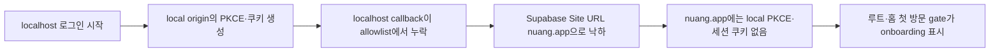
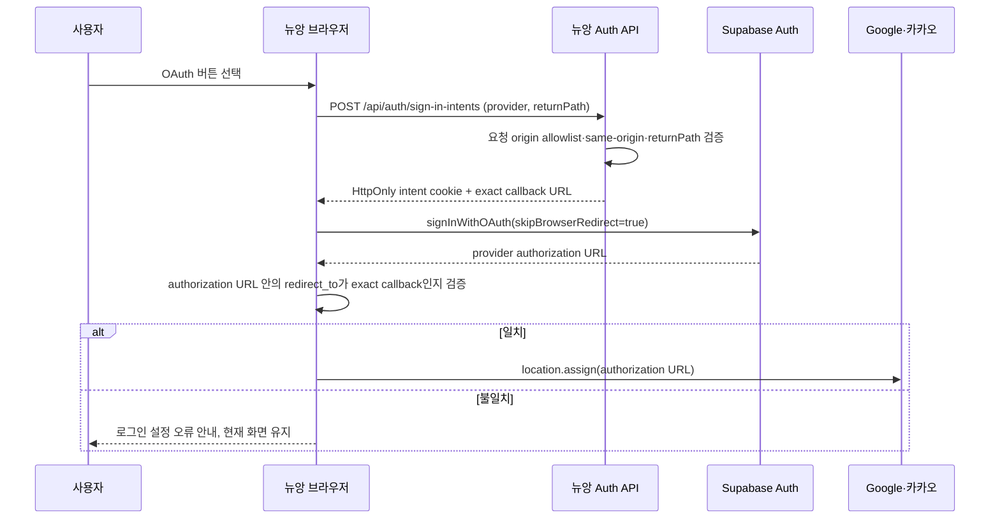
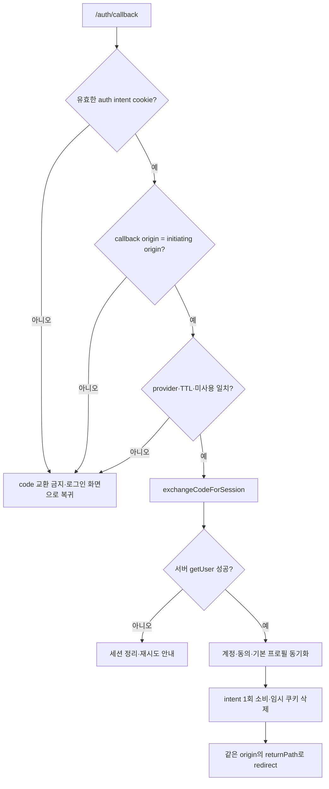

# 뉴앙 OAuth 출발 주소 보존·마이 화면 통합 기획서

> 문서 상태: 구현 기준선
> 작성일: 2026-08-03
> 적용 범위: Google·카카오 및 향후 OAuth 로그인, `/login`, `/auth/callback`, 세션 유지, `/onboarding`, `/my`, `/my/profile/edit`, 프로필·검사 전후 상태
> 관련 기준: `NUANG_MULTI_OAUTH_IDENTITY_LINKING_PRODUCT_SPEC.md`, `NUANG_CORE_ASSESSMENT_CROSS_DEVICE_JOURNEY_SPEC.md`, `NUANG_S00_FIRST_RUN_ONBOARDING_DESIGN_SPEC.md`, `NUANG_UX_GUARDRAILS.md`

---

## 1. 제품 결론

이번 개선은 두 기능을 따로 고치는 작업이 아니라 `로그인 시작 → 원래 서비스로 복귀 → 같은 마이 화면에서 활동 시작`까지를 하나의 여정으로 완성하는 작업이다.

1. OAuth 인증은 반드시 **로그인을 시작한 origin**으로 돌아온다.
   - `http://localhost:3000`에서 시작하면 `http://localhost:3000/auth/callback`으로 돌아온다.
   - `https://nuang.app`에서 시작하면 `https://nuang.app/auth/callback`으로 돌아온다.
   - 운영 Site URL은 허용되지 않은 callback의 대체 목적지가 아니며, 정상 흐름에서는 사용되지 않는다.
2. callback 이후에는 같은 origin 안에서 검증된 `next` 경로로 이동한다. 경로가 없거나 안전하지 않으면 `/my`를 사용한다.
3. 첫 로그인이라는 이유만으로 `/onboarding`을 강제로 열지 않는다. 온보딩은 앱 루트에서 처음 시작한 사람에게 서비스를 소개하는 흐름이며, 로그인 복귀 경로를 덮어쓰지 않는다.
4. OAuth 교환으로 만들어진 세션은 callback이 발생한 origin의 인증 쿠키에 저장하고, 직접 로그아웃하거나 보안상 폐기되기 전까지 최대 30일 동안 갱신하며 유지한다.
5. 로그인만 완료하고 코어 검사를 아직 하지 않은 사용자도 완성형 마이 화면을 본다. 검사 여부는 프로필 화면의 뼈대를 바꾸는 조건이 아니라, 성향 영역의 콘텐츠와 다음 행동만 바꾸는 조건이다.
6. 프로필 편집은 모든 로그인 사용자에게 `/my` 상단의 같은 위치에서 제공하고, 하나의 `/my/profile/edit` 화면·API·저장 계약을 사용한다.
7. 없는 코어 결과, 뉴앙 코드, 리포트는 임의로 채우지 않는다. 사용자 프로필과 커뮤니티 활동은 먼저 보여주고, 성향 영역에는 정확한 빈 상태와 검사 시작·이어하기를 제공한다.

---

## 2. 성공 기준

사용자는 다음 세 문장으로 경험을 설명할 수 있어야 한다.

- `로컬에서 로그인했더니 그대로 로컬의 보던 화면으로 돌아왔다.`
- `로그인한 뒤 새로고침하거나 다시 들어와도 로그인 상태가 유지됐다.`
- `아직 검사를 안 했어도 내 프로필과 게시물, 설정을 정상적으로 사용할 수 있었고 검사 후에도 화면 구조가 달라지지 않았다.`

제품 지표는 다음을 본다.

| 지표 | 정의 | 출시 경계 |
|---|---|---:|
| OAuth origin 일치율 | callback origin = 로그인 시작 origin | 100% |
| OAuth 목적 경로 복귀율 | 성공 callback 이후 검증된 `next` 도착 | 99.9% 이상 |
| 잘못된 Site URL 낙하 | localhost 시작 후 `nuang.app` 도착 또는 반대 | 0건 |
| 세션 복구 성공률 | 로그인 후 새로고침·재방문에서 사용자 복원 | 99.9% 이상 |
| 검사 전 마이 완성형 노출률 | 로그인+활성 프로필+코어 결과 없음 상태에서 공통 템플릿 사용 | 100% |
| 프로필 편집 경로 일치율 | 검사 전후 모두 `/my/profile/edit` | 100% |

분석 이벤트에는 OAuth code, access token, refresh token, 이메일, 전화번호, 검사 응답을 넣지 않는다.

---

## 3. 현재 구현 감사

### 3.1 상태표

| 영역 | 현재 구현 | 판정 | 발견한 결함 |
|---|---|---|---|
| 로그인 callback 생성 | `start-social-sign-in.ts`가 `window.location.origin`으로 `/auth/callback` 생성 | 방향은 맞음 | Supabase가 그 callback을 허용했는지 브라우저를 떠나기 전에 확인하지 않는다. Redirect allowlist가 빠지면 운영 Site URL로 낙하할 수 있다. |
| 복귀 경로 | callback URL query의 `next`를 사용 | 부분 구현 | 서명·서버 intent 없이 query만 신뢰하며 로그인 시작 origin과 결합되지 않았다. |
| callback 최종 origin | `request.nextUrl.origin`을 사용 | 부분 구현 | provider가 이미 잘못된 origin으로 보냈다면 원래 origin을 복구할 수 없다. PKCE verifier cookie도 원래 origin에 있어 세션 교환이 실패할 수 있다. |
| 외부 설정 문서 | 운영·로컬 callback을 모두 Supabase allowlist에 등록하도록 명시 | 문서만 존재 | 실제 실행 전 자동·수동 사전 점검 게이트가 없다. 현재 증상은 이 설정 불일치 가능성이 가장 높다. |
| 첫 방문 온보딩 | localStorage만 보고 `/home`을 `/onboarding`으로 전환 | 독립 기능으로는 정상 | 잘못된 운영 Site URL의 `/` 또는 `/home`에 떨어지면 본질적 OAuth 오류가 온보딩 화면으로 가려진다. |
| 세션 쿠키 | browser/server 공통 30일 `maxAge`, refresh proxy 존재 | 기반 구현 | 올바른 origin의 callback에서 code 교환이 끝나야만 유효하다. origin이 바뀌면 쿠키와 PKCE 상태가 분리된다. |
| 로그인 후 프로필 생성 | OAuth callback에서 `ensureCommunityProfile()` 실행 | 구현됨 | bootstrap 실패를 무시하고, `/my` 진입 시 일관된 복구 화면·재시도 정책이 없다. |
| 검사 완료 사용자의 `/my` | `CommunityProfileScreen mode="self"` 사용 | 완성형 | 직접 프로필 편집, 공유, 게시물·검사 결과 탭, 통계가 있다. |
| 검사 전 사용자의 `/my` | `MyOverview` 빈 상태로 fallback | 결함 | 이름·사용자 ID·소개·팔로워·게시물 탭·직접 프로필 편집이 사라지고 설정 중심의 다른 정보구조가 된다. |
| 검사 전 payload | `createServerCommunityProfilePayload()`가 활성 코드 snapshot을 필수로 요구 | 근본 원인 | 로그인 프로필은 존재해도 코어 결과가 없으면 payload 전체가 `null`이 된다. |
| 프로필 편집 화면 | `/api/me/profile`이 프로필을 보장하고 `ProfileEditForm` 하나를 사용 | 좋은 기반 | 진입 경로가 검사 전후 다르게 느껴진다. `code: null`은 이미 지원하므로 편집 화면을 분기할 기술적 이유가 없다. |

### 3.2 직접 확인한 주요 코드

- `src/features/auth/start-social-sign-in.ts`
  - 현재 창의 origin을 callback에 사용한다.
  - `signInWithOAuth()` 기본 redirect에 맡기므로 생성된 provider URL의 `redirect_to`가 의도와 일치하는지 검사할 기회가 없다.
- `src/app/auth/callback/route.ts`
  - code 교환 후 `request.nextUrl.origin + next`로 이동한다.
  - 로그인 시작 origin을 증명하는 별도 intent가 없다.
- `src/features/onboarding/EntryGate.tsx`
  - 기기 localStorage에 완료 기록이 없으면 `/onboarding`으로 이동한다.
- `src/lib/supabase/auth-session.ts`, `src/lib/supabase/proxy.ts`
  - 인증 쿠키 30일과 access token 갱신 기반은 구현돼 있다.
- `src/app/(tabs)/my/page.tsx`
  - 활성 공개 snapshot을 만들 수 있을 때만 완성형 `CommunityProfileScreen`을 사용한다.
- `src/features/feed/server-read.ts`
  - `createServerCommunityProfilePayload()`가 현재 뉴앙 코드가 있는 snapshot을 요구한다.
- `src/features/account/server-community-profile.ts`
  - 검사와 무관한 `community_profile` 생성·편집 기반은 이미 있다.
- `src/features/account/ProfileEditForm.tsx`
  - `code: null`, `profileName: null`을 받을 수 있어 검사 전 사용자도 같은 편집기를 사용할 수 있다.

### 3.3 현재 증상의 가장 유력한 원인

`localhost`가 만든 `redirectTo`가 Supabase Auth Redirect URLs에 허용되지 않았거나 실제 시작 URL에서 제거된 경우, Supabase는 Site URL인 `https://nuang.app`으로 돌아갈 수 있다. 이때 다음 문제가 연쇄적으로 발생한다.



따라서 `/onboarding` 자체가 원인이 아니라, 잘못된 origin 복귀를 사용자에게 보여주는 마지막 화면이다. 코드 방어와 외부 allowlist 수정을 함께 완료해야 한다.

---

## 4. OAuth 출발 origin 보존 계약

### 4.1 용어

- `initiatingOrigin`: 로그인 버튼을 누른 실제 문서의 `window.location.origin`
- `callbackOrigin`: OAuth provider가 `/auth/callback`을 호출한 요청 origin
- `returnPath`: 동일 origin 안에서 로그인 후 열 경로. pathname, search, hash 중 서버가 허용한 pathname·search만 저장한다.
- `authIntent`: provider, initiatingOrigin, returnPath, 생성 시각, 만료 시각, 1회용 nonce를 결합한 서버 검증 정보

### 4.2 허용 origin

| 환경 | 허용 origin | callback |
|---|---|---|
| 운영 | `https://nuang.app` | `https://nuang.app/auth/callback` |
| 로컬 기본 | `http://localhost:3000` | `http://localhost:3000/auth/callback` |
| 로컬 별칭 | 기본적으로 허용하지 않음 | `127.0.0.1`, 임의 LAN IP, 임의 포트는 별도 명시 전 차단 |
| Vercel Preview | 기본적으로 로그인 비활성 | 필요 시 정확한 preview origin만 한시적으로 allowlist 등록 |

와일드카드 production redirect는 사용하지 않는다. `*.vercel.app`, 임의 localhost 포트, `http://nuang.app`은 허용하지 않는다.

### 4.3 로그인 시작 흐름



#### 서버 sign-in intent

새 `POST /api/auth/sign-in-intents`는 다음을 수행한다.

1. `Origin`과 요청 URL origin이 같은지 확인한다.
2. origin이 배포 환경 allowlist에 있는지 확인한다.
3. provider가 활성 allowlist인지 확인한다.
4. `returnPath`를 path-only로 정규화한다.
5. 10분 TTL의 1회용 intent를 발급한다.
6. HttpOnly, SameSite=Lax, path=`/auth/callback`, 환경에 맞는 Secure cookie로 저장한다.
7. `callbackUrl = initiatingOrigin + /auth/callback`을 반환한다.

intent는 서버 서명 토큰 또는 DB+불투명 token으로 구현할 수 있다. 최소 필드는 다음과 같다.

```text
version
intentId / nonceHash
provider
initiatingOrigin
returnPath
createdAt
expiresAt
consumedAt
```

OAuth code, provider token, 이메일, 전화번호는 intent에 저장하지 않는다.

#### 브라우저 사전 검증

`signInWithOAuth()`는 `skipBrowserRedirect: true`로 호출한다. 반환된 authorization URL은 다음을 모두 통과할 때만 연다.

- URL origin이 현재 Supabase 프로젝트의 공식 Auth origin인가.
- query의 `redirect_to`를 디코딩한 origin이 `initiatingOrigin`과 같은가.
- pathname이 정확히 `/auth/callback`인가.
- `next`는 서버 intent와 같은 안전 경로인가.

불일치하면 외부로 이동하지 않는다. 사용자 문구는 다음과 같다.

- 제목: `로그인 연결을 확인하고 있어요`
- 본문: `현재 접속한 주소로 돌아오도록 설정을 확인한 뒤 다시 시도해 주세요.`
- 행동: `다시 시도`

내부 화면에 allowlist, origin, PKCE 같은 용어를 노출하지 않는다. 개발·운영 로그에는 민감값 없는 reason code만 남긴다.

### 4.4 callback 흐름



callback 수용 규칙:

- `callbackOrigin !== initiatingOrigin`이면 code를 교환하지 않는다.
- 유효한 intent가 없으면 query의 `next`만으로 성공 처리하지 않는다.
- 성공 목적지는 `new URL(returnPath, initiatingOrigin)`만 사용한다.
- 실패 목적지는 같은 origin의 `/login?next=...&auth=<reason>`이다. `/`로 보내지 않는다.
- `returnPath`에는 절대 URL, `//`, backslash, control character, 인증 callback 재귀 경로를 허용하지 않는다.
- hash는 서버에 전달되지 않으므로 복귀가 꼭 필요한 화면 상태는 안전한 query 또는 sessionStorage 복원 계약으로 저장한다.
- code와 intent는 한 번만 소비한다. 새로고침·중복 callback은 새 계정이나 중복 동의를 만들지 않는다.

### 4.5 `next`와 온보딩 우선순위

| 상황 | 최종 목적지 |
|---|---|
| `/login?next=/my`에서 로그인 성공 | 같은 origin의 `/my` |
| `/login?next=/my/profile/edit`에서 성공 | 같은 origin의 `/my/profile/edit` |
| 커뮤니티 행동 중 로그인 | 같은 origin의 검증된 원래 행동 경로 |
| `next` 누락·위험 | 같은 origin의 `/my` |
| OAuth 취소·실패 | 같은 origin의 `/login?next=...` |
| 앱 루트 `/` 첫 방문, 로그인 intent 없음 | 기존 온보딩 규칙 적용 |
| 명시적 로그인 복귀 | 온보딩이 `returnPath`를 덮어쓰지 않음 |

온보딩 완료 여부는 origin별 localStorage에 남으므로 localhost와 운영이 다를 수 있다. 이는 정상이다. 서로 다른 origin의 온보딩·인증 저장소를 공유하려고 cookie domain이나 URL token을 사용하지 않는다.

### 4.6 외부 설정 필수값

Supabase Auth URL Configuration:

- Site URL: `https://nuang.app`
- Redirect URLs:
  - `https://nuang.app/auth/callback`
  - `http://localhost:3000/auth/callback`
  - 계정 연결 기능을 운영·로컬에서 쓸 경우 각각 `/auth/link/callback`

Google·카카오 provider에는 Supabase가 안내하는 provider callback URL을 등록한다. 앱의 `/auth/callback`은 Supabase Redirect URLs에 등록하는 주소이며 두 종류를 혼동하지 않는다.

출시 전에는 로컬·운영 각각에서 Supabase authorize URL의 `redirect_to`를 캡처하고 exact callback인지 자동 검사한다. 설정이 어긋나면 기능을 열지 않는다.

---

## 5. 로그인 세션 유지 계약

### 5.1 사용자 약속

- 같은 브라우저·같은 origin에서는 로그아웃 전까지 최대 30일 동안 로그인 상태를 유지한다.
- access token이 만료돼도 유효한 refresh token이 있으면 화면 이동 전에 서버 proxy가 세션을 갱신한다.
- 보안 조치, 계정 삭제, refresh token 폐기, 사용자 로그아웃은 30일보다 우선한다.
- localhost와 nuang.app은 서로 다른 보안 origin이므로 세션을 공유하지 않는다. 각각 로그인하면 각각 유지된다.

### 5.2 구현 규칙

- browser/server/proxy가 같은 `supabaseAuthCookieOptions`를 사용한다.
- 쿠키 기본값: `maxAge=2,592,000`, `path=/`, `SameSite=Lax`, 운영 `Secure=true`.
- callback에서 `exchangeCodeForSession()` 이후 반드시 서버 `getUser()`로 세션을 확인한 뒤 성공 redirect한다.
- 갱신 응답은 `Cache-Control: private, no-store`를 유지한다.
- 로그아웃은 해당 origin의 Supabase 세션과 계정 소유 로컬 검사 캐시를 정리한다.
- 인증 쿠키를 `.nuang.app`과 localhost에 공용으로 만들지 않는다.
- 인증 token을 localStorage에 별도 복제하거나 URL query로 전달하지 않는다.

### 5.3 세션 상태별 UX

| 상태 | 사용자 화면 | 처리 |
|---|---|---|
| 유효 | 요청 화면 즉시 표시 | 백그라운드 갱신 |
| 갱신 중 | 기존 화면 또는 짧은 skeleton | 중복 OAuth 이동 금지 |
| 갱신 실패 | 로그인 필요 안내 | `next`를 보존한 로그인 이동 |
| OAuth 성공·프로필 bootstrap 실패 | 로그인은 유지, 마이에 복구 상태 표시 | 서버에서 프로필 생성 재시도 |
| account conflict·deleted·suspended | 일반 성공 처리 금지 | 기존 보안 상태 화면 사용 |

---

## 6. 마이 화면 통합 정보구조

### 6.1 핵심 원칙

`검사 결과 유무`는 마이 화면의 종류를 나누지 않는다. 로그인 사용자는 모두 하나의 `SelfProfileScreen`을 사용하고 다음 부분만 상태에 따라 바뀐다.

- 뉴앙 코드·성향 이름 표시 여부
- 성향 다음 행동: 시작, 이어하기, 리포트 보기, 정밀 검사
- 검사 결과 탭의 목록 또는 빈 상태

이름, 사용자 ID, 프로필 사진, 소개, 팔로워·팔로잉, 게시물, 프로필 편집, 설정은 코어 검사와 독립적이다.

### 6.2 공통 화면 구조

```text
상단바: 마이                                      설정

프로필 사진   표시 이름
              @사용자ID
              [코드·성향 이름 또는 첫 검사 전 상태]

소개 문장
게시물 N   팔로워 N   팔로잉 N

[프로필 편집] [프로필 공유]

[상태별 다음 행동 1개]

게시물 N | 검사 결과 N
--------------------------------
선택한 탭의 콘텐츠 또는 빈 상태
```

검사 전과 검사 후에 컴포넌트 위치, 탭, 헤더, 편집 경로, 여백, 로딩 skeleton이 달라지지 않아야 한다.

### 6.3 공통 템플릿 구성

권장 컴포넌트 경계:

| 컴포넌트 | 책임 | 상태 분기 허용 |
|---|---|---|
| `SelfProfileScreen` | 마이 전체 조립 | 인증·읽기 상태만 |
| `ProfileScreenHeader` | `마이`, 설정 | 없음 |
| `ProfileIdentityHero` | 사진, 이름, handle, bio, 코드 상태 | 코드 영역만 |
| `ProfileStats` | 게시물·팔로워·팔로잉 | 없음 |
| `SelfProfileActions` | 편집, 공유 | 공유 가능 상태만 |
| `AssessmentNextAction` | 시작·이어하기·결과 보기 | 검사 상태별 |
| `ProfileContentTabs` | 게시물·검사 결과 | count와 active tab만 |
| `ProfilePostCollection` | 내 게시물 | 필터 상태만 |
| `ProfileReportCollection` | 내 검사 결과 | 결과 목록·빈 상태만 |

현재 `CommunityProfileScreen`의 self-mode 표현을 재사용하되, public snapshot DTO를 self 화면의 필수 입력으로 삼지 않는다. 공개 프로필과 본인 마이는 개인정보·공개 범위가 다르므로 데이터 DTO는 분리하고 표현 컴포넌트만 공유한다.

### 6.4 Self profile read model

`SelfProfilePayload` 권장 구조:

```ts
type SelfProfilePayload = {
  profile: {
    publicId: string;
    displayName: string;
    handle: string;
    bio: string;
    image: PublicProfileImage;
  };
  trait: null | {
    code: string;
    profileName: string;
    source: "quick" | "full";
    completedAt: string;
  };
  assessmentJourney:
    | { state: "not_started" }
    | { state: "in_progress"; href: string; answered: number; total: number }
    | { state: "quick_completed"; reportHref: string; fullStartHref: string }
    | { state: "full_completed"; reportHref: string };
  stats: { posts: number; followers: number; following: number; reports: number };
  posts: FeedItem[];
  reports: OriginalProfileReportSummary[];
  capabilities: { canEdit: true; canShare: boolean; showAdminEntry: boolean };
};
```

데이터 정본:

- 계정·로그인: `identity.account`, `identity.auth_identity`
- 기본 프로필: `profile.community_profile`
- 프로필 사진: community profile avatar 또는 선택한 기본 캐릭터
- 성향 결과: 가장 최근 유효 코어 결과 selector
- 진행 중 검사: `assessment.account_assessment_progress`
- 게시물·관계·리포트 count: 서버 조회 결과
- 공개 snapshot: 타인에게 보여주는 데이터에만 필요하며 본인 마이 진입 조건으로 사용하지 않는다.

### 6.5 사용자 상태표

| 상태 | 프로필 hero | 성향 다음 행동 | 게시물 탭 | 검사 결과 탭 |
|---|---|---|---|---|
| 비로그인 | 축약 게스트 hero | `로그인 또는 가입` 또는 `첫 성향 검사 시작` | 기기 기준 허용 콘텐츠 | 기기 결과만, 계정 표현 금지 |
| 로그인·검사 전 | 실제 이름·ID·소개·사진, `첫 검사 전`, 공유 숨김 | `첫 성향 검사 시작하기` | 완성형 내 게시물 | `아직 완료한 검사 결과가 없어요` |
| 로그인·검사 진행 중 | 같은 hero | `{N}번부터 이어하기` | 동일 | 진행 상태 + 완료 결과 없음 |
| 빠른 코어 완료 | 코드·이름 표시 | `내 결과 보기`, 보조 `정밀 검사 시작` | 동일 | 빠른 결과 표시 |
| 정밀 코어 완료 | 최신 정밀 코드·이름 | `내 성향 상세 보기` | 동일 | 최신 결과 우선, 과거 결과 유지 |
| 프로필 bootstrap 복구 중 | 안정적인 skeleton | `다시 불러오기` | 임의 0건 확정 금지 | 임의 0건 확정 금지 |
| 데이터 일부 실패 | 불러온 프로필 유지 | 실패 영역만 재시도 | 독립 오류 상태 | 독립 오류 상태 |

### 6.6 프로필 편집 경로

- `/my` hero의 첫 번째 행동은 검사 전후 모두 `프로필 편집`이다.
- 목적지는 언제나 `/my/profile/edit`이다.
- 저장 성공 후 `/my`로 돌아와 같은 hero가 즉시 갱신된다.
- 설정 화면의 `프로필 편집` 중복 항목은 제거한다. 프로필 공개 범위는 설정에 유지한다.
- 연락처·로그인 방법·마케팅 수신은 프로필 편집에 섞지 않고 기존 `로그인 및 보안`, `알림 및 마케팅`에 유지한다.
- 코어 결과가 없으면 편집 화면의 읽기 전용 성향 영역은 `첫 검사를 완료하면 여기에 뉴앙 코드가 표시돼요`로 표현한다. 가짜 코드 `-----`는 본인 화면에 노출하지 않는다.

### 6.7 프로필 공유

이번 릴리스에서는 코어 결과가 생기기 전 프로필 공유를 제한한다. 현재 공개 프로필 계약은 검증된 공개 snapshot과 성향 공개 범위를 전제로 하므로, 기본 프로필만 별도 규칙으로 공개하는 범위를 섞지 않는다.

- 코어 결과와 유효한 공개 snapshot이 없으면 `프로필 공유` 버튼을 렌더링하지 않는다. 비활성 버튼으로 자리를 차지하지 않는다.
- 이때 `프로필 편집`은 한 칸 전체 너비 또는 안정적인 단일 버튼 폭을 사용하고, 아래의 첫 검사 CTA가 다음 행동을 담당한다.
- 코어 결과와 공개 snapshot이 준비되면 같은 action row에 `프로필 공유`가 나타난다.
- snapshot 생성 중·실패 상태는 공유 가능으로 간주하지 않는다.
- 향후 기본 프로필 공유를 출시하려면 이름·handle·bio·사진·게시물의 별도 공개 범위, 차단, 신고, 검색 노출, 삭제 전파 계약을 먼저 승인한다.
- 공유 버튼 유무와 관계없이 본인 `/my`의 header, hero, 통계, 탭과 프로필 편집 위치는 동일해야 한다.

---

## 7. 화면 카피

### 7.1 검사 전 hero

- 상태: `첫 검사 전`
- 소개가 없을 때: `나를 소개하는 한마디를 프로필에 남겨보세요.`
- 다음 행동 제목: `첫 성향 검사로 내 뉴앙 코드를 만나보세요`
- 주 행동: `첫 성향 검사 시작하기`
- 진행 중 주 행동: `{N}번부터 이어하기`

### 7.2 검사 결과 빈 상태

- 제목: `아직 완료한 검사 결과가 없어요`
- 설명: 별도의 긴 설명은 두지 않는다.
- 행동: `첫 검사 시작하기`

### 7.3 로그인 복귀 오류

| reason code | 사용자 문구 | 행동 |
|---|---|---|
| `origin_mismatch` | `로그인을 시작한 주소로 돌아오지 못했어요.` | `현재 주소에서 다시 로그인` |
| `intent_expired` | `로그인 시간이 지나 다시 확인이 필요해요.` | `다시 로그인` |
| `missing_code` | `로그인을 마치지 못했어요.` | `다시 시도` |
| `session_error` | `로그인 정보를 저장하지 못했어요.` | `다시 시도` |
| `identity_conflict` | 기존 계정 충돌 안전 문구 유지 | 계정 확인 흐름 |

오류 화면에서도 `localhost`, `production`, `callback`, `origin`, `PKCE` 같은 내부 용어를 사용자에게 보여주지 않는다.

---

## 8. UI·디자인 기준

1. 검사 전후 모두 `CommunityProfileScreen` self-mode의 익숙한 SNS 리듬을 기준으로 한다.
2. 헤더, hero, 통계, 행동, 탭의 수직 위치와 높이는 상태 전환으로 움직이지 않게 한다.
3. 코드가 없는 자리는 큰 빈 카드로 채우지 않는다. 이름·handle 아래 한 줄 상태로 정리한다.
4. 프로필 편집과 공유는 44px 이상의 동등한 버튼으로 두되, 현재 주요 성장 행동인 검사는 별도 한 줄 CTA로 구분한다.
5. 카드 안의 카드, 과한 gradient·glow, 아이콘 컬러 상자 반복을 만들지 않는다.
6. 320·360·390·430·520px에서 검증하고 한글은 `word-break: keep-all`을 사용한다.
7. 로그인·프로필 loading은 최종 레이아웃과 같은 skeleton을 사용해 레이아웃 이동을 줄인다.
8. 서버가 이미 아는 로그인 상태를 브라우저에서 다시 확인하는 동안 게스트 화면을 먼저 보여주지 않는다.

---

## 9. 접근성

- 상단 화면 제목 `마이`는 하나의 `h1`이어야 한다.
- 프로필 편집·설정·공유 버튼은 아이콘만 있어도 명확한 접근성 이름을 가진다.
- 게시물·검사 결과 탭은 `tablist`, `tab`, `tabpanel` 또는 동등한 키보드·상태 계약을 사용한다.
- 현재 탭은 색뿐 아니라 `aria-selected`로 전달한다.
- 검사 이어하기 진행 정보는 `20개 중 7개 답변 완료, 8번부터 이어서 진행`처럼 전체 의미를 읽는다.
- 로딩은 `aria-busy`, 복구 완료는 `aria-live=polite`, 세션 소실은 필요할 때만 assertive로 알린다.
- 터치 영역은 최소 44×44px, 본문은 16px 이상, 보조 라벨은 14px 이상을 기본으로 한다.
- 200% 확대에서 이름·handle·버튼이 겹치지 않고 버튼 문구는 필요하면 줄바꿈한다.
- `prefers-reduced-motion`에서 skeleton 외의 반복 애니메이션과 탭 이동 효과를 제거한다.

---

## 10. 라우팅·보안 가드레일

1. callback origin은 사용자 query로 지정하지 않는다.
2. 운영 환경에서 `x-forwarded-host`를 무조건 신뢰하지 않는다. 플랫폼이 정규화한 request URL과 서버 allowlist를 함께 확인한다.
3. `next`는 path-only이며 외부 URL, protocol-relative URL, 역슬래시 우회, control character를 차단한다.
4. `/auth/callback`, `/auth/link/callback`, `/api/*`를 일반 `next` 목적지로 허용하지 않는다.
5. intent cookie는 HttpOnly·SameSite=Lax·짧은 TTL·callback path 제한·1회 소비를 사용한다.
6. OAuth authorization URL이 예상 Supabase Auth origin이 아니면 이동하지 않는다.
7. callback 실패 시 code·token·provider 원문 응답을 로그에 남기지 않는다.
8. origin mismatch를 운영 Site URL redirect로 자동 보정하지 않는다. 공격자가 만든 cross-origin 흐름을 성공시키지 않고 현재 origin에서 다시 시작하게 한다.
9. 로그인 성공과 계정·프로필 bootstrap을 구분한다. 비핵심 프로필 생성 실패가 세션을 지우지는 않지만, 완성형 마이에서 명확한 복구 상태를 제공한다.
10. 본인 마이 payload에는 비공개 연락처·원 검사 응답·raw score를 포함하지 않는다.

---

## 11. 위험 기반 테스트 계획

### 11.1 P0 OAuth origin·세션

| 테스트 | 기대 결과 |
|---|---|
| localhost에서 Google 로그인 시작 | authorization URL의 `redirect_to`가 `http://localhost:3000/auth/callback` |
| localhost에서 카카오 로그인 시작 | 동일 |
| nuang.app에서 Google·카카오 로그인 시작 | `redirect_to`가 `https://nuang.app/auth/callback` |
| localhost callback을 Supabase allowlist에서 임시 제거한 사전 점검 | 외부 이동 전 설정 불일치를 감지하거나 출시 smoke gate가 실패, nuang.app 낙하 없음 |
| callback request origin과 intent origin 불일치 | code 교환·계정 write 없음 |
| 유효 intent 없이 callback | 성공 처리 없음, 같은 origin 로그인 재시도 |
| `next=https://evil.example`, `//evil`, `\\evil` | `/my` fallback |
| 동일 code·intent 두 번 호출 | 첫 요청만 성공, 계정·동의 중복 없음 |
| OAuth 취소 | 같은 origin·보존된 `next`의 로그인 화면 |
| callback 성공 후 새로고침 | 로그인 사용자 유지 |
| access token 만료 후 페이지 이동 | proxy refresh 후 사용자 유지 |
| 명시적 로그아웃 | 세션·계정 소유 기기 cache 정리, 보호 API 401 |
| localhost 로그인 후 nuang.app 방문 | 운영 세션으로 오인하지 않음 |

### 11.2 P0 마이 통합

| 테스트 | 기대 결과 |
|---|---|
| 로그인·community profile 있음·코어 결과 없음 | 완성형 self profile 화면, 실제 이름·handle·편집 버튼·두 탭 표시 |
| 로그인·프로필 행 없음 | 서버가 idempotent 생성 후 같은 화면 또는 복구 상태 |
| 프로필 생성 동시 요청 | profile 한 행만 생성 |
| 검사 전 프로필 편집 | `/my/profile/edit`의 같은 form 사용, 저장 후 `/my` 반영 |
| 빠른 코어 완료 직후 `/my` | 화면 뼈대 유지, 코드와 다음 행동만 변경 |
| 정밀 코어 완료 직후 `/my` | 최신 유효 정밀 결과 표시, 과거 리포트 유지 |
| 진행 중 검사 있음 | 정확한 `N번부터 이어하기` CTA |
| 게시물 0·리포트 0 | 각각 자기 탭의 빈 상태, 전체 화면 fallback 없음 |
| 프로필 API만 실패 | 로그인·검사 상태를 게스트로 오인하지 않음, 재시도 제공 |
| 다른 계정으로 전환 | 이전 계정 프로필·진행·결과가 보이지 않음 |

### 11.3 시각·접근성

- 320·360·390·430·520px screenshot 비교
- iOS Safari와 Android Chrome에서 sticky header, safe-area, bottom nav 중첩 확인
- 200% 확대, 긴 표시 이름 20자, 긴 handle 24자, bio 120자
- 키보드로 설정 → 편집 → 저장 → 탭 전환 가능
- VoiceOver/TalkBack에서 hero, 통계, 탭, 빈 상태 읽기 순서 확인
- reduced-motion에서 레이아웃과 기능 동일

---

## 12. 구현 순서와 점검 게이트

### Gate A — OAuth 설정·계약

- [ ] Supabase Site URL을 `https://nuang.app`으로 확인
- [ ] 운영·localhost `/auth/callback` exact Redirect URL 등록
- [ ] 계정 연결을 쓸 경우 운영·localhost `/auth/link/callback` 등록
- [ ] 허용 origin과 안전 return path 공통 모듈 구현
- [ ] sign-in intent Route Handler·cookie·TTL·1회 소비 구현
- [ ] 시작 URL `redirect_to` 사전 검증 구현
- [ ] localhost·운영 authorize URL contract test

**게이트 통과 조건:** 두 환경 모두 브라우저를 떠나기 전 callback origin이 정확하며, 일부러 잘못된 값을 주면 로그인 이동이 차단된다.

### Gate B — callback·세션

- [ ] callback에서 intent·origin·provider·TTL 검증 후 code 교환
- [ ] `next` query 대신 intent의 `returnPath`를 정본으로 사용
- [ ] 모든 실패를 같은 origin 로그인 화면으로 복구
- [ ] 첫 로그인도 `/onboarding`이 `returnPath`를 덮지 않도록 라우팅 테스트
- [ ] 기존 30일 cookie와 proxy refresh 회귀 테스트
- [ ] 로그인·동의·계정 resolver 멱등성 확인

**게이트 통과 조건:** localhost·운영의 Google·카카오 실제 로그인 4개 조합이 같은 origin·의도 경로로 돌아오고 새로고침 후 세션이 유지된다.

### Gate C — Self profile read model

- [ ] 공개 snapshot 없이 `community_profile`만으로 `SelfProfilePayload` 생성
- [ ] 최근 유효 코어 결과와 진행 상태를 선택적으로 결합
- [ ] posts·relations·reports를 독립적으로 조회
- [ ] 인증 사용자에게 guest `MyOverview`를 fallback으로 노출하지 않음
- [ ] bootstrap 실패와 일부 데이터 실패 상태 분리

**게이트 통과 조건:** 코어 결과가 없는 로그인 fixture가 실제 이름·handle·통계를 가진 공통 마이 payload를 받는다.

### Gate D — 공통 마이 UI

- [ ] 공통 header·hero·stats·actions·tabs 추출
- [ ] 검사 전후 모두 같은 `SelfProfileScreen` 사용
- [ ] `/my` hero에 항상 `프로필 편집` 제공
- [ ] 설정의 중복 프로필 편집 항목 제거
- [ ] 상태별 검사 CTA와 정확한 빈 상태 구현
- [ ] 검사 전 basic profile 공유 지원 또는 버튼 자연스럽게 숨김
- [ ] 모바일·긴 텍스트·접근성 시각 점검

**게이트 통과 조건:** 검사 전 fixture와 검사 완료 fixture의 screenshot에서 같은 정보구조를 유지하고 코드·CTA 콘텐츠만 달라진다.

### Gate E — 회귀·운영 관측

- [ ] auth callback, intent API, session proxy 단위·통합 테스트
- [ ] `/my` 상태 matrix component·server test
- [ ] 프로필 편집 GET/PATCH 회귀 테스트
- [ ] 실제 Google·카카오 E2E smoke
- [ ] origin mismatch·intent expired reason count 운영 지표
- [ ] typecheck, lint, 관련 test, build 통과
- [ ] 문서와 최종 구현 대조표 갱신

**게이트 통과 조건:** P0 수용 기준 전부 통과하고 잘못된 origin 복귀가 0건이며, 검사 전후 UI가 한 템플릿으로 증명된다.

---

## 13. 최종 수용 기준

1. `http://localhost:3000/login?next=/my`에서 Google 또는 카카오 로그인을 시작하면 localhost callback과 localhost `/my`로 돌아온다.
2. `https://nuang.app/login?next=/my`에서 시작하면 nuang.app callback과 nuang.app `/my`로 돌아온다.
3. 두 환경 중 한쪽 callback 설정이 빠지면 다른 origin이나 Site URL로 보내지 않고 로그인 시작 단계 또는 smoke gate에서 실패한다.
4. 로그인 callback은 유효한 origin-bound intent가 없으면 code를 교환하지 않는다.
5. 외부·위험 `next`는 실행되지 않고 같은 origin `/my`로 안전하게 복구한다.
6. 첫 로그인이라도 명시적 `/my` 복귀가 `/onboarding`으로 바뀌지 않는다.
7. 로그인 성공 후 새로고침·탭 닫기·재방문에서 최대 30일 세션이 유지되며 로그아웃 시 즉시 종료된다.
8. 로그인했지만 코어 결과가 없는 사용자는 검사 완료 사용자와 같은 마이 header, 프로필 hero, 통계, 행동, 게시물·검사 결과 탭을 본다.
9. 검사 전후 프로필 편집은 같은 위치의 같은 버튼과 `/my/profile/edit` 화면을 사용한다.
10. 검사 전 사용자의 실제 이름·handle·bio·프로필 사진·게시물·관계 데이터는 숨겨지지 않는다.
11. 없는 뉴앙 코드·성향 이름·리포트는 가짜 값으로 채우지 않고 정확한 빈 상태로 표시한다.
12. 진행 중 검사, 빠른 완료, 정밀 완료에 맞는 다음 행동이 정확한 저장 지점·리포트로 연결된다.
13. 프로필·게시물·리포트 일부 조회 실패가 전체 마이를 게스트 화면으로 바꾸지 않는다.
14. 320~520px, 200% 확대, 화면 읽기 도구, 키보드, reduced-motion에서 핵심 과업을 완료할 수 있다.
15. OAuth code·token·인증 식별자·원 검사 응답이 URL, 로그, 분석 이벤트, self profile payload에 노출되지 않는다.

---

## 14. 구현 중 기획 대조표

개발자는 각 Gate 종료 시 아래 표를 갱신한다. `부분 완료`는 출시 완료로 계산하지 않는다.

| 항목 | 기획 기준 | 구현 파일 | 테스트 | 상태 |
|---|---|---|---|---|
| origin-bound sign-in intent | 4.3 | `sign-in-intent-contract.ts`, `sign-in-intent-security.ts`, `/api/auth/sign-in-intents` | route·서명·origin 테스트 | 완료 |
| authorize URL 사전 검증 | 4.3 | `start-social-sign-in.ts` | 운영·localhost × Google·카카오 계약 테스트 | 완료 |
| callback origin·intent 검증 | 4.4 | `/auth/callback/route.ts` | origin mismatch·누락·만료·재사용·충돌 테스트 | 완료 |
| 30일 세션 회귀 | 5 | `auth-session.ts`, `proxy.ts` | 30일 cookie·proxy refresh 회귀 | 완료 |
| SelfProfilePayload | 6.4 | `self-profile-contract.ts`, `server-self-profile.ts` | 검사 전·부분 실패·진행·완료 서버/계약 테스트 | 완료 |
| 공통 마이 템플릿 | 6.2~6.3 | `SelfProfileScreen.tsx`, `ProfileIdentitySurface.tsx`, `/my/page.tsx` | 검사 전후 동일 셸·탭·공유 경계 컴포넌트 테스트 | 완료 |
| 프로필 편집 단일 경로 | 6.6 | `SelfProfileScreen.tsx`, `/my/profile/edit`, `/my/settings/page.tsx` | 검사 전후 직접 편집 링크·설정 중복 제거 검사 | 완료 |
| 검사 상태별 CTA | 6.5 | `self-profile-contract.ts`, `SelfProfileScreen.tsx` | 미시작·진행·빠른 완료·정밀 완료·동기화 경계 테스트 | 완료 |
| 접근성·모바일 QA | 8~9 | `SelfProfileScreen.module.css`, `ProfileIdentitySurface.module.css` | tab keyboard·ARIA progress·320/390 반응형 구조·로그인/게스트 실브라우저 회귀 | 완료 |

---

## 15. 범위 밖 후속 작업

- localhost와 nuang.app 사이의 세션 공유: 보안 origin이 다르므로 의도적으로 하지 않는다.
- 임의 Vercel preview URL 전체 허용: wildcard 공격면 때문에 하지 않는다.
- OAuth provider token 장기 저장: 필요 없으며 하지 않는다.
- 프로필 편집에 이메일·전화·마케팅 설정 재통합: 기존 계정·보안 분리 원칙을 유지한다.
- 코어 결과가 없는 사용자에게 임의 코드·성향 이름 생성: 하지 않는다.
- 여러 기기 동시 검사 충돌의 고급 사용자 선택 UI: 기존 기기 간 검사 명세의 후속 범위로 유지한다.

이번 릴리스의 완료 정의는 `OAuth가 제자리로 돌아오는 것`과 `검사 전 사용자도 정상 마이 사용자로 보이는 것`을 실제 환경·실제 계정으로 함께 증명하는 것이다.
