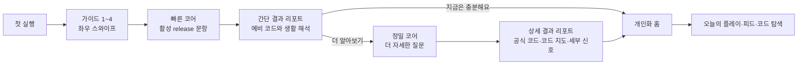

# NUANG S00O First-run Onboarding Design Specification

작성일: 2026-07-17 KST  
상태: 여정 v2 확정, G01~G04 이미지 승인, 스와이프 시뮬레이션 v1 검토  
기준: `NUANG_APP_FUNCTIONAL_REQUIREMENTS.md`, `NUANG_UI_UX_MASTER_DESIGN_BLUEPRINT.md`

## 1. 변경 결정

첫 방문자는 홈으로 바로 진입하지 않는다. 앱 루트에서 시작한 첫 방문자에게만 짧은 좌우 스와이프 가이드를 보여주고, 마지막 가이드에서 빠른 코어 검사를 시작하게 한다.

이 결정은 로그인 벽을 만들지 않는다. 가이드의 목적은 기능을 나열하는 것이 아니라 다음 네 가지를 20초 안에 이해시키는 것이다.

1. 뉴앙은 간단한 질문을 통해 나의 성향과 특징을 알아보는 서비스다.
2. 첫 결과는 기억하기 쉬운 뉴앙 코드와 생활 장면으로 제공된다.
3. 결과 뒤에는 다른 사람의 생각과 선택을 살펴보는 성향 커뮤니티가 열린다.
4. 빠른 코어는 무료이고 로그인 없이 약 3분 안에 시작할 수 있다.

## 2. 첫 가치 여정

### 2.1 진입 예외

- 공유 주소, 공개 리포트, 도움 연결처럼 사용자가 특정 목적의 주소로 들어온 경우 가이드가 해당 목적을 가로막지 않는다.
- 진행 중 검사를 가진 사용자는 가이드 대신 이어하기로 복구한다.
- `onboarding_seen_version`이 현재 버전과 같으면 재방문 시 홈으로 바로 이동한다.
- 사용자는 나중에 `마이 > 뉴앙 가이드 다시 보기`에서 다시 열 수 있다.

## 3. 온보딩 캐러셀 구조

온보딩은 총 네 장으로 제한한다. 각 장은 하나의 주장, 하나의 캐릭터 행동, 하나의 다음 행동만 가진다.

| 화면 | 사용자가 이해할 한 문장                                                  | 제목                                                        | 이미지 장면                                                                   | 상태                                                  |
| ---- | ------------------------------------------------------------------------ | ----------------------------------------------------------- | ----------------------------------------------------------------------------- | ----------------------------------------------------- |
| G01  | 나와 서로의 성향을 이해하는 서비스다                                     | `나를 이해하고, 서로를 이해하는 성향 놀이터`                | 캐릭터가 설문 카드와 정돈된 성향 결과 보드를 설명                             | 이미지 v3 승인·앱 셸 v4 검토                          |
| G02  | 여러 검사 결과가 쌓이면 5글자 뉴앙 코드와 더 자세한 성향 안내로 종합된다 | `내 성향을 5글자 뉴앙 코드로 확인해요`                      | 캐릭터가 여러 검사 결과 카드를 5글자 코드와 상세 성향 보드로 종합             | 이미지 v1 승인·legacy 코드 표기는 최종 asset에서 교체 |
| G03  | 원하는 상대와 성향을 비교해 공통점과 차이점을 이해하고 관계를 발전시킨다 | `원하는 사람들과 성향을 비교하고 더 좋은 관계를 만들어가요` | 캐릭터가 가족·친구·연인 타일에서 원하는 상대를 선택하고 관계 비교 보드를 설명 | 이미지 v1 승인                                        |
| G04  | 로그인 없이 3분 빠른 코어 검사를 진행하고 첫 성향 결과를 확인한다        | `3분 빠른 코어 검사로 시작해요`                             | 캐릭터가 `3:00` 타이머와 질문→답변→첫 결과 흐름을 안내                        | 이미지 v1 승인                                        |

G04가 승인되면 네 장의 이미지와 앱 셸 v4를 결합해 실제 좌우 스와이프 캐러셀을 구현한다.

최종 앱 asset에서는 legacy 예시 코드와 검증 전 문항 수를 사용하지 않는다. 3분 약속은 최종 빠른 코어 문항 수와 사용성 테스트의 실제 완료시간이 뒷받침할 때 유지하고, 그렇지 않으면 쉬운 시간 안내로 교체한다.

## 4. G01 화면 명세

### 4.1 화면 목표

사용자는 5초 안에 `질문에 답하면 나를 이해할 수 있다`고 말할 수 있어야 한다. 검사 길이, 코드, 커뮤니티를 한 화면에 설명하지 않는다.

### 4.2 정보 계층

1. 상단 좌측: `NUANG`
2. 상단 우측: `건너뛰기`
3. 좌우 스와이프 이미지: 브랜드, 제목, 설명, 메인 캐릭터 장면을 한 이미지에 통합
4. 이미지 내 제목: `나를 이해하고, 서로를 이해하는 성향 놀이터`
5. 이미지 내 설명: `간단한 질문에 답하면 나의 성향과 특징을 쉽게 확인할 수 있어요`
6. 진행 표시: 네 장 중 첫 번째
7. 주 행동: `다음`

### 4.3 이미지 의미

- 설문 카드: 몇 가지 질문에 답하는 짧은 과정
- 선택된 답: 복잡한 입력이 아닌 쉬운 선택 방식
- 성향 결과 보드: 답변이 나의 특징을 이해하기 쉬운 결과로 바뀐다는 의미
- 세 가지 색 막대: 우열 점수가 아니라 서로 다른 특징을 시각적으로 구분
- 캐릭터의 설명 동작: 앱이 사용자를 평가하는 것이 아니라 결과 이해를 돕는다는 의미

브랜드, 제목, 설명은 이미지 안에 직접 포함한다. 이미지 밖에는 같은 문구를 반복하지 않고 화면 읽기 도구를 위한 숨김 제목과 alt만 제공한다.

### 4.4 시각 기준

- 기존 보라색 뉴앙 캐릭터의 얼굴, 불꽃 모양 머리, 둥근 비율, 부드러운 3D 재질을 유지한다.
- 배경은 따뜻한 ivory와 옅은 lavender를 사용한다.
- 텍스트 영역과 캐릭터 영역을 명확히 나눈 편집 디자인 grid를 사용한다.
- 캐릭터, 설문 카드, 결과 보드는 같은 카메라 시점·모서리 반경·그림자 방향을 가진다.
- 무작위 floating object, orbit line, glow, 과한 blur를 사용하지 않는다.
- 2030 사용자가 유아용 캐릭터 광고로 느끼지 않도록 표정과 소품을 절제한다.
- 360px, 390px, 430px에서 이미지 전체가 잘리지 않고 한 장으로 보여야 한다.

### 4.5 실제 앱 셸 v4

이전 시안의 `화면 폭` 선택기, 회색 카드 외곽, 독립 상단바, 검은색 기본 버튼은 실제 앱 UI가 아니라 검토용 뷰어 요소였다. 실제 제품에서는 제거한다.

- 앱 화면은 카드 안에 올리지 않고 가이드 이미지를 전체 캔버스로 사용한다.
- `건너뛰기`는 별도 상단바 대신 이미지 안의 상단 안전 영역에 반투명 행동으로 배치한다.
- 진행 표시와 주 행동은 이미지 하단의 여백 영역 안에 통합해 이미지와 UI가 하나의 화면으로 보이게 한다.
- `다음`은 뉴앙 캐릭터와 같은 보라색 계열의 52px 버튼으로 표현하고, 라벨과 오른쪽 화살표만 사용한다.
- 4개의 진행 표시는 작은 dot 모음 대신 얘은 수평 segment로 표현해 이미지의 편집 그리드와 맞춘다.
- 시작 가이드에서는 하단 탭바, 핸드폰 mockup 테두리, 중첩 카드, 복수의 배지를 두지 않는다.
- 화면 폭 선택기는 개발·QA 환경에서만 사용하고 제품 UI와 배포 시안에는 포함하지 않는다.

## 5. 캐러셀 상호작용

### 5.1 이동

- 좌우 드래그와 터치 스와이프를 기본으로 한다.
- 키보드 좌우 화살표, 화면의 `이전`·`다음` 행동으로 같은 기능을 제공한다.
- 한 번의 스와이프로 한 장만 이동하는 scroll snap을 사용한다.
- 마지막 장의 `다음`은 `빠른 코어 시작`으로 바뀐다.

### 5.2 건너뛰기

- `건너뛰기`는 홈으로 보내지 않고 G04로 이동한다.
- 사용자는 빠른 코어의 시간, 문항 수, 무료·비로그인 조건을 확인한 뒤 시작한다.
- G04에서는 `빠른 코어 시작` 외에 낮은 위계의 `홈 먼저 둘러보기`를 둘 수 있다. 이는 사용자 자율성을 위한 탈출구이며 시작 버튼과 시각적으로 경쟁하지 않는다.

### 5.3 진행 상태

- 전체 4장을 같은 길이의 수평 segment로 표현하고, 현재 장만 뉴앙 보라색으로 채운다.
- 진행 표시에는 `총 4개 중 N번째 가이드` 접근성 이름을 제공한다.
- 자동 재생, 시간 제한, 반복 애니메이션은 사용하지 않는다.

### 5.4 모션

- 장 전환은 180~220ms의 짧은 수평 이동을 사용한다.
- 캐릭터는 최초 진입 때 한 번만 160ms 이내로 자리 잡는다.
- `prefers-reduced-motion`에서는 모든 이동을 즉시 전환한다.

## 6. 검사와 결과에서 홈으로 돌아오는 UX

### 6.1 빠른 코어 진행 중

- 상단 닫기 행동을 누르면 `여기까지 저장했어요` sheet를 보여준다.
- `검사 계속하기`와 `홈으로 돌아가기`를 제공한다.
- 홈으로 돌아가도 진행 위치는 이 기기에서 7일 동안 유지한다.

### 6.2 빠른 코어 완료

결과 리포트를 건너뛰고 홈으로 자동 이동하지 않는다. 사용자가 최소한 코드 이름과 첫 생활 해석을 본 뒤 다음을 선택한다.

- primary: `정밀 검사로 더 알아보기`
- secondary: `홈으로 돌아가기`
- 보조 문구: `빠른 결과는 지금의 모습을 가볍게 살펴보는 예비 코드예요.`

정밀 검사를 선택해도 빠른 결과를 틀린 결과처럼 표현하지 않는다.

### 6.3 정밀 코어 완료

상세 결과 리포트의 마지막 구간에서 다음을 제공한다.

- primary: `홈에서 내 성향 더 보기`
- secondary: `코드 지도 둘러보기`

상단 닫기 행동은 항상 홈으로 돌아간다. 뒤로가기는 다시 제출하거나 채점 화면으로 복귀하지 않고 최근 완성 결과를 유지한다.

## 7. 검사 이후 홈 v2

홈은 기능 메뉴판이 아니라 `내 결과를 놀이와 커뮤니티로 이어주는 개인화 허브`가 된다. 카드는 읽는 순서와 행동의 크기를 다르게 해 반복 카드 그리드처럼 보이지 않게 한다.

### 7.1 카드 계층

1. **내 성향 한눈에**: 최근 코드, 코드 이름, 오늘 다시 읽을 실제 모습 한 문장
2. **오늘의 성향 게임**: 오늘의 질문 또는 밸런스 게임 하나만 크게 노출
3. **코드별 선택 공개**: 투표 후 익명 코드별 차이를 reveal하는 게임형 카드
4. **뉴앙 조각**: 검사·질문·탐색을 통해 모은 시각 조각으로 나만의 작은 성향 장면을 완성
5. **지금 인기 있는 대화**: 공격성·민감도 필터를 통과한 피드 2~3개 preview
6. **이번 주 코드 탐험**: 내 코드와 닮거나 다른 코드 하나를 생활 장면 중심으로 소개

### 7.2 게임화 원칙

- 순위, 승패, 능력 점수, 사용자 간 leaderboard를 만들지 않는다.
- 연속 접속을 깨뜨렸다고 손해를 주거나 죄책감을 유도하지 않는다.
- 보상은 우월감이 아니라 새로운 해석, 캐릭터 장면, 익명 통계 reveal이다.
- 투표 결과는 표본 수를 함께 보여주고 개인이나 소수 코드를 추정할 수 없게 한다.
- 카드마다 primary action은 하나만 둔다.

### 7.3 새 기능 후보

| 기능                  | 만족 가치                    | 우선순위 | 구현 전 필요한 계약                    |
| --------------------- | ---------------------------- | -------- | -------------------------------------- |
| 오늘의 성향 게임 편성 | 매일 다른 이유로 홈 재방문   | P0       | 질문·투표 seed와 read model            |
| 결과 기반 홈 추천     | 다음 행동을 즉시 이해        | P0       | 로컬/계정 결과 통합 상태 selector      |
| 코드별 익명 reveal    | 커뮤니티 호기심과 재미       | P0       | 최소 표본, snapshot, 개인정보 차단     |
| 뉴앙 조각 컬렉션      | 비경쟁형 성취와 캐릭터 애착  | P1       | 획득 규칙, 중복 방지, 접근성 대체 표현 |
| 주간 코드 탐험        | 코드 세계 체류와 결과 재해석 | P1       | 32코드 콘텐츠 편성 계약                |

## 8. 저장과 데이터

온보딩에서 새로 필요한 로컬 상태:

- `onboarding_seen_version`: 완료하거나 G04에서 홈을 선택한 가이드 버전
- `onboarding_last_page`: 앱이 비정상 종료된 경우 복구할 장 번호
- `onboarding_started_at`, `onboarding_completed_at`: 식별 정보가 없는 퍼널 시각

가이드에는 문항 응답, 원점수, 계정 식별 정보가 없다. 분석 이벤트에도 이메일, provider, 직접 응답을 포함하지 않는다.

## 9. 측정 이벤트

| 이벤트                           | 시점                  | 속성                         |
| -------------------------------- | --------------------- | ---------------------------- |
| `onboarding_started`             | 첫 장 표시            | guide_version, entry_context |
| `onboarding_page_viewed`         | 장이 50% 이상 보임    | page_index, direction        |
| `onboarding_skipped`             | 건너뛰기 선택         | from_page                    |
| `onboarding_completed`           | G04 도달              | elapsed_bucket               |
| `onboarding_quick_core_clicked`  | 검사 시작             | entry_method                 |
| `quick_result_home_clicked`      | 빠른 결과에서 홈 선택 | report_read_depth            |
| `quick_result_full_core_clicked` | 정밀 코어 선택        | report_read_depth            |
| `full_result_home_clicked`       | 정밀 결과에서 홈 선택 | report_read_depth            |

## 10. 접근성

- 가이드 제목은 각 장의 `h1` 하나로 제공한다.
- 캐러셀은 영역 이름과 현재 위치를 화면 읽기 도구에 알린다.
- 스와이프만 요구하지 않고 버튼과 키보드 대체 조작을 제공한다.
- 주요 터치 영역은 최소 44×44px다.
- 이미지 alt는 캐릭터가 전달하는 서비스 의미를 한 문장으로 설명한다.
- focus 순서는 건너뛰기 → 현재 장 콘텐츠 → 이전/다음 → 마지막 시작 행동이다.
- 색만으로 현재 페이지와 통계 차이를 전달하지 않는다.

## 11. G01 완료 기준

- 360px, 390px, 430px에서 이미지·문구·진행 표시·다음 행동이 잘리지 않는다.
- 이미지가 없어도 alt와 문구로 `질문을 통해 나를 발견한다`는 뜻을 이해할 수 있다.
- 화면에 로그인, 점수, 코드, 피드 기능을 동시에 설명하지 않는다.
- 캐릭터가 기존 뉴앙 메인 캐릭터로 인식된다.
- `건너뛰기`가 마지막 가이드로 이동한다는 동작이 명세에 고정된다.
- 이미지 원본은 프로젝트 asset에 보존되고 사용자 화면용 최적화본을 사용한다.

## 12. 다음 작업

스와이프 시뮬레이션 v1에서 320~430px 응답성, 직접 스와이프, 버튼 이동, 건너뛰기, G04 CTA, 빠른 코어 첫 문항 연결을 검토한다. 승인되면 동일한 계약을 실제 앱 코드에 구현한다.

## 13. G01 이미지 제작 기록

- 생성 방식: built-in image generation
- 기존 캐릭터 역할: identity·재질·비율 reference
- 프로젝트 master asset: `public/assets/onboarding/nuang-guide-01-playground-v3-master.png`
- 프로젝트 최적화 asset: `public/assets/onboarding/nuang-guide-01-playground-v3.jpg`
- 크기: 1024×1536px
- 최종 프롬프트 요약: `승인된 캐릭터·설문 카드·성향 결과 보드·배경·조명을 그대로 유지하고, 제목만 “나를 이해하고, 서로를 이해하는 성향 놀이터”로 정확히 교체한다. 제목은 세 줄로 배치하며 기존 설명 문구와 다른 시각 요소는 변경하지 않는다.`

## 14. G02 이미지 제작 기록

- 생성 방식: built-in image generation
- G01 역할: 캐릭터 identity·재질·조명·색감·편집 그리드 reference
- 프로젝트 master asset: `public/assets/onboarding/nuang-guide-02-code-v1-master.png`
- 프로젝트 최적화 asset: `public/assets/onboarding/nuang-guide-02-code-v1.jpg`
- 크기: 1024×1536px
- 이미지 문구: `내 성향을 5글자 뉴앙 코드로 확인해요` / `검사를 진행할수록 결과가 쌓이고 모인 결과를 종합해 내 성향을 더 자세히 알려드려요`
- 코드 예시: 제작 당시 legacy v0.1의 유효 fixture `SVODE`; 신규 코드 release 확정 후 같은 시각 언어로 교체

## 15. G03 이미지 제작 기록

- 생성 방식: built-in image generation
- G01·G02 역할: 캐릭터 identity·재질·조명·색감·편집 그리드·구조화된 카드 reference
- 프로젝트 master asset: `public/assets/onboarding/nuang-guide-03-relationships-v1-master.png`
- 프로젝트 최적화 asset: `public/assets/onboarding/nuang-guide-03-relationships-v1.jpg`
- 크기: 1024×1536px
- 이미지 문구: `원하는 사람들과 성향을 비교하고 더 좋은 관계를 만들어가요` / `가족, 친구, 연인과의 공통점과 차이점을 살펴보며 더 편하게 대화하고 가까워지는 방법을 찾아봐요`
- 선택 표현: 가족·친구·연인 프로필 타일 중 사용자가 고른 타일에만 check 표시
- 비교 표현: 겹친 영역은 공통점, 양쪽 색 막대는 차이점, 대화 말풍선은 관계 발전을 의미

## 16. G04 이미지 제작 기록

- 생성 방식: built-in image generation
- G01·G03 역할: 캐릭터 identity·재질·조명·색감·편집 그리드·구조화된 카드 reference
- 프로젝트 master asset: `public/assets/onboarding/nuang-guide-04-quick-core-v1-master.png`
- 프로젝트 최적화 asset: `public/assets/onboarding/nuang-guide-04-quick-core-v1.jpg`
- 크기: 1024×1536px
- 이미지 문구: `3분 빠른 코어 검사로 시작해요` / `로그인 없이 간단한 질문에 답하면 나의 첫 성향 결과를 바로 확인할 수 있어요`
- 핵심 시각: 부담감 없는 `3:00` 원형 타이머와 질문→선택 완료→첫 성향 결과 카드
- 제외: 로그인 폼, 시험지, 압박감을 주는 stopwatch, 이미지 안의 가짜 CTA

## 17. 스와이프 시뮬레이션 v1

- G01~G04 최적화 JPG를 좌우 `scroll-snap` 캐러셀로 연결한다.
- 터치 스와이프, trackpad, 키보드 좌우 화살표, `이전`·`다음` 버튼을 같은 상태와 연결한다.
- `건너뛰기`는 G04로 이동하고 G04에서는 숨긴다.
- G04의 주 행동은 `빠른 코어 검사 시작`으로 바뀌고, 선택하면 실제 빠른 코어의 1/20 문항 UI를 보여준다.
- 빠른 코어 화면의 뒤로가기는 G04 가이드로 복귀한다.
- 시뮬레이션은 첫 문항 진입과 응답 선택 상태까지만 보여주며, 20문항 제출·채점·저장은 실제 앱 구현을 사용한다.
