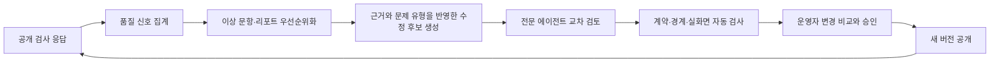

# 뉴앙 주제 검사 제작·운영 표준

- 문서 상태: Canonical
- 적용 범위: 뉴앙의 모든 주제 검사
- 기준일: 2026-07-29
- 우선 적용 순서: 위로 방식 → 사과 방식 → 상처 표현 방식 → 충전 방식 → 후속 주제
- 충돌 시 우선순위: 이 문서가 기존 주제 검사별 기획·파일럿 문서보다 우선한다.

## 1. 목적

뉴앙 주제 검사는 사용자가 부담 없이 참여하고, 결과를 읽으며 자신과 타인을 더 잘 이해하고, 다시 방문하거나 공유하고 싶게 만드는 제품이어야 한다. 동시에 문항과 리포트는 연구 근거, 명확한 구성개념, 일관된 채점, 버전 관리, 실사용 데이터에 기반해 계속 정교해져야 한다.

이 표준은 사업 성장과 검사 품질을 서로 반대되는 목표로 보지 않는다. 사용자 화면은 명료하고 자신감 있게 구성하고, 엄격한 검토·관찰·개선 과정은 내부 품질 시스템이 담당한다.

## 2. 제품 원칙

### 2.1 사용자에게는 가치와 이해를 먼저 전달한다

- 검사 시작 화면은 “무엇을 알 수 있는지”와 소요 시간에 집중한다.
- 결과는 사용자의 응답에서 직접 확인된 경향, 상황 차이, 활용법을 구체적으로 설명한다.
- 서비스의 가치를 스스로 낮추는 경고성 문구를 반복하지 않는다.
- “검증 전 자기성찰용 파일럿”, “미검증 자료”, “신뢰할 수 없음” 같은 표현을 사용자 화면과 공유 카드에 넣지 않는다.
- 사실보다 강한 진단·예언·인과 주장은 하지 않는다. 대신 “이번 응답에서는”, “이런 상황에서”, “나타날 수 있어요”처럼 정확하면서도 자연스러운 언어를 쓴다.

### 2.2 전 연령 공개를 기본값으로 한다

- 일반적인 관계·생활·감정 주제 검사는 `all_ages`로 공개한다.
- 성인 전용 기능이 필요할 때는 검사 전체를 막지 않고 별도의 연령 인증 정책으로 분리한다.
- 아동·청소년도 이해할 수 있는 쉬운 한국어를 사용하되, 성인에게 유치하게 느껴지는 말투는 피한다.

### 2.3 뉴앙 코드는 중심 축으로 유지하고 더 풍부하게 연결한다

- 모든 대표 주제 리포트는 가능하면 현재 뉴앙 코드와 이번 주제 결과를 함께 해석한다.
- 주제 검사 점수가 뉴앙 코드를 임의로 바꾸거나, 코드가 주제 검사 점수를 덮어쓰게 하지 않는다.
- 교차 해석은 “코드 때문에 반드시 그렇다”가 아니라 “이 코드의 기본 경향과 이번 응답이 만나면 이렇게 나타날 수 있다”는 가설 언어로 작성한다.
- 코드별 차이만 말하지 않고, 이번 검사에서 높거나 낮게 나타난 세부 축을 함께 반영한다.
- 교차 해석에는 강점, 오해 가능성, 가까운 사람이 도울 수 있는 방법을 포함한다.

### 2.4 공유 경험은 간결하게 유지한다

- 공유 카드는 결과의 핵심 한 문장, 대표 세부 축, 대화가 시작될 만한 문구에 집중한다.
- 파일럿·미검증·비진단 같은 기술적 고지를 공유 카드에 반복하지 않는다.
- 전체 근거와 상세 해석은 리포트 안의 “검사 설계 근거”에서 확인하게 한다.

### 2.5 공개 검사 자체가 지속적인 품질 개선 과정이다

- 별도의 긴 설문, 인지 면접, 파일럿 참여 화면을 사용자에게 중복 요구하지 않는다.
- 검사 도중 이미 발생하는 응답, 판단 어려움 사유, 응답 수정, 문항 체류 구간을 개인정보를 최소화해 품질 신호로 사용한다.
- 결과 화면에서는 한 번의 가벼운 적합도 질문만 제공한다.
- 운영센터는 신호를 문항·버전별로 자동 집계하고, 개선 후보를 우선순위화한다.

## 3. 역할별 전문 검토 체계

새 검사를 만들거나 기존 검사를 크게 개정할 때 다음 역할을 분리해 검토한다. 한 사람이 여러 역할을 맡을 수 있지만, 같은 작성자가 모든 검토를 단독 승인해서는 안 된다.

| 역할             | 핵심 질문                                    | 필수 산출물                                   |
| ---------------- | -------------------------------------------- | --------------------------------------------- |
| 제품·성장        | 사용자가 왜 지금 이 검사를 해야 하는가?      | 대상 사용자, 진입 문구, 완료·공유·재방문 목표 |
| 구성개념·문헌    | 정확히 무엇을 재고 무엇은 재지 않는가?       | 포함·제외 정의, 연구 근거표, 주장 목록        |
| 측정 설계        | 점수가 문항 구조와 일치하는가?               | 차원·상황 청사진, 채점·결측·버전 규칙         |
| 문항·쉬운 한국어 | 한 문항이 한 가지 의미만 묻는가?             | 문항 후보군, 편향·중복 검토표                 |
| 연령·문화·접근성 | 다양한 관계와 생활 조건에서 답할 수 있는가?  | 전 연령·문화·신경다양성 검토                  |
| 리포트·행동과학  | 점수에서 실제 문장으로 안전하게 이어지는가?  | 주장-근거-점수 연결표, 행동 제안              |
| 뉴앙 코드        | 코드 해석이 주제 결과를 풍부하게 만드는가?   | 코드×세부 축 교차 해석                        |
| 안전·윤리        | 낙인, 진단 오인, 관계 위해 가능성이 있는가?  | 금지 표현·민감 장면 점검                      |
| 데이터·운영      | 공개 후 무엇을 보고 어떻게 고칠 것인가?      | 품질 신호, 경보 기준, 개선 큐                 |
| QA·접근성        | 모바일·키보드·스크린리더·저장 복구가 되는가? | 자동 계약 테스트와 실화면 점검                |

## 4. 표준 제작 절차

### 단계 0. 주제 선정과 사업 가설

다음 항목을 한 장으로 정리한 뒤 제작을 시작한다.

1. 사용자가 이 주제에 관심을 가질 장면
2. 검사 완료 후 얻게 될 구체적인 가치
3. 뉴앙 코드·피드·프로필·공유와 연결되는 방식
4. 예상 소요 시간과 목표 완료율
5. 주요 재방문 또는 공유 동기
6. 과도한 민감성이나 연령 제한 필요 여부

우선순위는 검색·공유 가능성, 일상 관련성, 뉴앙 코드와의 연결성, 결과 리포트의 실용성, 기존 포트폴리오와의 중복 정도로 정한다.

### 단계 1. 구성개념과 사용 범위를 잠근다

#### 1-1. 한 문장 정의

검사가 측정하는 대상을 다음 형식으로 정의한다.

> 최근의 구체적인 `[상황]`에서 사용자가 보인 또는 필요로 한 `[행동·선호·반응 기능]`의 정도

예: 위로 방식은 “최근 힘들었던 상황에서 사용자가 필요로 한 사회적 지지의 기능과 전달 방식”을 살펴본다.

#### 1-2. 포함·제외 경계

- 포함: 문항과 리포트가 직접 말해도 되는 내용
- 제외: 애착 유형, 정신건강 상태, 관계의 좋고 나쁨, 성격 전체처럼 이 검사만으로 단정하지 않을 내용
- 인접 개념: 참고는 가능하지만 점수와 동일시하지 않을 내용

#### 1-3. 차원 설계

- 한 점수로 합치면 의미가 왜곡되는 행동은 독립 차원으로 둔다.
- 독립 차원은 서로 동시에 높거나 낮을 수 있다.
- 각 차원은 최소 4개 상황에서 관찰한다.
- 대표 주제 검사의 기본 구조는 3개 독립 차원 × 4개 공통 상황 = 12문항이다.
- 사용자가 기대하는 핵심 스타일을 기존 차원으로 답할 수 없으면 4개 차원 × 4개
  공통 상황 = 16문항까지 확장한다. 중요한 내용을 빼고 12문항에 맞추지 않는다.
- 차원마다 이름, 행동 정의, 높은 응답의 의미, 낮은 응답의 의미, 오해하면 안 되는 내용을 적는다.

### 단계 2. 연구 근거를 설계 자산으로 만든다

#### 2-1. 출처 기준

- 대표 검사는 원저 논문·메타분석·측정 논문을 합쳐 8개 이상 확보하는 것을 기본으로 한다.
- 그 외 공개 주제 검사는 최소 6개 이상의 직접 관련 연구를 확보한다.
- 블로그·마케팅 글은 핵심 구성개념이나 점수 해석의 근거로 사용하지 않는다.
- 번역·응용 문항은 원척도를 그대로 사용한 것처럼 표현하지 않는다.

#### 2-2. 근거표

각 연구마다 다음을 기록한다.

- 저자, 연도, 논문명, 학술지, DOI 또는 영구 링크
- 연구가 뒷받침하는 차원 또는 리포트 주장
- 연구의 대상과 맥락
- 뉴앙 문항·해석에 반영한 방식
- 그대로 일반화하면 안 되는 한계

#### 2-3. 사용자 화면

리포트에는 “검사 설계 근거” 섹션을 둔다.

- 사용자가 이해할 수 있는 2~3개의 설계 원칙을 먼저 보여준다.
- 원문 목록은 펼쳐볼 수 있게 제공한다.
- 근거 목록은 신뢰를 높이는 정보 구조로 제공하되, 결과 본문보다 앞세우지 않는다.

### 단계 3. 상황 청사진과 문항 후보를 만든다

#### 3-1. 상황 선정

상황은 특정 연애·직업·가족 형태에만 의존하지 않도록 구성한다.

- 일상적이고 쉽게 떠올릴 수 있을 것
- 차원마다 동일한 상황을 사용해 내용 차이를 비교할 수 있을 것
- 강도가 지나치게 높거나 임상적이지 않을 것
- 학생, 직장인, 비취업자 등 다양한 생활 조건에서 답할 수 있을 것
- 네 상황이 관계, 과업, 선택, 회복 등 서로 다른 맥락을 덮을 것

#### 3-2. 문항 작성

- 한 문항에는 하나의 도움 기능 또는 행동만 넣는다.
- 문항의 대상은 물건, 일정, 디지털 정보, 관계 장면처럼 한 번에 하나로 고정한다.
- `그것`, `둘 곳`, `정리한다`처럼 무엇을 어디에서 어떻게 한다는 뜻인지 장면을
  보지 않고는 알 수 없는 표현을 쓰지 않는다.
- 물리적 대상이 아닌 일정·약속에는 `둘 곳` 대신 목록, 달력, 날짜, 마감처럼
  사용자가 실제로 보는 위치와 행동을 쓴다.
- 같은 문장 안에 물건과 일정처럼 서로 다른 방식으로 정리하는 대상을 섞지 않는다.
- “항상”, “절대”, “좋은 사람이라면” 같은 도덕적 압박을 피한다.
- 한 차원의 문항만 유난히 긍정적이거나 성숙하게 보이지 않게 한다.
- 길이는 모바일에서 한 번에 읽히도록 줄인다.
- 문항 간 문장 구조와 구체성 수준을 맞춘다.
- 기계적인 역문항은 사용하지 않는다. 필요한 경우 의미가 자연스러운 대조 행동을 새 문항으로 설계한다.
- “해당 경험 없음”, “상황에 따라 다름”, “문장이 애매함”, “답하고 싶지 않음”을 점수로 억지 환산하지 않는다.

#### 3-3. 후보군과 운영 문항

- 여건이 허락하면 차원당 6개, 총 18개 안팎의 후보를 내부에서 만든다.
- 전문 역할별 검토와 중복 분석을 거쳐 차원당 4개, 총 12개를 운영 문항으로 선택한다.
- 후보 문항은 버리지 않고 문항 은행에 버전·탈락 이유와 함께 보관한다.

### 단계 4. 채점과 리포트를 함께 설계한다

#### 4-1. 채점

- 1~~5 응답은 사용자 표시용 0~~100으로 선형 변환할 수 있다.
- 독립 차원은 총점이나 승자 유형으로 합치지 않는다.
- 공통 상황에서 한 차원만 결측이면 그 상황 전체를 차원 비교에서 제외한다.
- 한 차원은 최소 3개의 유효 상황이 있을 때만 점수를 보여준다.
- 평균과 함께 상황별 범위·변산성을 저장한다.
- “높음/낮음” 라벨은 실제 응답 선택지의 의미와 맞아야 한다.

#### 4-2. 리포트 구조

대표 주제 리포트는 다음 순서를 기본으로 한다.

1. 개인화된 핵심 요약
2. 세부 차원별 점수와 해석
3. 확인된 강점, 약점, 우선 개선 행동
4. 상황에 따라 달라진 지점
5. 강점과 관계에서의 활용
6. 오해받기 쉬운 지점
7. 직접 써볼 수 있는 말과 행동
8. 가까운 사람이 도울 수 있는 방법
9. 뉴앙 코드와 이번 결과의 교차 해석
10. 검사 설계 근거와 참고 연구

#### 4-2-1. 핵심 성향 문장 계약

결과 첫 화면의 제목과 공유 카드의 첫 문장은 점수 요약이 아니라 사용자가 바로
알아볼 수 있는 **성향 문장**이어야 한다.

기본 문장 구조:

> `[일상 장면]`에서 `[주로 하거나 필요로 하는 반응]`을 `[선호 조건 또는 방식]`으로 한다

예:

- “집중이 끊기면 작은 행동부터 시작하며 집중을 되찾는 편이에요.”
- “서운했던 일을 짚고 다음에는 어떻게 해주길 바라는지 말해요.”
- “혼자 자극을 줄이고 쉬어야 충전되는 편이에요.”

필수 규칙:

- 제목만 읽어도 검사명이나 차원표를 보지 않은 사람이 “어떤 성향인지” 한 문장으로
  설명할 수 있어야 한다.
- `세 행동`, `두 행동`, `세 경로`, `전환 행동`, `점수가 높음`,
  `비슷하게 나타남` 같은 내부 집계 언어를 핵심 제목으로 사용하지 않는다.
- 동점과 점수 차이는 문장을 고르는 내부 분기일 뿐, 사용자에게 보여줄 결론이 아니다.
- 여러 차원이 함께 높으면 각 차원의 실제 행동을 연결해 한 사람의 모습으로 쓴다.
- 낮은 결과는 “성향이 없다”고 단정하지 않는다. 덜 사용하는 방식, 필요한 조건,
  말하거나 행동할 여건을 비난 없이 설명한다.
- 결과 본문의 첫 문단은 핵심 제목을 실제 장면과 행동으로 한 번 더 풀어 쓴다.
  “각 항목을 살펴봤어요” 같은 메타 설명으로 시작하지 않는다.
- 공유 카드의 `resultName`과 첫 요약은 결과 화면과 같은 핵심 성향을 사용한다.
  점수와 차원 이름은 이를 뒷받침하는 두 번째 정보로 둔다.
- 내부 용어가 꼭 필요하면 상세 근거 영역에서 쉬운 말로 정의한 뒤 사용한다.

5초 이해도 점검:

1. 제목만 다른 검토자에게 보여준다.
2. “이 사람은 해당 장면에서 주로 어떻게 하는 사람인가?”를 묻는다.
3. 답이 제목의 의도와 다르거나 “세 가지가 비슷하다는 사람”처럼 집계만 반복되면
   실패로 보고 다시 쓴다.
4. 모바일 공유 미리보기에서도 핵심 행동이 잘리지 않는지 확인한다.

#### 4-2-2. 강점·약점·개선 조언 계약

결과를 기분 좋게 만드는 것보다 사용자가 실제로 바꿀 수 있게 만드는 것이
우선이다. 모든 결과를 장점으로 포장하지 않는다.

행동·기술을 측정하는 주제의 설명 순서:

1. **확인된 행동**: 이번 응답에서 무엇을 자주 했고 무엇을 덜 했는지 말한다.
2. **현실적인 영향**: 낮은 행동 때문에 생길 수 있는 분실, 누락, 오해, 반복 문제를
   구체적으로 말한다.
3. **조건 구분**: 시간·안전·통제권 부족 때문일 가능성은 설명하되, 확인된 부족을
   지우는 면책 문장으로 앞세우지 않는다.
4. **개선 행동**: 다음 장면에서 바로 할 수 있는 한 가지를 제시한다.

필수 규칙:

- 필요한 상황에서도 낮은 행동과 실제 불편이 반복된다면 “현재 이 기술이 부족한
  상태”라고 분명히 말할 수 있다.
- 부족한 행동을 성격 전체, 게으름, 무능력, 진정성 부족으로 확대하지 않는다.
- 높은 점수에는 강점뿐 아니라 과하게 사용할 때 생기는 비용과 부작용도 쓴다.
- “모두 괜찮아요”, “그럴 수 있어요”로 끝내지 않는다. 최소 한 개의 관찰 가능한
  개선 행동을 붙인다.
- 위로 필요처럼 높고 낮음이 능력 우열이 아닌 **선호 주제**는 낮은 점수를 약점으로
  만들지 않는다. 대신 잘 맞는 조건, 어긋날 때 생기는 문제, 직접 요청할 문장을
  설명한다.
- 장점과 약점을 점수에서 도출할 수 없다면 리포트 문장을 추측하지 말고 구성개념과
  문항 청사진으로 돌아가 필요한 차원을 추가한다.

#### 4-3. 주장 관리

- 모든 긴 리포트 섹션에는 내부 `claimId`를 붙인다.
- 각 주장은 점수 구간, 문항 또는 연구 근거 중 하나 이상과 연결한다.
- 응답에서 확인하지 않은 과거 경험, 숨은 동기, 정신 상태를 만들어내지 않는다.
- 행동 제안은 명령보다 선택지로 제시한다.
- 부정적 해석만 길어지지 않도록 강점·오해·조정 방법을 함께 쓴다.

### 단계 5. 뉴앙 코드 교차 해석을 만든다

교차 해석은 제거하거나 별도 격리하지 않는다. 다음 구조로 보강한다.

1. 현재 코드의 관련 기본 경향
2. 이번 주제의 가장 뚜렷한 차원
3. 코드와 주제 결과가 같은 방향일 때 나타날 수 있는 모습
4. 서로 다른 방향일 때 나타날 수 있는 유연성 또는 긴장
5. 관계에서 활용할 수 있는 한 가지 행동

필수 문체 규칙:

- 결정론: “INGMC라서 공감을 원한다” → 사용하지 않음
- 교차 가설: “INGMC의 관계 조율 경향과 이번에 높게 나타난 마음 알아주기 필요가 만나면, 해결책보다 이해받았다는 신호가 먼저 중요하게 느껴질 수 있어요.” → 사용

### 단계 6. 공개 전 전문 검토와 자동 계약 검사를 통과한다

공개 전에 실제 사용자에게 별도 참여를 요구하지 않는다. 대신 가능한 모든 내부 작업을 수행한다.

- 각 역할의 독립 검토
- 구성개념과 문항의 연결 검토
- 문항 중복·이중 질문·사회적 바람직성 검토
- 전 연령·관계 형태·문화·접근성 검토
- 모든 응답 조합 경계 테스트
- 결측·판단 어려움·상황 차이 테스트
- 결과 리포트 최소 깊이와 `claimId` 검사
- 뉴앙 코드 섹션 생성 검사
- 연구 근거 수와 링크 형식 검사
- 금지 사용자 문구 검사
- 저장·동기화·과거 결과 버전 재현 검사
- 모바일·키보드·스크린리더 실화면 검사

### 단계 7. 버전 단위로 공개한다

다음 버전을 서로 분리해 저장한다.

- `instrumentVersion`: 문항·응답 척도·상황 구조
- `scoringVersion`: 결측 처리·점수 계산·구간
- `reportContentVersion`: 리포트 문장·구조·뉴앙 코드 해석
- `evidenceVersion`: 연구 근거 목록과 설계 원칙

과거 결과는 완료 당시의 리포트 스냅샷과 버전을 유지하며 점수·차원·근거를 새
도구처럼 다시 계산하지 않는다. 다만 C1 문구 또는 의미를 보존하는 C2 표현 개선은
과거 결과에도 표시 호환 계층으로 적용할 수 있다. 이때 원본 스냅샷과 버전은
보존하고, 점수 의미를 바꾸거나 과거 응답에서 확인되지 않은 성향을 추가하지 않는다.

## 5. 공개 검사 기반 자동 품질 개선 루프

### 5.1 사용자 피로를 늘리지 않는 수집

검사 중 자동 수집:

- 문항별 체류 시간 구간
- 응답을 바꾼 횟수 구간
- 일반 응답 또는 판단 어려움
- 판단 어려움 사유: 경험 없음, 상황에 따라 다름, 문장이 애매함, 답하고 싶지 않음

결과 화면에서 한 번만 수집:

- “이번 결과가 나와 얼마나 잘 맞았나요?”
- 잘 맞아요 / 대체로 맞아요 / 조금 달라요

원칙:

- 자유서술과 추가 설문을 매번 요구하지 않는다.
- 원문 답변, 정확한 밀리초, 불필요한 개인식별정보를 품질 이벤트에 복제하지 않는다.
- 동일 제출은 멱등 키로 중복 저장하지 않는다.
- 연결 실패 시 로컬 큐에서 재시도한다.

### 5.2 운영센터 자동 분류

품질 이벤트는 검사·문항·도구 버전·신호별로 집계한다.

초기 표본에서 사용하는 운영 기준:

| 신호             | 관찰     | 개선 후보         | 우선 개선          |
| ---------------- | -------- | ----------------- | ------------------ |
| 표본 수          | 30 미만  | 판단 보류         | 판단 보류          |
| 문장이 애매함    | 5% 이상  | 7% 이상·5건 이상  | 10% 이상·5건 이상  |
| 경험 없음        | 20% 이상 | 28% 이상·8건 이상 | 35% 이상·10건 이상 |
| 상황에 따라 다름 | 25% 이상 | 32% 이상          | 40% 이상           |
| 여러 번 수정     | 8% 이상  | 12% 이상          | 15% 이상           |
| 결과가 조금 다름 | 10% 이상 | 15% 이상·8건 이상 | 20% 이상·10건 이상 |

표본이 충분해지면 연령대·사용 맥락별로 문항 기능 차이를 검토하되, 작은 집단을 식별할 수 있는 원자료는 운영 화면에 노출하지 않는다.

### 5.3 자기개선 파이프라인

운영 시스템은 다음 순환을 자동화한다.

- 시스템이 자동으로 하는 일: 수집, 집계, 경보, 원인 후보 분류, 수정 초안, 테스트, 변경 비교
- 사람이 최종 확인하는 일: 구성개념 변경, 문항 의미 변경, 점수 해석 변경, 공개와 롤백
- 문구 수정만으로 해결되지 않는 문제는 구성개념·상황 청사진 단계로 되돌린다.
- 자동화는 빠른 개선을 돕는 장치이며, 점수 의미를 조용히 바꾸는 장치가 아니다.

## 6. 품질 판단 기준

### 6.1 내용 품질

- 차원 정의와 모든 문항의 연결이 설명 가능한가
- 중요한 내용 영역이 빠지지 않았는가
- 한 장면이나 관계 형태에 치우치지 않았는가
- 각 차원이 동일한 수와 비슷한 난도의 상황을 갖는가

### 6.2 측정 품질

초기에는 공개 사용 데이터를 이용해 다음을 순차적으로 확인한다.

- 문항별 응답 분포와 천장·바닥 집중
- 문항-차원 상관과 중복
- 차원별 내적 일관성
- 상황 효과와 사람 효과의 분리
- 경쟁 모형 비교: 한 요인, 상관된 다요인, 방법·상황 요인
- 충분한 표본에서의 재검사 안정성
- 연령대·성별·사용 맥락별 측정 동등성 또는 문항 기능 차이
- 결과 적합도, 완료율, 재검사율, 공유·저장 행동과의 관계

수치 하나로 품질을 판정하지 않는다. 문항 내용, 구조 모형, 실사용 반응, 결과 유용성을 함께 본다.

### 6.3 리포트 품질

- 모든 주요 문장이 실제 점수나 응답 패턴에 근거하는가
- 세부 차원이 충분히 다르게 설명되는가
- 상황 차이를 평균으로 숨기지 않는가
- 강점, 오해 가능성, 활용 행동의 균형이 있는가
- 낮은 행동을 불필요하게 미화하지 않고 현실적인 손실과 개선점을 말하는가
- 높은 행동을 과하게 사용할 때의 비용도 말하는가
- 선호와 기술 부족을 구분해 잘못된 약점 판정을 하지 않는가
- 가까운 사람이 바로 써볼 수 있는 표현이 있는가
- 뉴앙 코드 해석이 반복문이 아니라 코드×점수 조합을 반영하는가
- 연구 근거가 사용자가 읽을 수 있는 형태로 연결되는가

### 6.4 사업 품질

- 시작 대비 완료율
- 첫 문항·중간·결과 전 이탈
- 결과 스크롤 깊이와 주요 섹션 열람
- 저장·공유·재검사·프로필 연결
- 결과 적합도 응답
- 품질 질문 노출 대비 응답률

검사 품질 개선안은 완료율과 리포트 활용률의 변화도 함께 본다. 문항을 늘리거나 설명을 길게 만드는 것이 항상 더 좋은 개선은 아니다.

## 7. 변경 등급과 승인

| 등급         | 예시                                       | 필요한 조치                       |
| ------------ | ------------------------------------------ | --------------------------------- |
| C1 문구      | 오탈자, 의미 불변 가독성 수정              | 리포트 버전 갱신, 자동 검사       |
| C2 문항 표현 | 문항의 표현·상황을 의미 보존 범위에서 수정 | 도구 버전 갱신, 전문가 2역할 검토 |
| C3 구조·채점 | 차원, 문항 수, 결측·구간 변경              | 전체 역할 검토, 새 채점 버전      |
| C4 구성개념  | 무엇을 재는지 변경                         | 새 검사에 준해 단계 1부터 재진행  |

새 버전 공개 후 핵심 지표와 오류를 관찰하고, 심각한 회귀가 있으면 직전 버전으로 되돌린다. 롤백 뒤에도 완료된 과거 결과의 스냅샷은 유지한다.

## 8. 포트폴리오 적용 순서

### 8.1 위로 방식

대표 기준 검사로 운영한다.

- 마음 알아주기
- 방법과 실질 도움
- 내 속도와 공간
- 3개 차원 × 4개 공통 상황
- 사회적 지지, 관계 반응성, 도움의 적합성, 자율성 지지 연구 반영

### 8.2 사과 방식

위로 방식의 자동 품질 루프와 제작 계약을 그대로 적용한다.

- 책임 인정
- 상대가 받은 영향 이해
- 회복 행동과 후속 조치
- 사과의 구성 요소, 잘못의 맥락, 신뢰 회복 연구 반영

### 8.3 상처 표현 방식

- 구체적인 사건
- 느낀 감정
- 바라는 변화
- 직접 표현을 무조건 좋은 행동으로 만들지 않고 관계·권력·안전·문화 맥락을 함께 해석

### 8.4 후속 주제

- 충전 방식은 2026-07-29에 3개 독립 차원 × 4개 공통 상황 구조로 확장해
  pilot 공개한다. 세부 기준은 `NUANG_RECHARGE_ROUTINE_PRODUCTION_STANDARD.md`를
  따른다.
- 집중 전환은 2026-07-29에 충전 방식·기분 전환·정리 방식과의 중복을
  Stage 0에서 분리하고, 재개 단서·현재 목표 재정렬·작은 재진입의 3개 독립
  차원 × 4개 공통 상황으로 확장한다. 세부 기준은
  `NUANG_FOCUS_SWITCH_PRODUCTION_STANDARD.md`를 따른다.
- 정리 방식은 2026-07-29에 집중 전환·목표 유지·미루기 패턴과의 중복을
  Stage 0에서 분리하고, 자리와 분류·외부 기록·적응적 재정비·시간을 내
  한꺼번에 정리하기의 4개 독립 차원 × 4개 공통 상황으로 확장한다. 세부 기준은
  `NUANG_ORGANIZING_STYLE_PRODUCTION_STANDARD.md`를 따른다.
- 현재 3문항 수준의 주제는 바로 대표 검사로 공개하지 않고, 이 문서의 차원·상황 청사진에 따라 최소 12문항 구조로 확장한다.
- 기존 대표 주제와 충분히 다른 사용자 가치를 제공하는지 먼저 확인한다.

## 9. 공개 체크리스트

### 근거

- [ ] 측정 대상과 제외 범위가 한 문장으로 설명된다.
- [ ] 대표 검사는 8개 이상, 그 외 공개 검사는 6개 이상의 직접 관련 연구가 있다.
- [ ] 사용자 리포트에 설계 원칙과 원문 링크가 있다.
- [ ] 리포트의 주요 주장이 내부 `claimId`와 연결된다.

### 문항

- [ ] 3개 독립 차원과 4개 공통 상황을 기본으로 하되, 핵심 스타일이 빠지면
      4개 차원까지 확장한다.
- [ ] 각 차원에 4개 이상의 운영 문항이 있다.
- [ ] 문항마다 대상과 행동이 하나로 고정되어 문장만 읽어도 무엇을 묻는지 안다.
- [ ] 물건·일정·정보처럼 답하는 방식이 다른 대상을 한 문항에 섞지 않는다.
- [ ] 이중 질문, 도덕적 압박, 전문용어, 특정 관계·직업 편향을 점검했다.
- [ ] 판단 어려움 사유가 점수로 강제 변환되지 않는다.

### 결과

- [ ] 독립 차원을 총점이나 승자 유형으로 축약하지 않는다.
- [ ] 핵심 제목만 읽어도 일상 장면과 주된 반응을 5초 안에 이해할 수 있다.
- [ ] 동점·점수·항목 수가 아니라 실제 성향과 행동이 첫 문장의 주어가 된다.
- [ ] `세 행동`, `두 행동`, `세 경로`, `전환 행동`, `비슷하게 나타남`이 핵심 제목에 없다.
- [ ] 공유 카드의 첫 문장이 결과 화면의 핵심 성향과 같다.
- [ ] 낮은 결과도 결핍이나 무성향이 아니라 덜 쓰는 방식과 조건으로 설명한다.
- [ ] 행동·기술 주제는 확인된 약점, 현실적인 손실, 우선 개선 행동을 포함한다.
- [ ] 모든 높은 행동에 과하게 사용할 때의 비용 또는 주의점을 포함한다.
- [ ] 선호 주제는 억지 장단점 대신 적합 조건과 불일치 위험을 설명한다.
- [ ] 상황별 차이와 유효 응답 수를 반영한다.
- [ ] 강점·오해·행동 제안·가까운 사람 가이드가 있다.
- [ ] 뉴앙 코드 교차 해석이 점수 조합을 반영한다.
- [ ] 과장된 진단·결정론·인과 표현이 없다.

### 제품

- [ ] 전 연령 공개 정책이 적용된다.
- [ ] 시작 화면과 공유 카드에 불필요한 신뢰 저하 문구가 없다.
- [ ] 결과 적합도 질문은 한 번만 요청한다.
- [ ] 문항 체류·수정·판단 어려움 신호가 개인정보 최소화 형태로 수집된다.
- [ ] 운영센터에서 검사·버전·문항별 우선순위를 볼 수 있다.

### 기술

- [ ] 문항·채점·리포트·근거 버전이 구분된다.
- [ ] 동일 품질 제출이 중복 저장되지 않는다.
- [ ] 잘못된 검사·버전·문항 이벤트가 거부된다.
- [ ] 과거 결과 스냅샷이 유지된다.
- [ ] 단위·API·DB 계약·접근성·실화면 검사가 통과한다.

## 10. 참고 품질 기준

이 표준은 특정 외부 척도를 그대로 복제하기 위한 문서가 아니다. 다음 국제 기준의 핵심 원칙인 사용 목적 명료화, 타당도 근거의 누적, 공정성, 점수 해석의 책임, 버전과 운영 품질 관리를 뉴앙 제품 환경에 맞게 적용한다.

- [Standards for Educational and Psychological Testing](https://www.apa.org/science/programs/testing/standards)
- [EFPA Test Review Model](https://www.efpa.eu/sites/default/files/2025-08/efpa_test_review_model_v2025_5.pdf)
- [International Test Commission Guidelines](https://www.intestcom.org/page/16)
- [COSMIN content-validity methodology](https://www.cosmin.nl/wp-content/uploads/COSMIN_methodology-content-validity-prom_user-manual_v1.0.pdf)

---

이 문서의 성공 기준은 “한 번 완성된 검사”가 아니다. 사용자가 검사를 즐기고 결과를 유용하게 느끼는 동안, 공개 사용에서 얻은 신호가 운영센터와 전문 검토를 거쳐 다음 버전을 더 좋아지게 만드는 상태가 성공이다.
