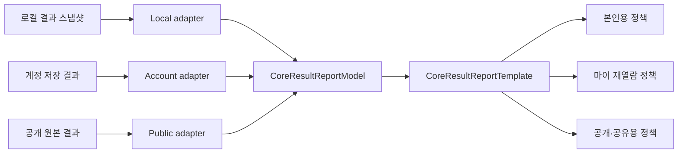

# 뉴앙 코어·정밀 통합 결과 리포트 최종 기획

- 문서 버전: 1.2
- 작성일: 2026-07-31
- 최종 갱신일: 2026-08-01
- 상태: Release 1 완료 · Release 2 제품 기반 구현 완료 · 실제 승인 데이터 발행 대기
- 적용 범위: 빠른 코어 검사, 정밀 코어 검사, 마이의 내 결과 리포트, 계정 저장 결과, 본인용 재열람, 공개·공유용 결과의 공통 기반
- 이번 단계: Release 2의 실패-폐쇄형 콘텐츠 resolver·완료 시점 스냅샷·섹션 피드백·문장 공유·읽기 탐색 구현, 승인 canonical·한국 표본 분석은 실제 데이터 구축 게이트로 유지

---

## 0. 최종 결정 요약

뉴앙의 코어 결과 리포트는 저장 위치나 진입 경로에 따라 달라지면 안 된다. 빠른 코어와 정밀 코어는 서로 다른 상품 화면이 아니라 **하나의 결과 리포트를 서로 다른 깊이로 읽는 두 가지 해상도**로 정의한다.

최종 구조는 다음 네 요소로 통일한다.

1. 출처와 무관한 `CoreResultReportModel`
2. 로컬·계정·공개 결과를 공통 모델로 바꾸는 adapter
3. 가장 최근 완료 코어 결과를 고르는 단 하나의 selector
4. 모든 본문을 그리는 단 하나의 `CoreResultReportTemplate`

마이의 `내 결과 리포트`에는 주제 검사나 연구소 결과가 아니라, 사용자가 가장 최근에 유효하게 완료한 **빠른 또는 정밀 코어 결과**를 보여준다. 최근 결과가 빠른 검사라는 이유로 오래된 정밀 결과를 대신 보여주지 않는다.

다만 다음 두 개념은 분리한다.

- `최근 코어 결과`: 빠른·정밀 중 실제 완료 시각이 가장 최근인 결과
- `내 대표 성향`: 현재 제품 정책대로 가장 최근의 사용 가능한 정밀 코어 결과를 우선하고, 정밀 결과가 없을 때 빠른 결과를 사용

따라서 새 빠른 결과는 마이의 최신 리포트로 열리지만, 기존 정밀 대표 코드를 조용히 덮어쓰지 않는다.

현재 보유한 데이터로 화면·점수·기존 게시 콘텐츠를 일치시키는 기본 통합 리포트는 만들 수 있다. 그러나 새로운 핵심 한 문장, 코드·세부 신호별 과사용 비용, 행동 실험, 데이터센터 연구 원장의 개인화 문장을 결과 화면에 추가하는 심화 리포트는 아직 바로 만들 수 없다. 현재 운영 allowlist와 고객 발행 승인이 비어 있고, 고객용 문단과 근거 claim의 연결도 끊겨 있기 때문이다. 기본 통합과 심화 콘텐츠 출시를 분리하며, 부족한 부분은 임의 문장으로 채우지 않고 이 문서의 결손 데이터 원장에 기록한다.

---

## 1. 사용자가 겪는 현재 문제

### 1.1 같은 결과가 다른 화면으로 보이는 구조

현재 결과 화면은 세 갈래로 나뉘어 있다.

| 진입점                            | 현재 화면                                    | 주요 문제                                                                 |
| --------------------------------- | -------------------------------------------- | ------------------------------------------------------------------------- |
| 검사 직후 `/results/local/[id]`   | `CandidateCoreResultView`                    | 가장 풍부한 현행 리포트                                                   |
| 계정 결과 `/results/account/[id]` | `AccountResultView`                          | 코드 자리, 경계 해석, 검사 깊이별 안내 등이 축약됨                        |
| 마이·본인 프로필 결과             | `AccountResultView` 또는 `MyTraitDetailView` | 본인 결과가 공개용 읽기 전용 화면으로 열리거나 또 다른 정보 구조로 표시됨 |
| 레거시 로컬 결과                  | `LocalResultView` 내부 별도 리포트           | 현행 결과와 섹션·문장·레이아웃이 다름                                     |

같은 결과라도 현재 기기에 로컬 사본이 남아 있으면 풍부한 화면, 로컬 사본이 없고 계정 결과만 남으면 축약 화면이 나타날 수 있다. 이는 스타일 문제가 아니라 데이터 모델과 렌더러가 분리된 구조적 문제다.

### 1.2 최신 결과 선택 규칙도 화면마다 다름

- `/my/reports`는 코어·주제·연구소 결과를 섞어 정렬하므로 최근 주제 검사가 최근 코어 리포트를 밀어낼 수 있다.
- `MyOverview`는 계정 결과가 하나라도 있으면 더 최신인 로컬 결과를 비교하지 않을 수 있다.
- `MyTraitDetailView`는 계정과 로컬 완료 시각을 비교하지만 별도 구현이다.
- 서버 계정 결과는 실제 검사 완료 시각이 아니라 DB 생성 시각 순으로 먼저 읽힌다.

이 상태에서는 로그인 연결이 늦었거나 계정 동기화가 지연됐을 때 오래된 결과가 최신으로 보일 수 있다.

### 1.3 계정 조회 과정에서 결과 정보가 사라짐

검사 직후 로컬 결과에는 다음 정보가 있다.

- 5개 축의 점수, 글자, 경계 여부, 상태
- 10개 세부 신호의 점수, 유효 응답 수, 상태
- 대안 코드
- 검사·채점·코드 체계·결과 문구 버전
- 응답 스냅샷 해시와 결과 상태

계정 저장·조회 손실은 두 종류다.

저장되지만 현재 조회 schema가 제거하는 값:

- domain의 `isBoundary`, `status`
- facet의 `validResponses`
- `versionBundle`

현재 계정 결과 summary에 처음부터 저장되지 않는 값:

- `alternativeCodes`
- `resultCopyVersion`
- `responseSnapshotHash`
- `resultStatus`와 `resultEvidenceStatus`
- 성향지도 baseline·manifest·고객 문장 ID·version

따라서 account contract만 넓혀서는 모든 값이 복원되지 않는다. 신규 저장 계약과 필요 시 DB·summary schema 변경이 함께 필요하며, 기존 결과의 누락값은 재구성하지 않고 `legacy_partial`로 처리한다.

### 1.4 빠른 결과에 정밀용 해석이 노출될 수 있음

일부 마이 상세 화면은 빠른 결과에도 정밀 깊이의 `TraitMapResultBridge`를 사용할 수 있다. 빠른 검사의 일부 세부 신호는 유효 응답이 한 문항 수준이므로, 가족·연인·업무 행동을 정밀 결과와 같은 깊이로 개인화해서는 안 된다.

---

## 2. 제품 목표와 성공 정의

통합 리포트의 목표는 사용자가 아래 세 질문에 순서대로 답을 얻는 것이다.

1. 나는 어떤 사람으로 나왔는가?
2. 왜 이런 결과가 나왔는가?
3. 이 결과를 일상과 관계에서 어떻게 활용할 수 있는가?

최고 만족도는 화려한 수치보다 다음 경험에서 나온다.

- 첫 화면만 보고도 자신의 핵심 성향을 이해한다.
- 좋은 점뿐 아니라 과해질 때 생기는 문제도 구체적으로 알 수 있다.
- 검사 직후, 마이, 다른 기기에서 다시 열어도 같은 리포트가 보인다.
- 점수와 해석의 연결을 확인할 수 있다.
- 일반적인 코드 설명과 이번 응답에서 실제로 나온 신호를 구분할 수 있다.
- 결과를 읽고 바로 해볼 수 있는 작은 행동을 얻는다.
- 데이터가 없는 영역을 그럴듯한 말로 채우지 않는다.

수익·체류 측면에서도 첫 화면의 “나를 알아본다”는 감각, 중간의 탐색 재미, 마지막의 활용·공유가 하나의 흐름으로 이어져야 한다. 단, `정확도`, `상위 비율`, `성향일 확률`처럼 현재 점수가 의미하지 않는 숫자를 후킹 수단으로 사용하지 않는다.

---

## 3. 공통 템플릿의 제품 원칙

### 3.1 하나의 본문, 여러 진입 정책



검사 직후와 마이의 본인용 리포트는 동일한 템플릿·동일한 섹션 계약·동일한 허용 본문을 사용한다. 공개·공유용도 같은 템플릿과 원본 결과 계약을 사용하되, 서버에서 surface별 허용 projection을 만든다. 공개용 클라이언트 payload와 DOM에는 self-only 데이터를 보내지 않는다.

진입점에 따라 달라질 수 있는 것은 다음이다.

- 뒤로 가기 위치
- 공유 가능 여부와 공유 URL
- 삭제·공개 범위 설정 권한
- 빠른 결과의 정밀 검사 CTA
- 타인 열람 시 `나도 검사하기` CTA
- 공개 범위에 따른 허용 섹션 projection

점수 계산, 해석 문장 선택, 최신 결과 선택을 React 화면 안에서 다시 수행하지 않는다.

### 3.2 빠른·정밀은 같은 골격, 다른 깊이

| 영역                | 빠른 코어                            | 정밀 코어                           |
| ------------------- | ------------------------------------ | ----------------------------------- |
| 코드·이름·완료일    | 제공                                 | 제공                                |
| 핵심 요약           | 코드 수준의 짧은 안내                | 코드와 유효 세부 신호를 결합        |
| 5개 축·5글자 풀이   | 제공                                 | 제공                                |
| 경계 설명           | 제공                                 | 제공                                |
| 10개 세부 신호      | 개인화 해석에 사용하지 않음          | 유효 상태의 신호만 사용             |
| 생활·관계·업무 장면 | 개인화 장문 미제공, 코드 일반 요약만 | 허용된 코드·세부 신호 범위에서 제공 |
| 강점·과사용 비용    | 짧게 제공                            | 구체적으로 제공                     |
| 작은 행동 실험      | 정밀 검사로 이어지는 확인 질문       | 승인된 행동 조언 제공               |
| 다음 행동           | 정밀 검사                            | 성향지도·함께하기·관련 주제 검사    |

데이터가 없는 섹션은 빈 카드나 미사여구로 채우지 않는다. 빠른 결과는 동일한 섹션 순서를 유지하되 확인 가능한 범위까지만 보여주고, 정밀 검사에서 무엇이 더 구체화되는지 자연스럽게 안내한다.

현행 고객 가이드가 앱에서 게시되고 계약 테스트를 통과한 것과 데이터센터 v2.3 canonical이 고객 발행 승인을 받은 것은 서로 다른 상태다. 이 문서에서 `현재 고객 가이드`는 전자를 뜻하고, `승인 canonical`은 표면별 allowlist에 들어간 후자를 뜻한다.

### 3.3 직접적이되 낙인찍지 않는 문장

좋은 결과만 나열하지 않는다. 각 성향은 다음 네 부분을 한 묶음으로 다룬다.

- 잘 작동할 때
- 과해질 때 생기는 문제
- 주변에서 먼저 보이는 신호
- 조정하는 방법

직설성은 단정적인 인격 평가가 아니라 관찰 가능한 비용을 숨기지 않는 데서 만든다.

권장 표현:

- `이번 응답에서는`
- `~하는 편에 가까워요`
- `이 방식이 과해지면`
- `이런 상황에서는`
- `두 방향을 오갈 수 있어요`
- `다음에는 이것을 먼저 확인해보세요`

금지 표현:

- `당신은 원래`, `절대`, `진짜 성격`
- `정확도 87%`, `성향일 확률`, `상위 10%`
- `공감 능력이 부족한 사람`
- `관계를 망치는 유형`
- `정신적으로 불안정`
- 현재 근거가 없는 궁합·성공·능력 예측

고객 화면에 서비스 신뢰를 떨어뜨리는 경고를 반복하지 않는다. 대신 내부 콘텐츠 조립기에서 허용 범위를 엄격히 통제하고, 고객에게는 짧은 `결과 읽는 기준`을 제공한다.

---

## 4. 마이의 최신 결과 계약

### 4.1 최신 코어 결과 selector

공통 선택기는 `latestCompletionRecord`와 `latestRenderableReport`를 구분한다. 최신 기록이 지원 불가라는 이유로 조용히 숨기고 오래된 결과를 최신처럼 보여주면 안 된다.

1. 빠른·정밀 코어 결과만 후보로 수집한다.
2. 계정 결과와 검증된 로컬 결과를 함께 읽고, API 장애와 결과 없음을 구분한다.
3. 로컬 결과는 `getValidatedLocalResultSnapshot`을 통과한 스냅샷만 온전한 결과로 사용한다. 응답을 현재 채점기로 조용히 재채점해 최신 결과처럼 만들지 않는다.
4. 로컬의 `resultStatus`는 실제 값을 사용한다. 해당 값이 저장되지 않은 기존 계정 결과는 자동으로 `ready`라고 가정하지 않고 `unknown_legacy`로 분류한다.
5. `localResultId`, account attempt ID 또는 신규 불변 `originResultId`처럼 검증 가능한 동일성 키가 있는 사본만 병합한다.
6. 완료 시각·코드가 같다는 이유만으로 결과를 병합하지 않는다. `responseSnapshotHash`가 계정에 저장되기 전에는 해시 병합도 사용할 수 없다.
7. 같은 논리 결과는 계정 식별자를 canonical route로 사용하되, 동일성이 확인될 때만 로컬의 더 완전한 필드를 병합한다.
8. 실제 `completedAt` 내림차순으로 정렬하며 빠른·정밀 종류에 최신 우선권 차이를 두지 않는다.
9. 서로 다른 결과의 완료 시각이 완전히 같을 때만 정밀 결과, 계정 원본, 안정 식별자 순으로 결정한다.
10. 주제 검사, 연구소 결과, 비교 리포트는 최신 코어 후보에 포함하지 않는다.
11. 가장 최신 완료 기록이 손상·불충분·지원 불가이면 `최근 결과를 온전히 열 수 없음` 상태를 먼저 보여주고, 열 수 있는 이전 결과를 보조 행동으로 제공한다.
12. selector 결과는 `latestCompletionRecord`, `latestRenderableReport`, `selectionReason`, `diagnosticCodes`를 함께 반환한다.

### 4.2 마이 정보 구조

권장 구조:

- 마이 프로필 상단: `내 대표 성향`
- `내 결과 리포트`: 가장 최근 완료한 빠른·정밀 코어 공통 리포트
- `지난 결과`: 과거 코어 결과
- `주제 검사 결과`
- `연구소 결과`
- `함께한 결과`

권장 IA는 `/my/reports`에서 최신 코어 리포트를 공통 템플릿으로 바로 보여주고, `/my/reports/history`에서 기존 코어·주제·연구소·비교 기록을 제공하는 방식이다. 이는 현재 목록 중심 화면을 바꾸는 결정이므로 사용자 승인 항목으로 남긴다.

`/my?tab=reports`는 내 기록 개요와 최신 코어 카드를 유지하되, 본인 코어 결과 링크는 공개 프로필 route가 아니라 `/my/reports`의 owner route로 보낸다. `/my/profile`에는 독립적인 결과 리포트 UI를 다시 만들지 않고 대표 성향 요약만 남긴 뒤 `/my/reports`로 연결한다.

유효한 코어 결과가 하나도 없으면 주제·연구소 결과를 대신 끼워 넣지 않는다. `첫 성향 검사 시작하기`와 로컬 결과 복구·로그인 연결 상태를 구분해서 보여준다.

route와 뒤로가기 계약:

- `/my/reports`: 최신 코어 본문
- `/my/reports/history`: 지난 결과 목록
- `/my?tab=reports`: 내 기록 개요
- 최신 본문의 뒤로가기: `/my?tab=reports`
- 지난 결과 상세의 뒤로가기: `/my/reports/history`
- 최신 결과 삭제 후: 다음 최신 결과로 `/my/reports`를 갱신하고, 남은 결과가 없으면 빈 상태
- 어떤 경로도 자기 자신을 `backHref`로 사용하지 않음

### 4.3 최신 결과와 대표 성향의 관계

예시:

- 7월 1일 정밀 검사: `ENGKC`
- 7월 30일 빠른 검사: `ENAKQ`

이때:

- 마이의 `내 결과 리포트` → 7월 30일 빠른 결과
- `내 대표 성향`·공개 프로필·1:1 비교 기준 → 기존 정책에 따라 7월 1일 정밀 결과
- 빠른 결과 화면 → `최근 답에서는 ENAKQ 방향이 나타났어요`와 정밀 재검사 CTA

두 결과를 임의 평균하거나 하나의 새 코드로 합치지 않는다.

최신 리포트 selector와 대표 성향 resolver는 같은 `validatedCoreResultCandidates` 수집기를 사용한다. 대표 성향 resolver만 그 위에 `가장 최근의 유효한 정밀 결과 우선, 없으면 최신 빠른 결과` 정책을 추가한다. 현재 대표 코드 구현도 로컬 응답을 현재 채점기로 다시 계산할 수 있으므로 Gate 2에서 함께 교체한다.

---

## 5. 공통 결과 데이터 모델

### 5.1 권장 모델

```ts
type CoreResultReportModel = {
  identity: {
    canonicalResultId: string;
    originResultId: string | null;
    accountResultReportId: string | null;
    localResultId: string | null;
    assessmentAttemptId: string | null;
    kind: "quick" | "full";
    completedAt: string;
    sourceState: "account" | "local" | "merged" | "legacy_partial";
  };
  measurement: {
    assessmentReleaseId: string | null;
    scoringReleaseId: string | null;
    scoringModelVersion: string | null;
    codeSchemeVersion: string | null;
    resultCopyVersion: string | null;
    responseSnapshotHash: string | null;
  };
  result: {
    code: string;
    profileNameAtCompletion: string | null;
    currentProfileName: string;
    profileNameReleaseId: string | null;
    profileNameValidationState: "product_published" | "user_validated";
    responseEvidenceStatus:
      "clear" | "near_boundary" | "insufficient_evidence" | "unknown_legacy";
    boundaryDomainIds: string[];
    domains: DomainScore[];
    facets: FacetScore[];
    alternativeCodes: string[];
  };
  interpretation: {
    traitMapBaselineId: string | null;
    guideVersion: string | null;
    manifestDigest: string | null;
    canonicalRefs: Array<{
      canonicalVariantId: string;
      version: number;
      contentKey: string;
    }>;
    contentResolution:
      | "completion_snapshot"
      | "current_customer_guide_fallback"
      | "legacy_limited";
  };
  sections: CoreResultReportSection[];
  completeness: {
    state: "complete" | "partial" | "unsupported";
    missingFieldCodes: string[];
    omittedSectionCodes: string[];
  };
};
```

`near_boundary`는 응답 품질이 낮다는 뜻이 아니다. 중앙에 가까운 domain 위치와 응답·측정 완전성을 서로 다른 필드로 다룬다. `responseEvidenceStatus`는 기존 로컬 스냅샷과의 호환을 위한 원본 상태이고, 실제 화면은 `boundaryDomainIds`, 각 domain·facet의 `status`, `completeness`를 구분해 해석한다.

`CoreResultReportSection`은 최소 아래 계약을 가진다.

```ts
type CoreResultReportSection = {
  sectionId: string;
  sourceClass:
    | "measurement"
    | "current_customer_guide"
    | "approved_canonical"
    | "reflection_prompt";
  contentKey: string;
  contentVersion: string;
  requiredSignals: string[];
  privacyScope: "owner_only" | "profile_public" | "share_public";
  allowedSurfaces: Array<"completion" | "my" | "profile" | "share">;
  availability: "render" | "omit";
  omissionCode: string | null;
};
```

section availability와 공개 범위를 UI 곳곳의 조건문으로 다시 흩어놓지 않는다.

### 5.2 데이터의 세 층

모든 결과 문장은 아래 세 층 중 하나로 명확히 분류한다.

1. **이번 응답에서 실제로 나온 정보**
   - 코드, 축 점수, 세부 점수, 경계, 응답 선명도
2. **해당 코드에서 참고할 수 있는 해석**
   - 코드별 생활·관계·업무·회복·성장 콘텐츠
3. **사용자가 직접 연결하는 성찰 도구**
   - 확인 질문, 대화 문장, 작은 행동 실험, 관련 주제 검사

사용자 화면에서도 문장 머리말과 시각 위계를 통해 구분한다.

- `이번 답에서 선명한 부분`
- `이 코드에서 자주 나타날 수 있는 모습`
- `내 경험과 비교해 볼 질문`

코드 수준 가능성을 개인의 실제 행동으로 단정하지 않는다.

### 5.3 버전 보존 정책

권장 정책은 “측정 사실 고정 + 승인된 설명의 통제된 갱신”이다.

- 코드, 점수, 경계, 완료 시각, 검사·채점 버전은 완료 시점 값으로 영구 고정한다.
- 완료 시 사용한 핵심 결과 문장과 canonical ID·version을 스냅샷으로 보존한다.
- 코드 이름이 바뀌면 live 본문·마이·공유에는 현재 제품 이름을 일관되게 표시하고, `결과 읽는 기준`에 완료 당시 이름을 함께 보존한다. 이 정책은 사용자 승인 항목으로 둔다.
- 일반 교육 콘텐츠는 현재 제품 게시 버전으로 갱신할 수 있다.
- 안전성·명백한 오류 교정은 이전 문장보다 우선할 수 있으며 변경 원장을 남긴다.
- 과거 결과에 콘텐츠 스냅샷이 없으면 `current_customer_guide_fallback`으로만 해석하고, 완료 당시 문구였던 것처럼 기록하지 않는다.

신규 `ReportContentSnapshot`은 연구 원문 전체가 아니라 실제 노출한 고객 문장 식별자만 보존한다.

```ts
type ReportContentSnapshot = {
  surface: "owner_report";
  traitMapBaselineId: string;
  manifestDigest: string;
  profileNameReleaseId: string;
  sections: Array<{
    sectionId: string;
    sourceClass: CoreResultReportSection["sourceClass"];
    contentKey: string;
    canonicalVariantId: string | null;
    version: number;
    privacyScope: CoreResultReportSection["privacyScope"];
  }>;
};
```

---

## 6. 최종 결과 리포트 정보 구조

### 6.1 모바일 첫 화면: 10초 안에 이해

첫 화면에는 아래 정보만 둔다.

- `첫 성향 결과` 또는 `정밀 성향 결과`
- 뉴앙 코드
- 현재 제품에 게시된 코드 이름
- 완료 날짜
- 핵심 한 문장
- 이번 결과에서 선명한 핵심 표현 2~3개
- 공유

점수 차트나 긴 설명은 첫 화면을 밀어내지 않는다.

심화 핵심 한 문장은 다음 구조를 권장한다.

> 자연스럽게 잘하는 행동 + 과해질 때의 실제 비용

Release 1은 현재 제품의 `overview`, `summary`, `heroSummary` 중 기존에 게시된 한 문장을 그대로 사용한다. 새로운 조합 문장은 콘텐츠 원장에서 허용된 경우에만 Release 2에서 사용한다. 코드 이름만 보고 런타임에서 새 문장을 생성하지 않는다.

핵심 표현 2~3개도 별도 `contentKey`가 있는 경우에만 표시하고, 없으면 자동 생성하지 않는다.

### 6.2 한눈에 보는 나

세 개의 짧은 블록으로 구성한다.

- `내가 빠르게 해내는 것`
- `이 방식이 과해질 때`
- `바로 해볼 조정`

각 블록은 관찰 가능한 행동 한두 문장으로 제한한다. 장점과 주의점을 서로 다른 카드로 과장 분리하지 말고 하나의 성향 흐름으로 읽히게 한다.

### 6.3 이번 답에서 선명한 방향

- 빠른 결과: 5개 대표 축의 방향과 경계만 제공
- 정밀 결과: 유효한 10개 세부 신호 중 중심에서 멀고 응답 근거가 충분한 최대 3개를 우선 제공
- 50 전후는 실패나 오류가 아니라 두 방향을 오갈 수 있는 상태로 설명
- `score`를 확률이나 백분위로 표현하지 않음
- 응답 부족 상태는 숫자를 보정하지 않고 해당 신호를 생략

### 6.4 내 뉴앙 코드 풀이

현재 신규 결과 화면의 5글자 탐색 경험을 공통 템플릿의 핵심 인터랙션으로 유지한다.

각 글자에서 제공할 내용:

- 양쪽 방향 이름
- 환산된 양쪽 방향 점수
- 이번 결과가 어느 쪽에 가까운지
- 일상에서 보일 수 있는 행동
- 반대 방향도 나타날 수 있는 조건
- 능력·우열 차이가 아니라는 짧은 읽기 기준

탭은 터치뿐 아니라 키보드 좌우 화살표, Home, End를 지원한다.

0~100 값은 답변 개수의 비율이나 해당 성향일 확률이 아니라 채점 규칙으로 환산한 방향 점수다. 화면과 접근성 문장 모두 `응답 비율` 대신 `이번 답의 방향 점수`로 표현한다.

### 6.5 생활 속에서 나타나는 모습

정밀 결과에서 우선 제공할 순서:

1. 생각에서 행동까지
2. 평소 생활
3. 일·공부
4. 스트레스와 회복
5. 친구·연인·가족

성향지도 장문은 `해당 코드에서 자주 나타날 수 있는 모습`, 세부 점수는 `이번 응답에서 선명한 부분`으로 분리한다. 현재 코어 결과에는 관계 맥락별 개인 점수가 없으므로 `당신은 연인에게 반드시 이렇게 행동한다`처럼 쓰지 않는다.

### 6.6 잘 작동할 때와 과해질 때

각 핵심 성향은 다음 순서로 보여준다.

1. 잘 작동할 때
2. 과해질 때 생기는 문제
3. 주변에서 먼저 보이는 신호
4. 조정하는 방법

모든 코드를 좋은 말로만 포장하지 않는다. 동시에 약점을 인격 결함으로 쓰지 않고 강점의 과사용 비용, 맥락 불일치, 놓치기 쉬운 신호로 설명한다.

### 6.7 오해받기 쉬운 순간과 잘 통하는 말

현재 성향지도의 `misread_and_conversation` 구조를 다음 형태로 재편한다.

- 사람들이 나를 이렇게 오해할 수 있어요
- 실제 의도는 이쪽에 가까울 수 있어요
- 이렇게 말하면 오해가 줄어요
- 가까운 사람이 이렇게 말해주면 편해요

공유할 가치가 높은 섹션이지만, 전체 리포트를 강제 공유하지 않고 사용자가 선택한 문장만 카드로 공유할 수 있게 확장한다.

### 6.8 작은 행동 실험

행동 조언은 아래 조건을 모두 만족해야 한다.

- 한 번의 행동
- 특정 상황
- 5분 안팎으로 시작 가능
- 성공·실패를 평가하지 않아도 됨
- 성향을 반대로 바꾸라고 요구하지 않음
- 승인된 조언 원장과 claim ID가 있음

현재 모든 코드·세부 점수 조합에 이러한 조언 데이터가 구조화되어 있지는 않다. 승인 원장이 완성되기 전에는 일반 장문을 잘라 임의 조언으로 만들지 않는다.

### 6.9 성향지도와 관련 검사 연결

- 결과 리포트: `이번 답에서 나타난 나`
- 성향지도: `이 코드에서 나타날 수 있는 더 넓은 모습`

성향지도 이동은 첫 화면이 아니라 현재 읽던 주제의 앵커로 연결한다.

- 관계를 읽다가 이동 → 관계 장
- 스트레스와 회복을 읽다가 이동 → 회복 장
- 강점과 과사용을 읽다가 이동 → 성장 장

주제 검사 결과는 코어 점수에 임의 합산하지 않는다. 관련 주제 결과가 있으면 `함께 보면 좋은 내 결과`로 연결만 하고, 대표 코드 재계산은 별도의 승인된 동적 성향 릴리스에서 수행한다.

### 6.10 결과 읽는 기준과 참고 자료

기본 흐름을 방해하지 않는 접힘 영역에 둔다.

- 점수가 뜻하는 것
- 경계 구간 읽는 법
- 빠른 결과와 정밀 결과의 차이
- 문항·채점·콘텐츠 버전
- 참고 연구와 적용 범위
- 데이터 업데이트 시 과거 결과 보존 방식

내부 미승인 상태를 고객에게 자기비하식으로 반복하지 않는다. 고객에게 필요한 것은 결과를 오해하지 않게 하는 짧고 정확한 안내다.

---

## 7. 현재 활용 가능한 데이터 자산

### 7.1 즉시 활용 가능

- 32개 뉴앙 코드와 고유 코드 이름
- 5개 대표 축
- 정밀 검사의 10개 세부 신호
- 코드별 overview·summary
- 5글자 각 방향의 쉬운 언어
- 축 점수, 글자, 경계, 상태
- 세부 점수, 유효 응답 수, 상태
- 빠른·정밀 구분과 완료 시각
- 검사·채점·코드 체계 버전 저장 기반
- 정밀 결과에서 선명한 세부 신호를 고르는 기존 로직

### 7.2 현재 고객 가이드

현재 고객 가이드 registry는 32개 코드를 모두 제공하고, 각 가이드는 15개 장과 참고 자료 계약을 가진다.

주요 장:

- 핵심 패턴
- 역할 의미
- 뉴앙 코드
- 결합 패턴
- 생각과 반응
- 평소 생활
- 가족
- 친구
- 연인
- 호감 상대
- 일·공부
- 스트레스와 회복
- 강점과 성장
- 오해와 대화
- 근거

### 7.3 데이터센터 연구 원장

데이터센터 v2.3 최종 감사에는 다음 자산이 기록돼 있다.

- 32/32 코드별 연구 장문 원고
- 코드마다 16장, 72개 생활 장면, 288개 참조
- canonical 605개
- 프로필 참조 9,216개
- 한 글자 이웃 80/80
- finding 연결 2,939개

그러나 현재 고객 결과 화면은 이 고유 연구 원고를 직접 사용하지 않는다.

- `ENAKQ`: 별도 수작업 고객 가이드
- `ENGKC`: 별도 수작업 고객 가이드
- 나머지 다수 코드: 10개 글자별 공통 axis story를 조합한 생성형 가이드
- 연구 장문을 고객 가이드로 바꾸는 adapter는 존재하지만 현재 registry의 주 경로와 연결되지 않음

따라서 “32개 가이드가 존재한다”와 “32개 고유 연구 원고가 결과 리포트에 반영됐다”는 같은 말이 아니다.

### 7.4 데이터센터를 결과에 연결하는 올바른 흐름

```text
32개 연구 원장
→ 고객 표면용 승인 canonical 선택
→ 결과 시점 코드·축·세부 신호와 결합
→ 사용 문장 ID·version 스냅샷
→ CoreResultReportModel
→ 공통 결과 리포트
```

연구 원장과 고객용 가이드는 내부 출처 등급을 분리한다.

- `measurement`: 이번 응답의 실제 결과
- `current_customer_guide`: 현재 앱에 게시된 고객 가이드
- `approved_canonical`: 데이터센터에서 표면별 승인된 문장
- `reflection_prompt`: 개인 사실이 아닌 확인 질문

---

## 8. 결손 데이터 원장

아래 항목은 임의로 생성하거나 좋은 문장으로 덮으면 안 된다.

| ID      | 부족한 데이터                                 | 현재 영향                                                                   | 현재 처리                                                             | 필요한 보강                                                       |
| ------- | --------------------------------------------- | --------------------------------------------------------------------------- | --------------------------------------------------------------------- | ----------------------------------------------------------------- |
| GAP-R01 | 결과 화면용 canonical 승인 목록               | 데이터센터 문장을 개인화 결과로 직접 사용할 수 없음                         | 현재 고객 가이드 범위만 유지, 미승인 canonical 제외                   | `result_summary` 표면용 canonical ID·version 승인과 manifest 발행 |
| GAP-R02 | 32개 코드 이름의 실제 사용자 검증             | 이해·회상·오해 정도를 알 수 없음                                            | 현재 제품 이름 사용, 이해도를 임의 주장하지 않음                      | 한국어 인지 면담·회상·인접 이름 혼동 검사                         |
| GAP-R03 | 장면별 직접 근거                              | 1,321개 연결의 맥락 전이가 미확립, 동일 맥락 finding이 없는 canonical 101개 | 높은 위험 장면은 개인 사실로 단정하지 않음                            | 우선순위 장면 직접 검증과 독립 확인 표본                          |
| GAP-R04 | 생각과 실제 반응을 구분하는 개인 신호         | 내면 과정과 행동을 개인화할 수 없음                                         | 코드 수준 가능성 또는 확인 질문으로만 표현                            | 별도 측정 문항·신호 모델                                          |
| GAP-R05 | 가족·친구·연인·업무별 개인 점수               | 관계 장면을 개인 행동처럼 말할 수 없음                                      | `이 코드에서 나타날 수 있는 모습`으로 구분                            | 맥락별 직접 응답 또는 사용자 선택 맥락                            |
| GAP-R06 | 개인별 회복 선호·현재 상태                    | 회복 방법을 개인화할 수 없음                                                | 일반 조언만 제공                                                      | 회복 주제 검사와의 동의·버전·구성개념 매핑                        |
| GAP-R07 | 고객 문장별 근거 계보                         | 문단이 어떤 점수·claim·출처를 쓰는지 추적 불가                              | 일반 참고자료만 표시, 개별 문장의 과학적 검증을 주장하지 않음         | `문항/점수 → claim → 고객 문장 → 출처` 원장                       |
| GAP-R08 | 과거 결과의 콘텐츠 스냅샷                     | 가이드 업데이트 시 과거 문구가 바뀔 수 있음                                 | 내부 `current_customer_guide_fallback` 표시                           | canonical ID·문장 version·manifest digest 저장                    |
| GAP-R09 | 계정 결과의 응답 품질 신호                    | 로컬과 계정의 경계·선명도 화면 불일치                                       | Release 1에서 신규 결과의 상태·유효 응답 수 조회 계약 복원            | 레거시는 누락값을 만들지 않고 제한 상태 유지                      |
| GAP-R10 | 누적 성향 증거 운영 스냅샷                    | 주제 검사와 코어를 안전하게 합산할 수 없음                                  | 관련 결과 링크만 제공                                                 | 별도 승인된 동적 성향 릴리스                                      |
| GAP-R11 | 빠른 코어 facet 해석 깊이                     | 일부 facet은 유효 응답이 한 문항 수준                                       | 빠른 결과에서 facet 개인화 제외                                       | 정밀 결과로 연결                                                  |
| GAP-R12 | 계정 API의 경계·상태·버전 필드                | 검사 직후 리포트를 계정에서 재현 불가                                       | Release 1 account contract·server read 확장 완료                      | 신규 저장 회귀 테스트 유지                                        |
| GAP-R13 | 레거시 버전 호환 매트릭스                     | 예전 결과의 누락 값을 안전하게 변환할 수 없음                               | `legacy_partial`로 제한 표시                                          | release별 변환 가능 필드와 금지 필드 정의                         |
| GAP-R14 | 섹션별 실제 유용성 기준선                     | 목표 수치와 만족 기준을 정할 근거 없음                                      | 임의 KPI 목표를 만들지 않음                                           | 노출·도달·재열람·도움·반례 데이터 수집                            |
| GAP-R15 | 검사 신뢰도·오차·집단 동등성의 실제 표본 분석 | 신뢰구간·백분위·변화 유의성을 표시할 근거 없음                              | 해당 수치 미표시                                                      | 한국 표본 신뢰도, 재검사, 구조, 측정 동등성·DIF 분석              |
| GAP-R16 | 로컬·계정 결과 원본 동일성 키                 | 중복 제거와 안전한 필드 병합을 보장할 수 없음                               | Release 1에서 `originResultId`·응답 해시 계약과 확인 가능한 병합 구현 | 레거시는 확실한 키가 있을 때만 병합                               |
| GAP-R17 | surface별 콘텐츠 projection 계약              | 공통 모델을 그대로 공개하면 self-only 데이터 유출 가능                      | Release 1 owner·profile·share projection과 section allowlist 구현     | projection 회귀 테스트 유지                                       |

### 8.1 데이터센터의 현재 발행 상태

데이터센터 v2.3 내부 문서는 연구 원장 구축과 고객 발행 검증을 명확히 구분한다.

- 연구 원장 구조·계보·재현 기준: 완료
- 독립 검토자: 0명
- 인지 면담 참여자: 0명
- 실제 정량 분석: 0건
- 고객 발행 승인: 0건
- 운영 allowlist: 0개

이 상태는 고객 화면에 부정적인 배지로 표시할 내용이 아니라 내부 발행 계약이다. 공통 리포트는 앱에 이미 게시된 현재 고객 가이드를 별도 출처 등급으로 사용할 수 있지만, 이를 v2.3 승인 canonical과 동일하게 취급하거나 데이터센터 canonical을 “검증된 개인화 해석”으로 조용히 승격해서는 안 된다.

---

## 9. 부족 데이터를 채우기 위한 레퍼런스와 방법

### 9.1 측정·해석 표준

1. **AERA·APA·NCME, Standards for Educational and Psychological Testing**
   - 적용: 결과 해석의 타당성 논증, 공정성, 점수 용도 제한, 집단별 검토
   - 방법: 각 화면 claim이 어떤 측정값과 타당성 근거에 의해 허용되는지 claim matrix로 관리
   - 참고: <https://www.aera.net/Publications/Books/Standards-for-Educational-Psychological-Testing-2014-Edition?Tags=63064>

2. **International Test Commission, Quality Control in Scoring, Test Analysis, and Reporting of Test Scores**
   - 적용: 점수·분석·보고의 재현성, 오류 원장, 이해 가능한 결과 설명, 보고 보안
   - 방법: 로컬·계정 동일 fixture 검증, 점수 의미 안내, report think-aloud, 오류·버전 기록
   - 참고: <https://www.intestcom.org/files/guideline_quality_control.pdf>

3. **ITC Guidelines for Test Use**
   - 적용: 결과를 받는 사용자의 이해, 적절한 피드백, 정기적인 품질 검토
   - 참고: <https://www.intestcom.org/page/15>

### 9.2 성격 구조와 상황 변동

현재 사용 중인 자료를 유지하되, 결과 문장별 적용 범위를 더 엄격히 연결한다.

- Soto & John (2017), BFI-2: <https://doi.org/10.1016/j.jrp.2016.10.007>
- DeYoung, Quilty, & Peterson (2007), Big Five aspects: <https://doi.org/10.1037/0022-3514.93.5.880>
- Fleeson (2001), trait와 일상 상태 변동: <https://doi.org/10.1037/0022-3514.80.6.1011>
- Gross (1998), 감정 조절 과정: <https://doi.org/10.1037/1089-2680.2.3.271>

적용 방법:

1. 문항 묶음과 산출 점수를 정의한다.
2. 점수 구간이 허용하는 claim을 정의한다.
3. claim을 쉬운 한국어 고객 문장으로 변환한다.
4. 각 문장에 출처·표본·맥락·위험 등급을 연결한다.
5. 관계·스트레스·능력처럼 확장 위험이 큰 문장은 별도 전문가 승인을 받는다.
6. 승인되지 않은 문장은 런타임에서 fail-closed로 제외한다.

### 9.3 결과 피드백 경험

- Poston & Hanson (2010)의 메타분석은 개인화되고 협력적이며 사용자가 깊이 관여하는 심리평가 피드백이 긍정적 효과와 연관될 수 있음을 보고했다. 다만 임상·치료 맥락의 연구이므로 소비자 앱 효과로 그대로 일반화하지 않고, `개인화 + 이해 가능한 설명 + 사용자의 성찰 참여`라는 설계 방향만 참고한다.
  - <https://pubmed.ncbi.nlm.nih.gov/20528048/>
- Bollich, Johannet, & Vazire (2011)는 자기지식에서 명시적 피드백과 타인의 관찰이 가질 수 있는 역할을 검토했다. 뉴앙에서는 결과를 확정적 진실로 선언하기보다 사용자가 자신의 경험과 비교하도록 하는 확인 질문에 반영한다.
  - <https://www.frontiersin.org/journals/psychology/articles/10.3389/fpsyg.2011.00312/full>

### 9.4 바넘 효과와 과도한 개인화 방지

일반적이고 호의적인 문장을 `당신만을 위한 결과`로 표시하면 실제 개인화가 없어도 품질이 높게 느껴질 수 있다. 따라서 `잘 맞아요` 비율만으로 콘텐츠 정확성을 판단하지 않는다.

- Barnum 효과와 개인화 표기의 영향 연구: <https://doi.org/10.1145/3544548.3580656>
- 성격 피드백 수용 연구: <https://doi.org/10.1016/0191-8869(89)90075-5>

검증 방법:

- 자신의 실제 리포트와 한 글자 이웃 리포트를 섞은 blind contrastive test
- `내 것 선택`, `둘 다 비슷함`, `둘 다 아님`을 함께 측정
- 긍정 문장뿐 아니라 과사용 비용·반례 문장도 평가
- `정확하다` 외에 `이해된다`, `구체적이다`, `행동에 도움이 된다`, `상황에 따라 다르다`를 분리

### 9.5 모바일·접근성

- WCAG 2.2: <https://www.w3.org/TR/WCAG22/>
- WAI-ARIA Authoring Practices: <https://www.w3.org/WAI/ARIA/apg/>

적용:

- 320, 360, 390, 430px 실기기·브라우저 검수
- 200% 글자 확대에서 콘텐츠 손실과 가로 스크롤 없음
- 본문 텍스트 4.5:1 이상 대비
- 모든 차트에 동일 정보의 텍스트 대체
- 최소 44px 제품 터치 목표
- 탭·disclosure·dialog의 키보드와 포커스 복귀
- `prefers-reduced-motion`

---

## 10. 리포트 안에 통합하는 품질 피드백

별도의 긴 리뷰를 반복 요청하지 않는다. 결과를 읽는 과정 자체가 콘텐츠 품질을 개선하는 관찰 경로가 되게 한다.

핵심 섹션 끝의 경량 선택:

- `나와 비슷해요`
- `상황에 따라 달라요`
- `나와 달라요`

`상황에 따라 달라요` 또는 `나와 달라요`를 선택했을 때만 짧은 이유를 연다.

- 경험한 상황이 달라요
- 표현이 이해되지 않아요
- 반대 모습이 더 가까워요
- 너무 일반적인 말 같아요
- 지금의 나와는 달라요

함께 저장할 내부 키:

- result kind와 release
- 코드·domain·facet 상태
- section ID
- 고객 문장 ID·version
- canonical ID가 있으면 해당 ID
- 노출 surface
- 완료 후 경과 시간

품질 관찰 payload에는 원시 문항 응답과 공개할 필요가 없는 민감 정보를 복제하지 않는다. 사용자가 결과를 삭제하면 연결된 개인 피드백을 어떻게 익명화·삭제할지 운영 계약을 함께 둔다.

피드백은 즉시 다른 사용자 문장에 자동 반영하지 않는다. 운영센터에서 버전·코드·섹션별로 집계하고, 전문가 검토와 승격 절차를 거친다. 긍정률만 최적화하면 바넘 효과와 좋은 말 편향을 키울 수 있으므로 반례와 맥락 차이를 같은 비중으로 관리한다.

---

## 11. 모바일 UI·UX 설계 원칙

### 11.1 하나의 세로 스토리

1. 나를 한 문장으로 이해
2. 이번 답의 선명한 신호 확인
3. 뉴앙 코드를 직접 탐색
4. 생활 속 장면과 강점·비용 이해
5. 오해를 줄이는 말과 행동 실험 획득
6. 성향지도·정밀 검사·공유로 이동

### 11.2 점진적 공개

- 핵심 요약과 선명한 신호는 기본 펼침
- 관계·상황별 장문은 disclosure
- 같은 세션에서 열어본 상태 유지
- 상단의 짧은 섹션 내비게이션으로 원하는 곳에 이동
- 긴 글을 읽어도 현재 위치를 잃지 않게 진행 표시
- 하단 고정 CTA가 본문을 가리지 않음

### 11.3 전문 앱의 시각 위계

- 첫 화면은 뉴앙의 따뜻한 바탕색과 코드 정체성을 유지하되 장식보다 문장 우선
- 카드마다 테두리를 반복하지 않고 큰 섹션과 내부 행의 위계를 구분
- 숫자는 보조, 행동 언어는 주 정보
- 레이더 차트는 리포트 초반 후킹이 아니라 상세 근거 영역에 배치
- 강점과 주의점을 성공·실패 색으로 나누지 않음
- 경계·불충분 상태를 경고색으로 낙인찍지 않음

### 11.4 권한·위험 작업

- 공유는 첫 화면과 마지막 행동 영역에서 제공
- 삭제는 본문과 충분히 떨어진 위험 작업 영역
- 공개 sheet 종료 후 공유 버튼으로 포커스 복귀
- 공개용 결과 응답 payload와 DOM에 직접 응답·비공개 품질 신호를 포함하지 않음

### 11.5 claim·공유·정밀 검사 복귀

- 검사 직후 로컬 결과는 계정 claim이 완료돼 `resultReportId`가 생긴 뒤에만 서버 공유를 활성화한다.
- 로그인 전 공유를 누르면 `localResultId`, `returnTo`, `shareIntent`를 안전한 서버·세션 계약으로 보존하고, 로그인·claim 성공 뒤 같은 결과의 공유 sheet로 복귀한다.
- claim 실패 시 임의 공유 ID를 만들지 않고 로컬 결과는 그대로 읽을 수 있게 한다.
- 빠른 결과의 정밀 검사 CTA는 `backTo`, `returnTo`, `entrySource`를 보존하고 정밀 완료 뒤 의도한 결과·마이 화면으로 돌아온다.
- 명시적으로 만든 공유 토큰은 공개 프로필 존재 여부와 분리된 `share_public` projection을 연다.
- 결과를 private으로 바꾸면 기존 토큰을 비활성화하고, 삭제·토큰 폐기·만료·차단 관계는 항상 공유를 막는다.
- 공유 토큰은 해당 결과의 허용 본문만 열며 프로필의 다른 비공개 결과나 owner-only 데이터를 노출하지 않는다.
- 공유 주소는 주소를 가진 사람에게 여는 bearer-link 정책이다. 로그아웃 상태에서도 접근할 수 있지만 무작위 원문 토큰, 서버 해시 저장, 30일 만료, 폐기와 private 전환 시 일괄 비활성화로 범위를 제한한다.
- 로그인 사용자는 양방향 차단 관계를 확인해 어느 한쪽이 차단했으면 접근을 막고, 관계 조회 실패도 닫힘으로 처리한다. 익명 방문자는 계정을 식별할 수 없으므로 차단 관계 대신 토큰 보유·유효성 정책을 적용한다.

---

## 12. 구현 순서와 게이트

이 문서는 2026-08-01 사용자 승인 후 아래 게이트 순서로 구현했으며, 각 게이트의 계약 테스트를 다음 단계 진입 조건으로 사용했다.

### 12.1 출시 범위 분리

#### 통합 리포트 Release 1 — 화면·데이터 일치

- account 저장·조회 손실 보완
- 검증된 결과 후보 수집기와 최신 selector
- 최신 결과와 대표 성향 resolver 분리
- 공통 모델·surface projection·공통 템플릿
- 현재 이미 게시된 코드 이름·overview·summary·고객 가이드 중 빠른/정밀 허용 범위
- 5개 축·경계·정밀 10개 세부 신호
- 로컬·계정·마이 route 수렴
- 레거시 partial·unsupported 상태
- 모바일·접근성·보안 QA

Release 1에서는 새 핵심 문장이나 행동 조언을 런타임 생성하지 않는다.

#### 심화 리포트 Release 2 — 근거 추적 개인화

- 데이터센터 surface allowlist와 runtime resolver 연결
- claim 단위 핵심 문장
- 코드·세부 신호별 과사용 비용
- 승인된 작은 행동 실험
- 선택 문장 공유 카드
- 섹션 내비게이션·읽기 진행 표시
- 리포트 안의 문장별 품질 피드백과 운영센터 승격 큐

Release 2의 결손이 Release 1의 공통 화면·데이터 일치 배포를 막지는 않는다. 단, Release 2 문장을 Release 1에 임의로 앞당겨 넣지 않는다.

### Gate 0. 기획 승인

승인 대상:

- 최근 결과와 대표 성향 분리
- 빠른·정밀 공통 골격
- `/my/reports` 최신 코어 우선
- 데이터센터 canonical은 표면별 승인 문장만 연결
- 측정 사실 고정과 콘텐츠 버전 정책

### Gate 1. 데이터 계약 복원

- account result 조회에 경계, 상태, 유효 응답 수, 대안 코드, 버전 묶음 추가
- DB에 있는 release trace를 server read에 포함
- 신규 저장 계약에 `originResultId` 또는 `responseSnapshotHash`, `alternativeCodes`, `resultCopyVersion`, `resultStatus`, `resultEvidenceStatus` 추가
- 새 결과에 `ReportContentSnapshot` 저장 단위 정의
- 기존 계정 결과는 누락값을 생성하지 않고 `unknown_legacy`·`legacy_partial`로 판정
- 레거시는 partial 상태로 구분

통과 조건: 동일 신규 결과의 local/account adapter가 동일 측정값을 만든다.

### Gate 2. 공통 모델과 최신 selector

- `CoreResultReportModel`
- local/account/public adapter
- `selectLatestCompletedCoreReport`
- 중복 병합과 지원 버전 검사
- 최신 결과와 대표 코드 resolver 분리
- 두 resolver가 같은 검증된 candidate 수집기를 사용
- 지원 불가 최신 기록과 이전의 renderable 결과를 함께 반환
- API 장애와 결과 없음 분리

통과 조건: 최신 로컬·계정·빠른·정밀·동률·손상 fixture 전부 계약 통과.

### Gate 3. 콘텐츠 조립기

- 측정값 기반 문장
- 현재 앱에 게시된 고객 가이드
- 향후 승인 canonical
- 확인 질문·행동 실험
- 문장 ID·version·출처 추적
- 빠른·정밀 section availability

통과 조건: 데이터가 없는 문장을 생성하지 않고 omission code를 남긴다.

### Gate 4. 공통 템플릿 UI

- 첫 화면
- 한눈 요약
- 선명한 신호
- 5글자 풀이
- 생활 장면
- 강점과 과사용 비용
- 오해와 대화
- 작은 행동 실험
- 성향지도 연결
- 결과 읽는 기준

Release 1은 현재 데이터로 허용되는 section만 렌더하고, Release 2 전용 section은 비어 있는 카드로 만들지 않고 `omit`한다.

통과 조건: 320~430px, 200% 확대, 키보드·스크린리더 계약 통과.

### Gate 5. route 수렴

- `/results/local/[id]`
- `/results/account/[id]`
- `/my/reports`
- `/my/reports/history`
- `/my?tab=reports`
- 본인 프로필 결과 진입
- 공개 프로필 원본
- 공유 토큰·피드 공유

기존 URL은 깨지지 않게 adapter route로 유지한다. 검사 직후와 마이는 같은 owner 본문으로 수렴하고, 공개·공유는 같은 템플릿에 서버의 허용 projection과 surface policy를 적용한다.

함께 점검할 모든 진입 CTA:

- `AssessmentHomeCoreSection`
- `MyOverview`
- `MyTraitDetailView`
- `LocalMapView`
- `PrecisionAssessmentIntro`
- `ProfileReportCollection`
- `/feed/reports/[postId]`
- `/share/[token]`
- candidate beta와 이전 quick·full 로컬 결과

공통 본문 바깥에 유지할 별도 상태:

- `CandidateResponseReviewResultView`
- `CandidateUndeterminedResultView`
- `MissingResult`
- `UnavailableVersionedResult`
- 로딩·claim 진행·claim 오류

이 상태들은 값이 준비되지 않았으므로 공통 완성 리포트로 강제 수렴하지 않는다.

### Gate 6. 품질 관찰과 운영센터

- 섹션별 경량 피드백
- 오류·누락·unsupported version 진단
- claim·문장 version별 집계
- 자동 승격 금지, 운영 검토 큐
- 피드백 요청에 소유한 `resultReportId` 또는 검증된 local result identity 포함
- 해당 결과의 code·kind·content version과 노출 문장 검증
- 현재 대표 성향과 같아야 한다는 조건에 의존하지 않음
- 빠른 결과는 실제 노출된 제한 콘텐츠에만 피드백 허용

### Gate 7. 최종 QA와 점진 배포

- 내부 fixture
- 계정 동기화 전후 비교
- 실기기 모바일
- 보안·공개 범위
- 이전 URL 회귀
- 코드별 콘텐츠 coverage

기술 플래그로 새 템플릿을 점진적으로 열고, 구형 템플릿과 결과 본문 parity를 비교한 뒤 단일화한다.

---

## 13. 구현 파일 구조 권장안

구현 시 예상 구조이며, 파일명은 실제 작업 전에 저장소 규칙과 대조한다.

```text
src/features/result/unified-core-report/
  core-result-report-model.ts
  core-result-report-contract.ts
  core-result-report-selector.ts
  local-core-result-adapter.ts
  account-core-result-adapter.ts
  public-core-result-adapter.ts
  core-result-content-assembler.ts
  core-result-surface-policy.ts
  CoreResultReportTemplate.tsx
  CoreResultReportTemplate.module.css
  sections/
  __tests__/
```

기존 `CandidateCoreResultView`, `AccountResultView`, `MyTraitDetailView`의 중복 본문은 route adapter로 단계적으로 축소하고 최종 제거한다.

---

## 14. 수용 테스트

### 14.1 데이터·본문 동등성

- 동일 fixture를 로컬·계정·마이에서 열면 코드, 제목, 섹션 순서, 점수, 핵심 문장이 같다.
- 계정 저장·다른 기기 재열람 뒤에도 경계, 상태, facet, 버전이 유지된다.
- 진입 경로별 차이는 뒤로가기, 공유·삭제 권한, CTA뿐이다.
- 빠른 결과에 정밀 전용 개인화가 나타나지 않는다.
- 누락 데이터에 50점이나 공통 미사여구를 넣지 않는다.

### 14.2 최신 결과

- 오래된 계정 정밀 + 최신 로컬 빠른 → 최신 로컬 빠른
- 오래된 계정 빠른 + 최신 계정 정밀 → 최신 계정 정밀
- 같은 결과의 local/account → 한 건
- 최신 주제 검사 → 최신 코어 선택에 영향 없음
- 손상·불충분 최신 결과 → 조용히 숨기지 않고 열 수 없음 상태와 이전 renderable 결과를 함께 제공
- API 장애 → 결과 없음으로 오인하지 않음
- 새 빠른 결과 → 최신 리포트는 갱신하지만 대표 정밀 코드는 덮어쓰지 않음
- 홈·MyOverview·마이 tab·성향지도·정밀 intro가 최신 리포트 selector와 대표 성향 resolver를 혼용하지 않음

### 14.3 콘텐츠

- 32개 코드 모두 필수 기본 섹션 공급 여부 자동 검사
- 정밀은 유효 세부 신호만 사용
- 모든 개인화 문장에 source class와 version 존재
- 장점만 있고 과사용 비용이 없는 결과 금지
- 행동 조언은 승인 원장 문장만 사용
- 코드 일반 설명과 이번 응답 설명이 구분됨
- 같은 문장을 여러 섹션에서 반복하지 않음

### 14.4 보안

- 비공개 결과 직접 접근 차단
- 차단 관계 접근 차단
- 공개용에는 삭제 버튼 없음
- 소유자만 삭제·공개 범위 변경
- 직접 응답과 원시 score payload는 공개 응답에 미포함
- 공유 URL은 canonical 공개 원본과 일치
- 공개 projection fixture가 owner-only facet·응답 품질·관계·회복 신호를 포함하지 않음

### 14.5 route·claim·공유

- `/my?tab=reports`의 본인 코어 링크는 공개 read-only 경로가 아니라 owner route를 사용
- `/my/reports`와 `/my/reports/history`의 역할·뒤로가기 분리, self-loop 없음
- 최신 결과 삭제 후 다음 최신 결과 또는 빈 상태로 이동
- local/account 병합 결과 삭제 시 서버 결과와 로컬 사본을 함께 정리하고 중복 행이 다시 나타나지 않음
- 로컬 결과 claim 전·중·성공·실패 상태
- 로그인 후 같은 결과와 공유 의도로 복귀
- claim 완료 전 임의 공유 ID 생성 금지
- 활성·만료·폐기 토큰, 삭제 결과, 프로필 없음, private 전환, 차단 관계
- 빠른 → 정밀 이동에서 `backTo`, `returnTo`, `entrySource` 보존
- 정밀 완료 후 redirect loop 없이 원래 요청한 화면으로 복귀

### 14.6 레거시·신규 저장

- 신규 결과의 `resultStatus`, `resultEvidenceStatus`, 경계·상태, 유효 응답 수, 대안 코드, 결과 문구 버전이 실제 계정 결과에 저장됨
- 기존 계정 결과에는 누락값을 임의 생성하지 않음
- 이전 candidate beta와 이전 quick·full을 partial 또는 unsupported로 정확히 구분
- `completion_snapshot`, `current_customer_guide_fallback`, `legacy_limited`가 정확히 분기
- 현재 채점기로 레거시 응답을 조용히 재계산하지 않음

### 14.7 반응형·접근성

- 320, 360, 390, 430px 가로 넘침 없음
- 200% 텍스트 확대에서 정보 손실 없음
- 하나의 `h1`과 올바른 제목 계층
- 모든 차트에 텍스트 대체
- 5글자 tablist 키보드 탐색
- 터치 목표 44px 이상
- dialog 포커스 트랩·Escape·복귀
- 동작 줄이기 설정 지원
- 로딩·부분 데이터·오류 상태 live region

---

## 15. 지표 계획

현재 기준선이 없으므로 목표 수치를 임의로 만들지 않는다. 우선 아래 지표의 기준선을 수집한다.

- 결과 첫 렌더 성공률과 시간
- 검사 완료 후 리포트 도달률
- D1·D7·D30 재열람률
- 핵심 요약 이후 섹션 도달률
- 5글자 탐색 사용률
- 성향지도 장별 이동률
- 정밀 검사 전환률
- 공유 시작·완료율
- `비슷해요 / 상황에 따라 달라요 / 달라요` 분포
- 코드·문장별 blind contrastive 식별률
- 계정·로컬 본문 parity 오류율
- unsupported·partial 결과 발생률

최적화 우선순위:

1. 본문 일치와 데이터 무결성
2. 이해도와 구체성
3. 유용성과 재열람
4. 공유와 전환

`맞아요` 비율이나 공유율 하나만 높이는 방향으로 콘텐츠를 달콤하게 만들지 않는다.

---

## 16. 사용자 승인 권고안

다음 항목을 이 기획의 최종 기본값으로 권고한다.

1. 마이의 `내 결과 리포트`는 빠른·정밀 중 가장 최근 완료한 유효 코어 결과를 보여준다.
2. `내 대표 성향`은 별도 개념으로 유지하며 가장 최근 정밀 결과를 우선한다.
3. 빠른·정밀은 동일 템플릿을 사용하고 데이터 해상도만 다르게 한다.
4. 데이터센터 미승인 canonical은 결과 화면에 임의 반영하지 않고, 현재 앱에 게시된 고객 가이드와 측정값으로 Release 1을 먼저 통합한다.
5. 점수·코드·버전은 완료 시점에 고정하고, 개인화 핵심 문장은 ID·version까지 스냅샷으로 보존한다.
6. `/my/reports`는 최신 코어 본문, `/my/reports/history`는 지난 결과 목록으로 분리한다.
7. 코드 이름이 바뀌면 live 화면·공유에는 현재 제품 이름을 사용하고, 완료 당시 이름은 결과 읽는 기준과 감사 데이터에 보존한다.
8. 명시적으로 만든 공유 토큰은 프로필 존재 여부와 분리하되, 결과 private 전환·삭제·폐기·만료·차단 시 접근을 막는다.
9. 지원 불가 최신 결과는 숨기지 않고 상태를 알리며, 이전에 열 수 있는 결과를 보조로 제공한다.

Release 1 구현은 `데이터 계약 복원 → 공통 모델·selector → 콘텐츠 조립기 → 공통 UI → route 수렴 → 품질 관찰 → 최종 QA` 순서로 완료했다.

---

## 17. 코드 감사 근거

주요 확인 지점:

- 검사 완료 후 로컬 결과 이동: `src/features/assessment/AssessmentRunner.tsx`
- 로컬 결과 분기: `src/features/result/LocalResultView.tsx`
- 검사 직후 현행 리포트: `src/features/result/CandidateCoreResultView.tsx`
- 계정·공개 리포트: `src/features/result/AccountResultView.tsx`
- 마이 결과 병합·최근 선택: `src/features/account/LocalResultManager.tsx`
- 마이 대표 요약: `src/features/account/MyOverview.tsx`
- 마이 별도 상세: `src/features/account/MyTraitDetailView.tsx`
- 계정 결과 계약: `src/features/account/account-result-contract.ts`
- 계정 결과 저장: `src/features/account/server-writes.ts`
- 계정 결과 조회: `src/features/account/server-reads.ts`
- 로컬 결과 원형: `src/features/assessment/types.ts`
- 점수 모델: `src/lib/scoring/types.ts`
- 대표 코드 선택: `src/features/assessment/current-nuang-code.ts`
- 성향지도 결과 연결: `src/features/result/TraitMapResultBridge.tsx`
- 고객 가이드 registry: `src/features/nuang-code/trait-map-customer-guide-registry.ts`
- 데이터센터 runtime gate: `src/features/nuang-code/trait-map-runtime-resolver-v2.ts`
- v2.3 현재 기준선: `docs/research/trait-map-data-center-v2/129_CURRENT_BASELINE_MANIFEST_V2_3.md`
- v2.3 고객 발행 게이트: `docs/research/trait-map-data-center-v2/118_PUBLICATION_GATE_V2_3.md`
- v2.3 완료 정의: `docs/research/trait-map-data-center-v2/160_DATA_CENTER_DEFINITION_OF_DONE_V2_3.md`
- v2.3 최종 감사: `docs/research/trait-map-data-center-v2/161_DATA_CENTER_FINAL_COMPLETION_AUDIT_V2_3.md`

---

## 18. Release 1 구현 결과와 남은 작업

### 18.1 완료한 범위

- 로컬·계정·공개 원본을 하나의 `CoreResultReportModel`로 변환하고, 신규 로컬·계정 결과의 측정 사실과 section 계약 동등성을 자동 검증한다.
- `/results/local/[id]`, `/results/account/[id]`, `/my/reports`, 공개 프로필 원본, 공유 토큰이 `CoreResultReportTemplate`로 수렴한다.
- 마이는 계정·기기 저장 결과를 함께 읽어 실제 최신 완료 결과와 정밀 우선 대표 성향을 서로 다른 selector로 결정한다.
- 최신 결과 손상 또는 저장소 일부 조회 실패를 이전 결과로 조용히 대체하지 않고, 사용자의 명시적 선택 뒤에만 확인 가능한 이전 결과를 연다.
- 빠른 결과에는 정밀 전용 facet·생활 장면을 노출하지 않고 정밀 검사 복귀 파라미터를 보존한다.
- 신규 계정 결과의 경계·상태·유효 응답 수·대안 코드·버전·원본 식별자를 보존하고, 레거시 누락값은 추정하지 않는다.
- owner/profile/share section allowlist가 콘텐츠 조립 단계에서 실제 렌더링을 차단하며, 공개 projection은 계정·시도·로컬 식별자와 측정 상세를 제거한다.
- private 전환 시 활성 공유 토큰을 폐기하고, 토큰 만료·폐기·삭제 결과·로그인 사용자의 양방향 차단 관계·관계 조회 실패를 닫힘 처리한다.
- 완료 당시 코드 이름과 현재 제품 이름이 다르면 현재 이름을 본문에 사용하고 완료 당시 이름을 owner용 `결과 읽는 기준`에 보존한다.
- 5글자 키보드 탐색, dialog 포커스 복귀, 44px 터치 목표, 하단 안전영역, 로딩·빈 상태·부분 조회·지원 불가 상태를 공통 시각 언어로 정리했다.

### 18.2 Release 2에서 구현한 제품 기반

- `result_summary` 전용 활성 manifest·프로필 claim ref·canonical library를 별도 운영 레지스트리로 분리했다. 현재 고객 공개 승인 0건을 반영해 활성 allowlist는 비어 있으며, 연구 초안·COMMON·retired·버전 불일치·privacy scope 불일치는 모두 omit한다.
- 신규 계정 claim은 실제 렌더 가능한 section마다 `contentKey`, 문자열 `contentVersion`, canonical ID·버전, privacy scope, 프로필 이름 릴리스, 데이터센터 baseline·manifest digest를 `ReportContentSnapshot v2`로 저장한다.
- 재열람 시 완료 당시 manifest와 section 버전을 정확히 복원한다. manifest나 콘텐츠 아카이브가 없으면 현재 가이드로 조용히 바꾸지 않고 측정·읽기 기준만 남긴 부분 리포트로 실패 폐쇄한다.
- 승인 데이터가 생기면 `headline`, `overuse_cost`, `action_experiment` placement에만 각각 핵심 해석·과사용 비용·작은 행동 실험을 표시한다. 현재는 승인 문장이 없으므로 빈 카드도 만들지 않는다.
- owner 리포트의 핵심 모습·강점과 과사용·오해와 대화 섹션에 경량 적합도 피드백을 넣었다. 서버는 로그인, 결과 소유권, 삭제 여부, 완료 스냅샷의 section ID·content key·version을 다시 검증한다.
- 결과 문장 피드백은 코드·검사 깊이·section·content version별로 집계하고, 운영센터에서 `검토 중 → 개선 반영/근거 부족`을 선택한다. 반영 상태 변경은 원자 RPC와 운영 감사 로그를 사용하며 자동 발행은 금지한다.
- 긴 리포트 상단에 텍스트형 목차와 현재 읽기 진행률을 제공하고, 각 section에 앵커와 충분한 scroll margin을 적용했다.
- owner가 직접 고른 공개 가능 overview 문장만 문장 공유 미리보기로 보낼 수 있다. self-only 고객 가이드·측정 상세·미승인 canonical은 선택 공유 대상으로 만들지 않았다.
- 운영 DB 변경은 `supabase/migrations/202608010001_core_result_report_feedback.sql`에 고정했다.

### 18.3 실제 데이터가 있어야 활성화되는 범위

아래는 코드 부족이 아니라 실제 검토·사용자 표본 부족이다. 임의 문장이나 합성 응답으로 완료 처리하지 않는다.

| 범위                       | 현재 상태               | 고객 화면                              | 완료 조건                                                        |
| -------------------------- | ----------------------- | -------------------------------------- | ---------------------------------------------------------------- |
| 승인 canonical 핵심 문장   | customer approved 0건   | 기존 게시 고객 가이드 유지             | `result_summary` 대상 문장 7개 역할 승인·정확 버전 manifest 발행 |
| 코드·facet별 과사용 비용   | 승인 데이터 0건         | 기존 `잘 작동할 때와 과해질 때`만 유지 | 과사용 placement·근거·위험 검토·문장 피드백 기준 통과            |
| 작은 행동 실험             | 승인 데이터 0건         | section 자체 omit                      | 실행 가능성·부작용·비진단성·쉬운 한국어 검토와 고객 승인         |
| 32개 코드 이름 사용자 검증 | 0/32                    | 현재 제품 이름 유지                    | 이해·구분·회상·오해·공유 의향의 실제 한국어 표본                 |
| 심리측정 근거              | 실제 분석 0건           | 신뢰계수·백분위·변화 유의성 미표시     | 한국 표본 구조·내적 일관성·재검사·측정 동등성·DIF 분석           |
| 콘텐츠 아카이브            | 현재 버전만 코드에 보존 | 현재 snapshot은 정확 버전만 허용       | 이름·고객 가이드·canonical의 이전 승인 버전 불변 아카이브        |

실제 데이터 수집·분석·승인 절차는 `docs/NUANG_RELEASE_2_REAL_DATA_BUILD_GUIDE.md`를 단일 실행 문서로 사용한다.
